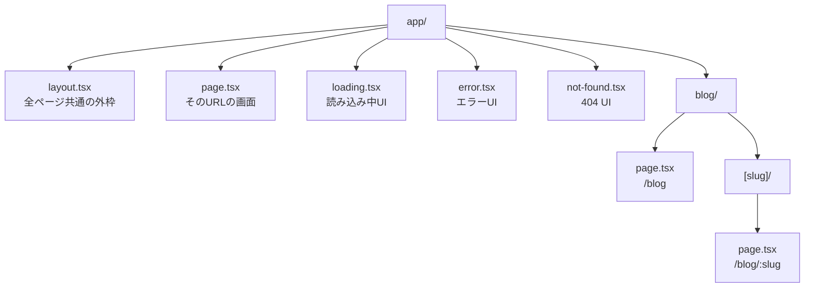
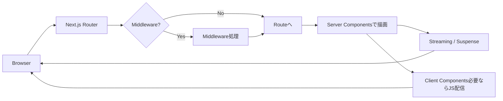
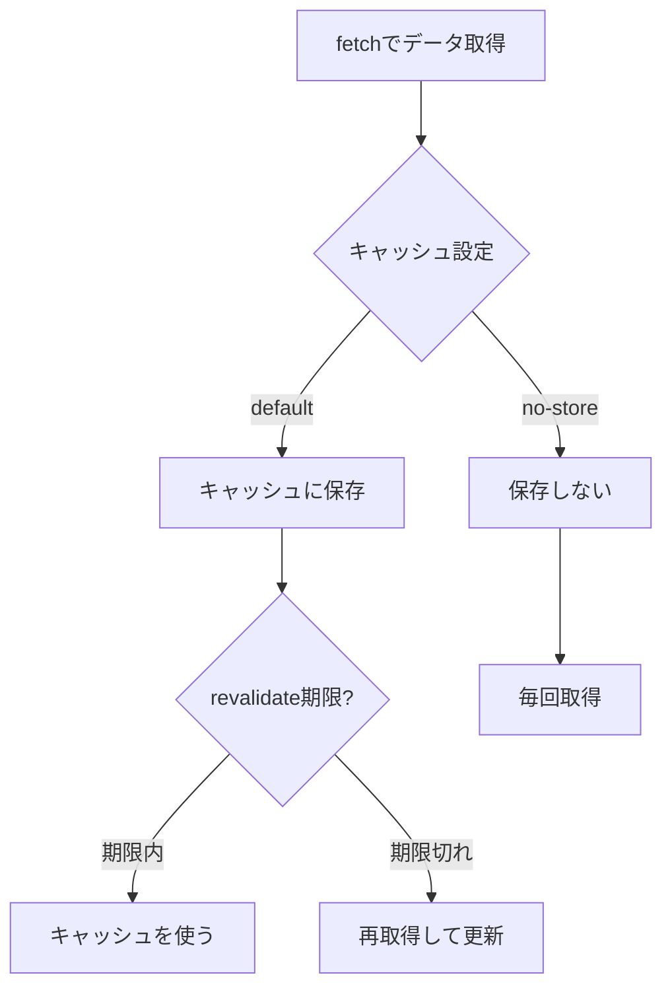

# 挫折しない Next.js（2025版 / App Router中心）教材アウトライン 📚✨（全284章）

Next.js は **App Router が基本**になっていて、**React 19 系の流れ（Server Components / Server Actions / Suspense）**とめちゃ相性いいよ〜！😊💡（Next.js 16 は React 19.2 系の機能も取り込みつつ進化中だよ） ([Next.js][1])
新規は `create-next-app@latest` で始めるのが最短ルート！🚀 ([Next.js][2])

---

## 図解①：App Router の「フォルダ＝画面」感 🗂️🧭

---

# 🌱 Module 1：Next.jsってなに？全体像をつかむ（1〜10章）✨

* **第1章：Next.js は「Reactに翼をつける」感じ🪽**
* **第2章：できること一覧：ルーティング/SSR/SEO/APIまで！🧰**
* **第3章：App Router と Pages Router の違い（まずはApp！）🛣️**
* **第4章：Server Components って何が嬉しいの？🧊**
* **第5章：Client Components っていつ必要？🎮**
* **第6章：Next.jsの「レンダリング種類」ざっくり（SSR/SSG/ISR）🧠**
* **第7章：開発のゴール：ミニアプリ→本命アプリへ🏁**
* **第8章：教材の進め方：毎章ちょい達成で気持ちよく進む😆**
* **第9章：よくある誤解：Next.jsは「難しい」じゃなくて「機能が多い」だけ🫶**
* **第10章：最初の約束：困ったら“分けて小さく”で勝てる✂️**

---

# 🚀 Module 2：プロジェクト作成と初期設定（11〜22章）🛠️

* **第11章：`npx create-next-app@latest` で作る🎉** ([Next.js][2])
* **第12章：作成時の質問（TS/ESLint/alias）を理解する✅**
* **第13章：起動してみる：`npm run dev` 🌈**
* **第14章：フォルダを観察：`app/` `public/` `next.config.*` 👀**
* **第15章：TypeScriptの設定：最初に見るべき `tsconfig.json` 🧩**
* **第16章：ESLintの役目：未来の自分を守る盾🛡️**
* **第17章：パスエイリアス（`@/`）を使って迷子防止🗺️**
* **第18章：Prettierはどうする？（方針だけ決める）🎀**
* **第19章：Gitの最小運用：コミット粒度のコツ🧊**
* **第20章：環境変数 `.env.local` の基本🔐**
* **第21章：開発中に便利：Turbo/ビルドの雰囲気だけ知る⚡**
* **第22章：練習：トップページの文言と見た目を軽く変える🎨**

---

# 🧱 Module 3：App Router 基本（23〜36章）🧭

* **第23章：`app/page.tsx` が「/」だよ🏠**
* **第24章：`layout.tsx` が外枠（ヘッダー/フッター）になる🧱**
* **第25章：`metadata` でタイトルを付ける（SEOの第一歩）🔎**
* **第26章：`Link` で画面移動（aタグじゃない理由）🔗**
* **第27章：ルート追加：`app/about/page.tsx` を作る📄**
* **第28章：Route Group `(group)` でURLを変えずに整理📦**
* **第29章：共通UI：`app/(site)/layout.tsx` みたいに分ける🧰**
* **第30章：`not-found.tsx` で404を作る🚪**
* **第31章：`error.tsx` でクラッシュ時の保険🧯**
* **第32章：`loading.tsx` で読み込み中を可愛くする⏳**
* **第33章：Dynamic Route：`[id]` の基本🧩**
* **第34章：`params` の型をちゃんと書く（TSで安全に）🧷**
* **第35章：Catch-all：`[...slug]` の使いどころ🪤**
* **第36章：練習：3ページ＋ナビ付きの“学科紹介”ミニサイト🌸**

---

## 図解②：リクエストが来た時の流れ（ざっくり）📨➡️🧠

---

# 🧩 Module 4：コンポーネント設計（37〜48章）🧱✨

* **第37章：Server Component がデフォルトって覚えよう🧊**
* **第38章：`"use client"` の意味（必要な時だけ！）🎮**
* **第39章：Propsの型：`type Props = {}` の基本🧷**
* **第40章：子要素：`children: React.ReactNode` 🧸**
* **第41章：コンポーネントの置き場所：`app/` と `components/` 🗂️**
* **第42章：UIを分解するコツ：「見た目」と「ロジック」を分ける🧠**
* **第43章：Server→Clientへ渡せるデータの注意（シリアライズ）📦**
* **第44章：よくあるハマり：ブラウザAPIはClientだけ🌐**
* **第45章：練習：プロフィールカードをServer/Clientで作り分ける🪄**
* **第46章：コンポーネント命名：迷子にならないルール決め📛**
* **第47章：再利用しすぎ注意（ほどほどが正義）🧘**
* **第48章：ミニ整理：フォルダ構成を“自分の型”に固定する🧱**

---

# 🎨 Module 5：スタイリング（49〜60章）💅✨

* **第49章：CSSの選択肢：CSS Modules / Tailwind / CSS-in-JS ざっくり🎛️**
* **第50章：CSS Modules 基本：`styles.module.css` 🧵**
* **第51章：グローバルCSS：どこに置く？🌍**
* **第52章：レイアウトの基本：Flex/Gridの最短復習🧱**
* **第53章：Tailwind導入の雰囲気（導入する/しないを決める）🌪️**
* **第54章：shadcn/ui 的な「コピペで増やすUI」概念🧩**
* **第55章：フォームの見た目を整えるコツ（余白が8割）🧼**
* **第56章：ダークモードの方針：CSSでやる？クラスでやる？🌙**
* **第57章：レスポンシブの最小セット📱**
* **第58章：アクセシビリティ：ボタン/ラベル/フォーカス🧑‍🦽**
* **第59章：練習：カード一覧を“それっぽく”仕上げる✨**
* **第60章：練習：ヘッダー固定＋スマホメニューを作る🍔**

---

# 🧭 Module 6：ルーティング応用（61〜74章）🛣️🧠

* **第61章：`useRouter` / `usePathname` の使いどころ🧭**
* **第62章：Dynamic Routeで詳細ページを作る🔍**
* **第63章：検索パラメータ（`?q=`）を読む🕵️**
* **第64章：Route Groupで“見た目の枠”を分ける📦**
* **第65章：Parallel Routes の考え方（ダッシュボードに強い）🪟**
* **第66章：Intercepting Routes の考え方（モーダル遷移）🪄**
* **第67章：`loading.tsx` を“区間ごと”に置く⏳**
* **第68章：エラー境界を“区間ごと”に置く🧯**
* **第69章：`generateStaticParams` の役割（静的生成）🧊**
* **第70章：練習：記事一覧→詳細→モーダル表示を体験📰**
* **第71章：`redirect()` と `notFound()` の使いどころ🚦**
* **第72章：URL設計のコツ：人間に優しいURLにする😊**
* **第73章：ページ分割のコツ：肥大化したら“ルートで分割”✂️**
* **第74章：復習：迷子にならないためのルーティング地図🗺️**

---

# 📡 Module 7：データ取得（基本）とキャッシュ感覚（75〜90章）🧊💧

* **第75章：Serverで `fetch` するのが基本になる話🍵**
* **第76章：`fetch` の結果が“勝手に速くなる”理由（キャッシュ）⚡**
* **第77章：キャッシュの種類：データ/レンダー/ルート ざっくり🧠** ([Next.js][3])
* **第78章：`cache: "no-store"` の使いどころ🧊➡️🔥**
* **第79章：`revalidate` の考え方（ちょい更新したい）⏱️**
* **第80章：`next: { revalidate }` の雰囲気を掴む🧩**
* **第81章：リクエストの重複を減らす考え方（同じデータは共有）🍱**
* **第82章：練習：公開APIから一覧を取って表示する📥**
* **第83章：練習：詳細ページでIDを使って取得する🔎**
* **第84章：エラー時の表示を整える（`error.tsx`活用）🧯**
* **第85章：ローディングを整える（`loading.tsx`活用）⏳**
* **第86章：Streamingの“うれしさ”を体験する🌊**
* **第87章：Client側で取るのはどんな時？（検索/操作UI）🎮**
* **第88章：Route Handler経由でクライアント取得する導線🚪**
* **第89章：データ取得の設計：まず“読み取り”を固める📚**
* **第90章：復習：キャッシュで混乱しないための3つの質問🧠**

---

## 図解③：キャッシュと再取得のイメージ 🧊🔁

---

# 🌊 Module 8：Suspense / Streaming / エラー設計（91〜104章）🧯⏳

* **第91章：`Suspense` は“待つUI”を部品化する🫧**
* **第92章：`fallback` の作り方（軽くてOK）🧸**
* **第93章：`loading.tsx` と `Suspense` の使い分け🤝**
* **第94章：Streamingで“先に見せる”ができる🌊**
* **第95章：エラーの種類：通信/コード/想定外を分ける🧯**
* **第96章：`error.tsx` の `reset()` を使う🔁**
* **第97章：`not-found.tsx` を“丁寧に”作る（案内が命）🧭**
* **第98章：練習：一覧は先に表示、詳細だけ遅れて表示📰**
* **第99章：練習：失敗した時に“再試行”ボタンを付ける🔁**
* **第100章：エラーログ方針：consoleだけで終わらせない📌**
* **第101章：境界を小さく：ページ全体を巻き込まない✂️**
* **第102章：ユーザーに優しい文言（責めないメッセージ）🫶**
* **第103章：復習：ロード/エラー/404の3点セットを固定化📦**
* **第104章：ミニ課題：エラーに強い“記事ビューア”完成🏁**

---

# 🧪 Module 9：Route Handlers（API）入門（105〜118章）🚪🧰

* **第105章：Route Handlerってなに？（アプリ内API）🧪**
* **第106章：`app/api/xxx/route.ts` の基本🗂️**
* **第107章：GETで返す（JSON）📤**
* **第108章：POSTで受ける（body）📥**
* **第109章：バリデーションはサーバーで絶対やる🛡️**
* **第110章：ステータスコードの基本（200/400/401/500）🚦**
* **第111章：Cookie/Headersの扱い方の雰囲気🍪**
* **第112章：クライアントから叩いてみる（fetch）🎯**
* **第113章：練習：/api/todos を作って一覧返す📋**
* **第114章：練習：/api/todos に追加POSTする➕**
* **第115章：エラーレスポンス設計（型を決める）🧷**
* **第116章：APIを“作りすぎない”方針（Server Actionsとも比較）⚖️**
* **第117章：復習：APIは“境界”だからこそ丁寧に🧱**
* **第118章：ミニ課題：API付きTODOの土台完成🏗️**

---

# 🧤 Module 10：MiddlewareとEdgeの考え方（119〜132章）🌐⚡

* **第119章：Middlewareってなに？（ルートに入る前の門番）🧤**
* **第120章：どんな時に使う？（ログイン判定/リダイレクト）🚦**
* **第121章：やりすぎ注意：重い処理は置かない🪶**
* **第122章：Edge Runtimeのざっくり（速いけど制約あり）⚡**
* **第123章：パスごとに適用/除外の設定🧭**
* **第124章：練習：/dashboard をログイン必須にする導線🧱**
* **第125章：練習：国別/言語別にリダイレクトするイメージ🌏**
* **第126章：Cookieで“入場券”を見る🍪**
* **第127章：セキュリティ：直接叩かれる前提で守る🛡️**
* **第128章：アクセス制御は「UI」じゃなく「サーバー」でやる🙅**
* **第129章：ログの考え方（何を残す？）📝**
* **第130章：運用で効く：遮断より案内（/loginへ）🫶**
* **第131章：復習：Middlewareは“薄く、鋭く”✂️**
* **第132章：ミニ課題：保護ルートの土台完成🔐**

---

# 🧾 Module 11：Server Actions & フォーム革命（133〜150章）🚀📨

Next.jsの Server Actions は、フォーム送信をかなり自然にしてくれるよ〜！ ([Next.js][4])

* **第133章：昔のフォーム（onSubmit + useState）を思い出す🕰️**
* **第134章：`<form action={...}>` の考え方🧾**
* **第135章：Server Actionの作り方（`"use server"`）🧑‍🍳**
* **第136章：送信中UIを作る（楽にする）⏳**
* **第137章：エラーを表示する（ユーザーに優しく）🧯**
* **第138章：`useActionState` の雰囲気（状態まとめ役）🧠**
* **第139章：`useFormStatus` の雰囲気（子が送信中を知る）🧩**
* **第140章：`useOptimistic` の雰囲気（先に反映）✨**
* **第141章：練習：お問い合わせフォームをServer Actionsで作る📮**
* **第142章：練習：TODO追加をServer Actionsに置き換える➕**
* **第143章：バリデーションはサーバーでも必須🛡️**
* **第144章：クライアント側バリデーションは“補助”🌸**
* **第145章：二重送信対策（連打防止）🖱️**
* **第146章：成功/失敗のトースト通知を付ける🔔**
* **第147章：フォーム部品化：Input/Buttonを整える🧩**
* **第148章：復習：フォームは“状態＋体験”セットで作る🫶**
* **第149章：ミニ課題：TODO CRUDのうち「追加」が完成🏗️**
* **第150章：ミニ課題：編集・削除にもActionsを広げる✏️🗑️**

---

# 🔐 Module 12：セキュリティ基本（XSS/CSRF/依存更新）（151〜160章）🛡️🧠

* **第151章：XSSってなに？（ユーザー入力は信用しない）🧨**
* **第152章：dangerouslySetInnerHTML は最終手段🙅**
* **第153章：CSRFのざっくり（クッキー認証の時に意識）🍪**
* **第154章：入力のサニタイズとバリデーションの役割分担🧼**
* **第155章：依存関係アップデートは“怖い”じゃなく“保険”🔁**
* **第156章：RSC/Server Functions周りの脆弱性情報は必ず追う🧯** ([react.dev][5])
* **第157章：練習：バリデーション失敗を丁寧に表示する🧩**
* **第158章：練習：ログイン必須ページの“直接アクセス”対策🚪**
* **第159章：練習：環境変数の漏えいを防ぐ（公開/非公開の区別）🔒**
* **第160章：復習：セキュリティは“毎回ちょい意識”が最強💪**

---

# 🗄️ Module 13：DBとCRUD（Prisma想定）（161〜174章）🧱🗃️

* **第161章：DBを使うと何が嬉しい？（永続化）🗃️**
* **第162章：ORMってなに？（SQLを安全に扱う）🧩**
* **第163章：Prismaの超ざっくり（モデル＝型の源）📘**
* **第164章：スキーマ設計：Todo/Userの最小モデル🧱**
* **第165章：マイグレーションの考え方（履歴が命）🧾**
* **第166章：ServerでDBに接続する置き場所🧊**
* **第167章：一覧取得（Read）📖**
* **第168章：追加（Create）➕**
* **第169章：更新（Update）✏️**
* **第170章：削除（Delete）🗑️**
* **第171章：練習：Server ActionsでCRUDを完成させる🏁**
* **第172章：エラー設計：DB失敗時の見せ方🧯**
* **第173章：復習：CRUDは“順番”が大事（R→C→U→D）🧠**
* **第174章：ミニ課題：DB付きTODO完成🎉**

---

# 👤 Module 14：認証（Auth.js/NextAuth系の考え方）（175〜188章）🔑✨

* **第175章：ログインって裏で何してる？（セッション/トークン）🧠**
* **第176章：Next.jsの認証は“方式を選ぶ”から始まる🎛️**
* **第177章：Auth.js系の導入イメージ（プロバイダ）🧩**
* **第178章：ログインページを作る📄**
* **第179章：ログイン状態を読む（Serverで守る）🛡️**
* **第180章：保護ルート（Middleware/Server両方で考える）🧤**
* **第181章：ログアウトを作る🚪**
* **第182章：ユーザー情報を表示する（ヘッダーに名前）😊**
* **第183章：権限（admin等）の考え方👑**
* **第184章：練習：ログイン必須の“マイページ”を作る🏠**
* **第185章：練習：ログイン中だけTODO編集できるようにする✏️**
* **第186章：認証エラーの体験を良くする（案内）🫶**
* **第187章：復習：認証は“UI”より“ガード”が本体🧱**
* **第188章：ミニ課題：認証付きTODOの土台完成🔐**

---

# 🧰 Module 15：画像・フォント・SEO（189〜202章）🖼️🔎

* **第189章：`next/image` の考え方（速くて綺麗）📸**
* **第190章：画像のサイズ指定とレイアウト崩れ対策🧱**
* **第191章：`public/` の使い方（静的ファイル）🗂️**
* **第192章：フォント最適化の考え方（読み込み体験）🔤**
* **第193章：`metadata` を本気で整える（OGP含む）🧡**
* **第194章：動的メタデータ（記事タイトルをOGPに）📰**
* **第195章：sitemap/robots の考え方🤖**
* **第196章：`Link`設計でクローラに優しくする🕷️**
* **第197章：練習：ブログ記事のOGPを整える✨**
* **第198章：練習：アイキャッチ画像を最適化する🖼️**
* **第199章：Core Web Vitals ざっくり（気にしすぎない）🫶**
* **第200章：画像が重い時の“まずこれ”チェックリスト✅**
* **第201章：復習：SEOは“設定より中身（構造）”が強い📚**
* **第202章：ミニ課題：ブログ風ページを完成させる📰🏁**

---

# 🧪 Module 16：テスト（Vitest / RTL / E2E）（203〜218章）🧫🧪

* **第203章：テストは未来の自分の味方🫶**
* **第204章：ユニット/統合/E2E の違い🧠**
* **第205章：Vitestの立ち位置（速い）⚡**
* **第206章：React Testing Libraryの考え方（画面目線）👀**
* **第207章：`render` と `screen` の基本🧩**
* **第208章：`user-event` で操作を再現🖱️**
* **第209章：練習：ボタン押したら増えるテスト➕**
* **第210章：練習：フォーム送信のテスト📨**
* **第211章：モックの考え方（やりすぎ注意）🎭**
* **第212章：E2E（Playwright等）の価値（本番に近い）🎬**
* **第213章：練習：ログイン→TODO追加までE2Eで通す🔐**
* **第214章：CIで回すイメージ（失敗したら止める）🚦**
* **第215章：壊れやすいテストを避けるコツ（文言依存しすぎない）🧊**
* **第216章：スナップショットは“使いどころだけ”📸**
* **第217章：復習：テストは“安心”を買う作業💰**
* **第218章：ミニ課題：主要画面のテスト網羅（薄くでOK）✅**

---

# 🚢 Module 17：デプロイ & 運用（Vercel中心）（219〜232章）🌍🚀

* **第219章：`npm run build` と `npm start` の意味🏗️**
* **第220章：本番環境の環境変数（管理のコツ）🔐**
* **第221章：Vercelデプロイの流れ（最短）🚀**
* **第222章：プレビューURLの便利さ（レビュー文化）👀**
* **第223章：ログの見方（どこで詰まった？）🧭**
* **第224章：エラー監視（Sentry等）の考え方🧯**
* **第225章：画像/DB/認証の本番設定（罠ポイント）🪤**
* **第226章：キャッシュと再検証を本番で調整する🧊**
* **第227章：パフォーマンス計測の入口（まず1個だけ）📈**
* **第228章：セキュリティアップデート運用（月イチでも）🔁**
* **第229章：練習：本番に出して“友だちに触ってもらう”📱**
* **第230章：練習：リリースノートを読む習慣（怖くない）📰**
* **第231章：復習：運用は“仕組み化”でラクになる🛠️**
* **第232章：ミニ課題：公開URLを完成させる🎉**

---

# 🏁 Module 18：卒業制作（企画→実装→公開）🎓✨（233〜244章）

* **第233章：卒業制作テーマ決め（3案から選ぶ）🎯**
* **第234章：要件を紙に書く（画面/機能/データ）📝**
* **第235章：URL設計（ルーティング表を作る）🗺️**
* **第236章：DB設計（テーブル2〜4個で十分）🗃️**
* **第237章：UI設計（まずワイヤーでOK）🧱**
* **第238章：実装順：ログイン→一覧→詳細→編集→削除🔁**
* **第239章：エラー/ローディング/404の仕上げ🧯⏳**
* **第240章：SEO/OGP/画像最適化の仕上げ🔎🖼️**
* **第241章：テストを最低限入れる（重要画面だけ）✅**
* **第242章：公開して改善点をメモする🧠**
* **第243章：リファクタリング（読めるコードへ）🧼**
* **第244章：ゴール！次に学ぶ道（API/Edge/複雑UI）🚀🎉**

# 🛡️ Module 19：運用保守・エコシステム（245〜254章）🛠️

* **第245章：バージョンアップとセキュリティ更新の心得🛡️**
* **第246章：`revalidateTag` で「更新ボタン」を作る🧊**
* **第247章：安全なアップデート手順と codemod 🤖**
* **第248章：`revalidatePath` vs `revalidateTag` 🔁**
* **第249章：ログ設計：何をどこに出す？（Console/File/Service）📝**
* **第250章：エラー追跡の導入（Sentry等の概念）🧯**
* **第251章：バンドルサイズなどパフォーマンス計測の基礎（@next/bundle-analyzer）📈**
* **第252章：CI/CDパイプラインの役割（GitHub Actions等）🤖**
* **第253章：Vercel以外のデプロイ（Docker/Self-hosting 概念）🐳**
* **第254章：運用中の「困った」に対処するトラブルシューティング💡**

---

# 🏺 Module 20：App Router時代の状態管理（Server連携特化）（255〜264章）🧬

* **第255章：Server ComponentsとクライアントStateの境界線（どこまでProps？どこからState？）🪣**
* **第256章：Zustand/Jotaiへの初期値注入（Hydrationパターン）🐻**
* **第257章：Route Handlers/Server ActionsからのState更新🤝**
* **第258章：URL State Management（`nuqs`を活用する）🔗**
* **第259章：Cookieをストアの永続化に使う（サーバーサイドでの読み書き）🍪**
* **第260章：Context API は Server Components 時代にどう使う？🔦**
* **第261章：Optimistic UI の深掘り（useOptimistic 実践）✨**
* **第262章：複数コンポーネント間の連携パターン（Event vs State）🧵**
* **第263章：サーバーで持つべき状態 vs クライアントで持つべき状態⚖️**
* **第264章：ミニ課題：複雑な検索フィルターの状態管理🔍**

---

# 🐼 Module 21：次世代スタイリング（Panda CSS）（265〜274章）💅⚡

* **第265章：なぜPanda CSSか？（Zero-Runtime & Type-Safe）🐼**
* **第266章：インストールとセットアップ（Next.js設定）🧱**
* **第267章：基本のスタイリング（`css()` 関数）🎨**
* **第268章：Recipes でバリエーションを作る（Button等）🧂**
* **第269章：Slot Recipes で複合コンポーネントを作る（Card, Dialog）🍱**
* **第270章：Patterns でレイアウトを組む（Stack, Grid）📐**
* **第271章：Design Tokens と Theming（色はこう管理する）🎨**
* **第272章：JSX Style Props の是非と設定（`<Box p={4} />`）🤔**
* **第273章：Tailwind からの移行/共存戦略⚔️**
* **第274章：ミニ課題：Panda CSS でコンポーネントカタログを作る📖**

---

# 🤖 Module 22：次世代バリデーション（Valibot）（275〜284章）🛡️⚡

* **第275章：なぜValibotか？（Bundle Size & Modular）🤖**
* **第276章：基本のスキーマ定義と検証（`safeParse`）🧪**
* **第277章：データ型ごとのバリデーション（String/Number/Date）🔢**
* **第278章：Server Actions での入力検証🛡️**
* **第279章：APIレスポンスの型安全と検証📦**
* **第280章：エラーメッセージの日本語化と平坦化（`flatten`）🇯🇵**
* **第281章：カスタムバリデーションを作る（`check`）🔧**
* **第282章：スキーマの合成と再利用（`merge`, `pick`）🧩**
* **第283章：フォームライブラリ（Conform等）との連携概要📋**
* **第284章：ミニ課題：堅牢な入力フォームとAPI通信🔒**

