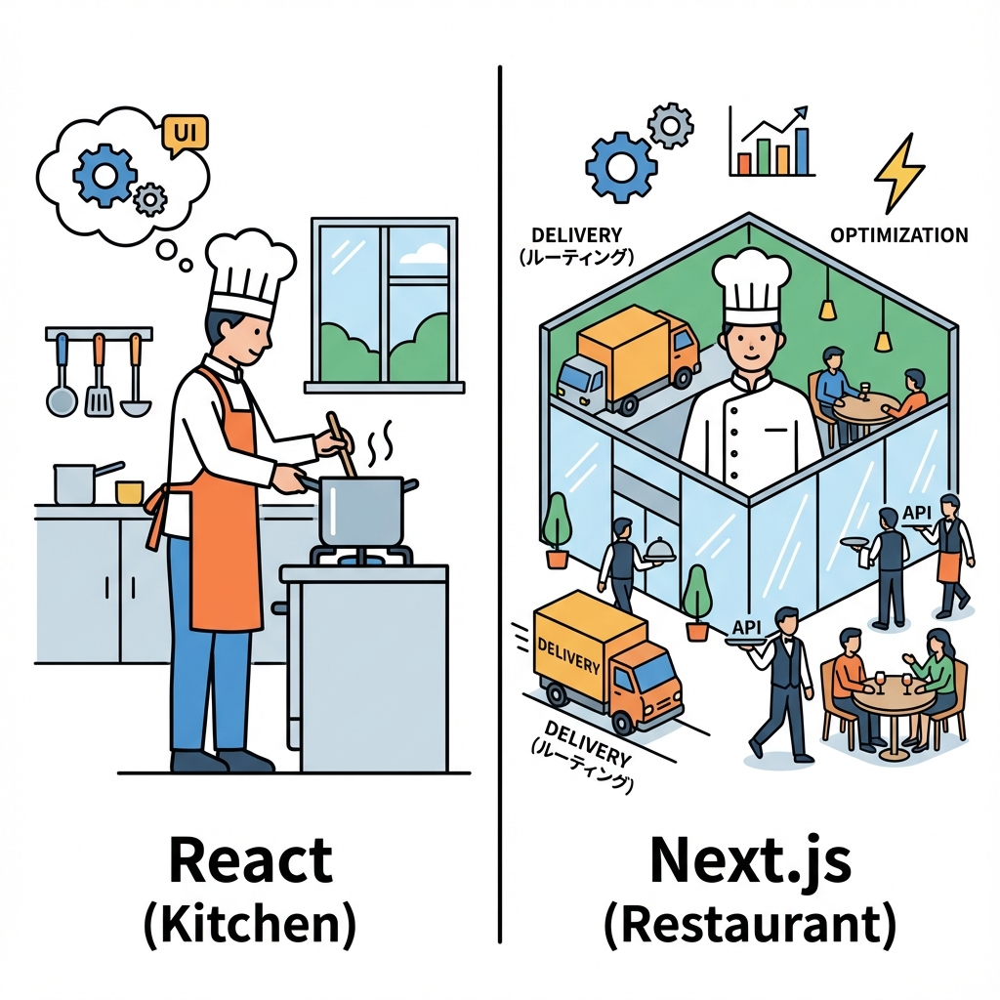
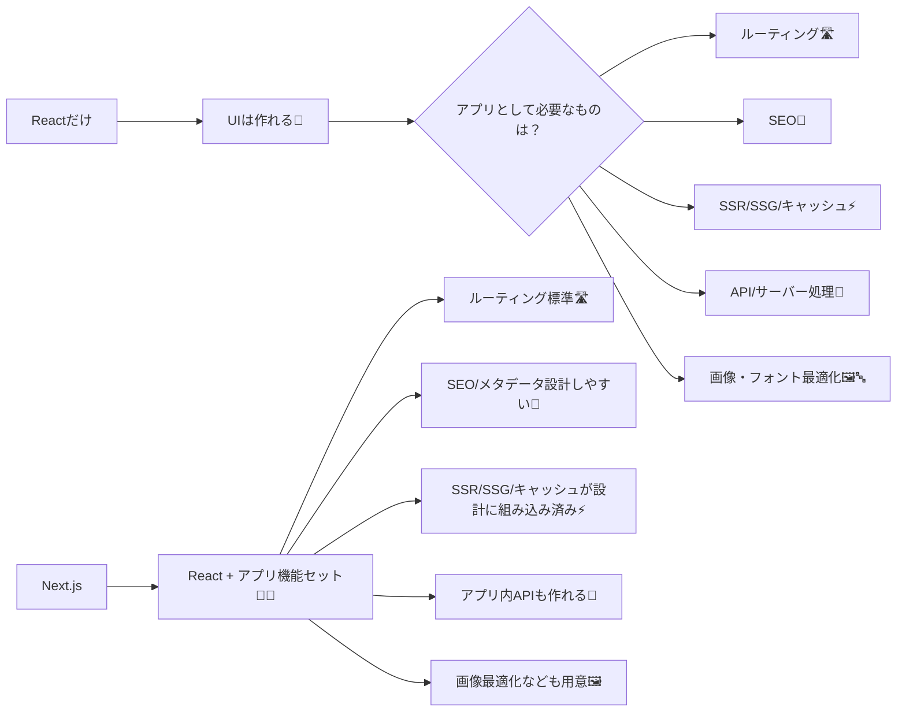

# 第1章：Next.js は「Reactに翼をつける」感じ🪽

## 今日のゴール🎯

* 「Reactだけ」と「Next.jsあり」の違いを、ざっくり言葉で説明できるようになる😊
* Next.js が “何を面倒みてくれるフレームワークか” をイメージできるようになる🧠✨

---

## まず結論🧡（超ざっくり）

* **React**：画面（UI）を作るための“部品づくり”が得意🧩
* **Next.js**：React を使って、**Webアプリとして完成させるための仕組み**をまとめて用意してくれる🚀

つまり…
**React = 料理（UI）**🍳
**Next.js = キッチン＋レシピ＋配達＋お店の運営セット**🏠📦✨

---

## Reactだけだと、何が「別途必要」になりやすいの？🤔

React は UI が得意だけど、アプリとして作るときに「周辺の仕組み」を自分で選んだり組み合わせたりしがちだよ〜💡

たとえば👇

* ページ移動（ルーティング）どうする？🛣️
* SEO（検索に強くする）どうする？🔎
* 速く表示（SSR/SSG/キャッシュ）どうする？⚡
* API（サーバー側の処理）どこに置く？🧪
* 画像最適化・フォント最適化どうする？🖼️🔤

Next.js はこのへんを **「最初から標準装備」**でまとめてくれる感じだよ🧰✨

---

## Next.js が「翼」っぽい理由🪽

Next.js は React をそのまま使いながら、アプリに必要な機能を“自然に”足してくれるよ😊
特に今の Next.js は **App Router** が中心で、ページやレイアウトは **デフォルトで Server Components**（サーバーで描画しやすい）という考え方が軸になってるよ〜🧊✨ ([Next.js][1])

---

## 図でイメージしよ〜📌（Reactだけ vs Next.js）

---

## ちょい現実の話（2025の今どんな感じ？）📅✨

* Next.js は **16系**が現行の大きな軸になっていて、改善がどんどん入ってるよ🚀 ([Next.js][2])
* React も 19系が進んでいて、React公式は「最新は 19.2」と案内してるよ📌 ([React][3])

---

## 10分ワーク📝🌸（コード書かない練習）

「Next.js が欲しくなる瞬間」を、ミニアプリで想像してみよ〜😆

### お題：学科紹介ミニサイト🏫✨

ページはこの3つにしたい👇

* `/`：トップ（学科の魅力）🌟
* `/courses`：授業一覧📚
* `/access`：アクセス🚃

ここで質問！🙋‍♀️

1. URLが増えたとき、ページ管理どうする？🗂️
2. Google検索で見つけてもらうには？🔎
3. 最初の表示を速くするには？⚡

👉 これ、Next.js だと「そういうの込みで作りやすい設計」になってるよ〜🪽✨

---

## よくある誤解を先に潰す🧯💬

* ❌「Next.js = Reactの上位互換で、Reactいらない」
  ✅ **Reactを使うための“アプリ用の土台”**だよ😊
* ❌「Next.js は難しい」
  ✅ 機能が多いだけ！最初は **“ページを作る”だけ**でOK👌✨

---

## 3分ふりかえり✅✨（ミニチェック）

* Next.js は何をしてくれる？👉 **Reactアプリに必要な周辺機能をまとめて面倒見てくれる**🧰
* “翼”ってどういう意味？👉 **速さ・SEO・ルーティング・サーバー機能などで完成形に近づく**🪽

---

## 次章の予告📣💖

次の第2章では、Next.jsで「できること」を一覧でスッキリ整理するよ〜🧰✨
（ルーティング/SSR/SEO/APIまで、ぜんぶ地図にする感じ🗺️💕）

[1]: https://nextjs.org/docs/app/getting-started/server-and-client-components?utm_source=chatgpt.com "Getting Started: Server and Client Components"
[2]: https://nextjs.org/blog/next-16?utm_source=chatgpt.com "Next.js 16"
[3]: https://react.dev/versions?utm_source=chatgpt.com "React Versions"
