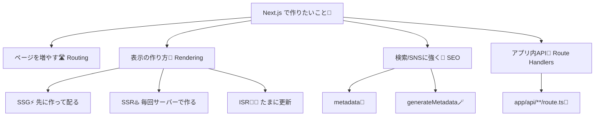
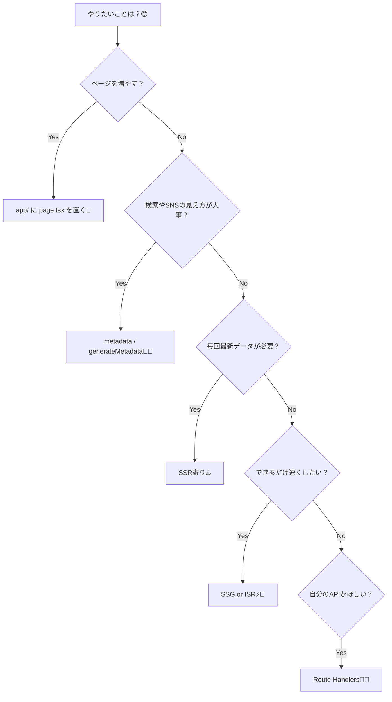

# 第2章：できること一覧：ルーティング/SSR/SEO/APIまで！🧰

この章は「暗記」じゃなくて、**Next.jsにどんな“道具箱”があるか**を知る回だよ〜！😊🪄
「やりたいこと」が出てきた時に「それ、Next.jsならこうするかも💡」って思えるのがゴール✨

---

## 1) Next.jsの“できること”をざっくり一気見👀💖


### ✅ ① ルーティング（画面を増やす）🛣️

* ファイルを置くだけでページが増える（例：`/about` とか）📄✨
* 画面遷移もスムーズ（`Link` で移動）🔗

（App Routerが基本で、Reactの新しめ機能とも相性がいいよ〜） ([Next.js][1])

---

### ✅ ② レンダリング（表示のされ方を選べる）🧠🌈

Next.jsはページごとに「作り方」を選べる感じ！

* **SSR**：アクセスのたびにサーバーで作って返す（鮮度つよめ）♨️
* **SSG**：先に作っておいて配る（高速つよめ）⚡
* **ISR**：基本はSSG、たまに更新（バランス型）🧊🔁

ISRの考え方は公式ガイドにまとまってるよ📝 ([Next.js][2])
SSRの説明も公式にあるよ🧾 ([Next.js][3])

---

### ✅ ③ SEO（検索・SNSで“ちゃんとして見える”）🔎💖

* タイトルや説明文、OGPなどを**Next.jsの仕組みで整理して設定**できる✨
* `metadata` や `generateMetadata` でページごとに変えられる🧡

公式：Metadata/OGまわりの入門ページ＆API ([Next.js][4])

---

### ✅ ④ API（アプリの中に“自分のAPI”を作れる）🚪🧪

* `app/api/.../route.ts` を作ると **自前API** が生える🌱
* ちょいDBや、外部APIの中継、フォーム送信の受け口にも便利💌

公式：Route Handlers（`route.ts`） ([Next.js][5])

---

## 2) 何したい？→ どの道具？の早見表🧭✨

* 「ページを増やしたい」→ **Routing** 🛣️
* 「検索にちゃんと載ってほしい」→ **Metadata（SEO）** 🔎
* 「表示を速くしたい」→ **SSG / ISR** ⚡🧊
* 「最新データを毎回見せたい」→ **SSR** ♨️
* 「フロントから叩ける自分のAPIがほしい」→ **Route Handlers** 🚪🧪

---

## 3) 図解①：Next.jsの機能マップ（この章の全体像）🗺️✨



---

## 4) 図解②：「やりたい！」から機能を選ぶミニ診断🎯💡



---

## 5) ミニ実装（10分）：“未来の自分”のための3点セットを眺める👀✨

※ まだプロジェクト作成前でもOK！「こういう形で作るんだ〜」って雰囲気だけ掴めば勝ち💖

### ✅ A) APIの最小例（Route Handler）🚪🧪

```ts
// app/api/hello/route.ts
export async function GET() {
  return Response.json({ message: "Hello from Next.js API! 😆" })
}
```

この形は公式の例そのまま系だよ〜✨ ([Next.js][5])

---

### ✅ B) SEOの最小例（metadata）🔎🧡

```ts
// app/layout.tsx か app/page.tsx など
export const metadata = {
  title: "学科紹介ミニサイト🌸",
  description: "Next.jsの練習だよ〜！",
}
```

`metadata` / `generateMetadata` の話は公式にまとまってるよ📘 ([Next.js][4])

---

### ✅ C) 「ページが増える」イメージ（ファイル配置）📄🛣️

```txt
app/
  page.tsx          ->  /
  about/
    page.tsx        ->  /about
  api/
    hello/
      route.ts      ->  /api/hello
```

---

## 6) 3分ふりかえり（めっちゃ大事🫶✨）

* 今日の道具箱で、**「一番使いそう！」**って思ったのどれ？🧰💭
* 自分の作りたいアプリで、

  * 「SEOが大事なページ」🔎
  * 「速さ優先のページ」⚡
  * 「毎回最新が必要なページ」♨️
    それぞれどれになりそう？☺️
* 「APIほしい瞬間」ってどんな時？🚪🧪（例：フォーム送信、外部APIの中継、DBアクセス…）

---

## この章のまとめ🎀✨

Next.jsは **Reactにプラスして**、
「ページの増やし方🛣️」「表示の作り方🧠」「SEO🔎」「API🚪」が**最初から揃ってる**フレームワークだよ〜！
次の章から、ほんとに手を動かして “使える道具” にしていこうね😆💖

[1]: https://nextjs.org/docs?utm_source=chatgpt.com "Next.js Docs | Next.js"
[2]: https://nextjs.org/docs/app/guides/incremental-static-regeneration?utm_source=chatgpt.com "How to implement Incremental Static Regeneration (ISR)"
[3]: https://nextjs.org/docs/pages/building-your-application/rendering/server-side-rendering?utm_source=chatgpt.com "Server-side Rendering (SSR)"
[4]: https://nextjs.org/docs/app/getting-started/metadata-and-og-images?utm_source=chatgpt.com "Getting Started: Metadata and OG images"
[5]: https://nextjs.org/docs/app/api-reference/file-conventions/route?utm_source=chatgpt.com "File-system conventions: route.js"
