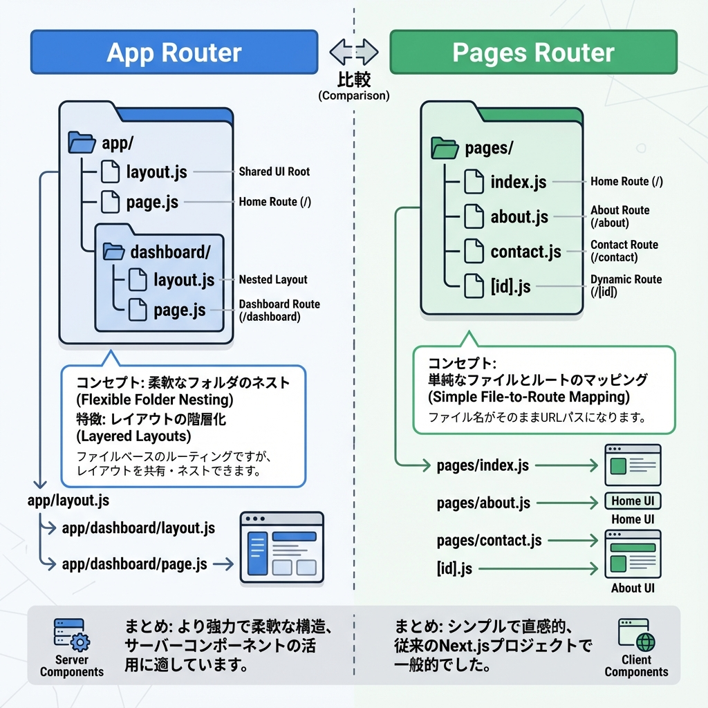
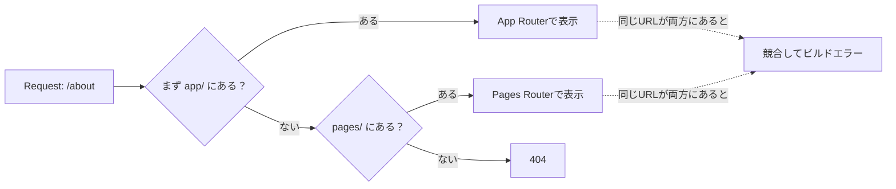
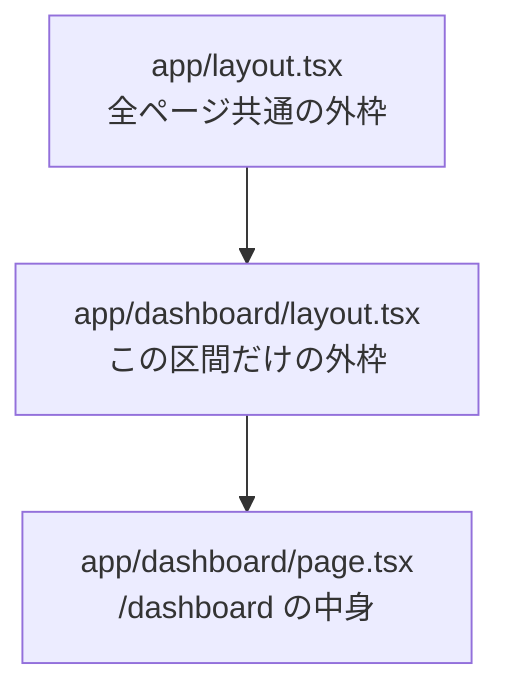

# 第3章：App Router と Pages Router の違い（まずはApp！）🛣️

この章では、「Next.jsにはルーターが2つあるよ〜！」ってところを、ゆるっと理解していくよ😊🌸
結論から言うと **新しく作るなら App Router が基本** だよ〜！🧡（Pages Routerもまだ使えるけど、最新機能はApp側が中心だよ）([Next.js][1])

---

## 1) そもそも「ルーター」ってなに？🚏

**URL（/about とか）と、表示するReactコンポーネントを結びつける仕組み**だよ🔗✨

Next.jsには2種類あるよ👇

* **App Router**（新しい・`app/` フォルダ）🆕
  Reactの新しめ機能（Server Components / Suspense など）を前提に作られてる([Next.js][2])
* **Pages Router**（昔からある・`pages/` フォルダ）📚
  今もサポートはされてるけど、新規ならAppへ移行が推奨されがち([Next.js][3])

---

## 2) 一番大事な違いは「置く場所」と「考え方」📦🧠

### ✅ 置く場所の違い



* App Router：`app/` の中に `page.tsx` を置くと、そのURLになる🏠([Next.js][4])
* Pages Router：`pages/` の中に `about.tsx` とかを置くと、そのURLになる📄([Next.js][5])

---

## 3) ざっくり比較表📋✨

| 観点         | App Router（app/）🆕                                                 | Pages Router（pages/）📚                  |
| ---------- | ------------------------------------------------------------------ | --------------------------------------- |
| 推奨         | 新規は基本こっち🌟([Next.js][6])                                           | 既存資産がある時に便利🔧([Next.js][7])             |
| レイアウト      | `layout.tsx` を階層ごとに積める🧱                                           | `_app.tsx` / `_document.tsx` で全体を包む感じ🎁 |
| ローディング/エラー | `loading.tsx` / `error.tsx` / `not-found.tsx` みたいな“専用ファイル”が強い⏳🧯🚪 | 404やエラーは別の流儀（ファイルで対応）🧰                 |
| Reactの新機能  | Server Components がデフォルト🧊([Next.js][8])                           | 従来のやり方が中心📘                             |
| 両方同居       | できるけど混乱しやすい⚠️（優先度のルールあり）([Next.js][8])                             | 同左                                      |

---

## 4) 同居できるけど「同じURL」はダメ🙅‍♀️💥

App Router と Pages Router は **同じプロジェクトに共存できる**よ〜！でも…⚠️

* **App Router の方が優先される**([Next.js][8])
* そして **同じURLを両方で作ると競合してビルド時にエラー**になるよ💣([Next.js][8])

図にするとこんな感じ👇（このMermaidは基本文法に沿って書いてあるよ🧩）



---

## 5) 体験して理解しよ〜！ミニ実装🧪✨（10分くらい）

「目で見る」と一気に分かるよ👀💖

### (A) App Router でページを1つ増やす🌷

`app/hello/page.tsx` を作って👇

```tsx
// app/hello/page.tsx
export default function HelloPage() {
  return (
    <main style={{ padding: 24 }}>
      <h1>Hello 👋✨</h1>
      <p>これは App Router（app/）のページだよ〜！</p>
    </main>
  );
}
```

ブラウザで `http://localhost:3000/hello` に行って表示できたらOK🎉

> App Router は「`app` の中に `page.tsx` を置くと、そのURLになる」って覚え方が最強🧠✨([Next.js][4])

---

### (B) Pages Router も“あえて”1ページ作ってみる（比較用）🧁

`pages/legacy.tsx` を作って👇（`pages/` が無ければ作ってOK！）

```tsx
// pages/legacy.tsx
export default function LegacyPage() {
  return (
    <main style={{ padding: 24 }}>
      <h1>Legacy 📚</h1>
      <p>これは Pages Router（pages/）のページだよ〜！</p>
    </main>
  );
}
```

`http://localhost:3000/legacy` に行って表示できたらOK🎉

---

## 6) レイアウトの感覚だけ先にチラ見👀🧱

App Router の “積み重ねレイアウト” はこんなイメージだよ👇



「ページごと」じゃなくて「URLの区間ごと」に外枠を重ねられるのが、App Router の気持ちよさ🥰🧱

---

## 7) よくあるハマりどころ（先に回避）🧯💡

* `app/` と `pages/` の **同じURLを両方で作っちゃう** → 競合エラーになりがち💥([Next.js][8])
* App Router は **Server Components がデフォルト** → ブラウザAPI（`window` とか）はそのままだと使えない場面があるよ（後の章でちゃんとやるよ）🧊🌐([Next.js][8])
* 既存プロジェクト移行は「一気に」じゃなくて段階的が基本だよ🪜✨([Next.js][7])

---

## 8) 3分ふりかえり（ミニ確認）📝💗

最後にこれ答えられたら、この章は勝ち〜！🏆✨

1. `app/hello/page.tsx` を作ると、URLは何になる？😊
2. `pages/legacy.tsx` を作ると、URLは何になる？📚
3. `app/about/page.tsx` と `pages/about.tsx` を両方作ったらどうなる？⚠️([Next.js][8])

---

次の章（第4章）で、**App Routerの主役：`layout.tsx` と Server Components** をもうちょい楽しく触っていくよ〜！🧊🧱✨

[1]: https://nextjs.org/docs?utm_source=chatgpt.com "Next.js Docs | Next.js"
[2]: https://nextjs.org/docs/app?utm_source=chatgpt.com "Next.js Docs: App Router"
[3]: https://nextjs.org/docs/pages?utm_source=chatgpt.com "Next.js Docs: Pages Router"
[4]: https://nextjs.org/docs/app/getting-started/layouts-and-pages?utm_source=chatgpt.com "Getting Started: Layouts and Pages"
[5]: https://nextjs.org/docs/pages/building-your-application/routing/pages-and-layouts?utm_source=chatgpt.com "Routing: Pages and Layouts"
[6]: https://nextjs.org/docs/13/app?utm_source=chatgpt.com "Introduction: App Router"
[7]: https://nextjs.org/docs/app/guides/migrating/app-router-migration?utm_source=chatgpt.com "Migrating: App Router"
[8]: https://nextjs.org/docs/13/app/building-your-application/routing?utm_source=chatgpt.com "Building Your Application: Routing"
