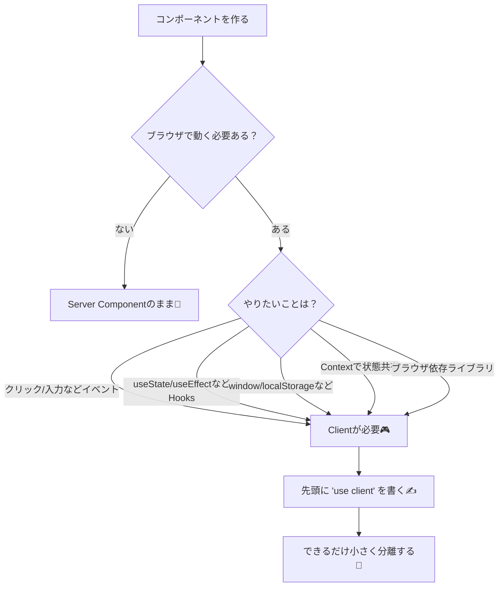
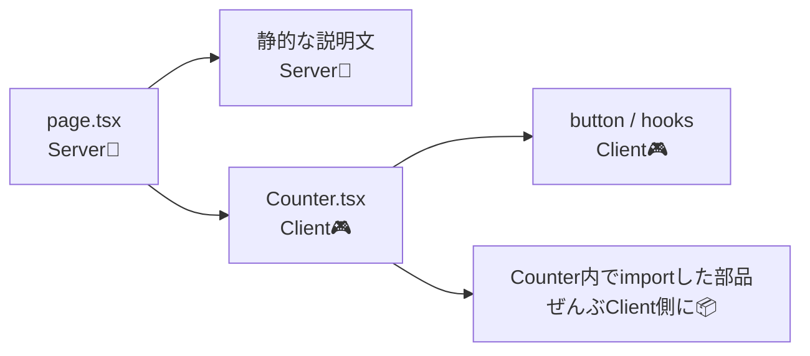

# 第5章：Client Components っていつ必要？🎮

この章のゴールはこれだけだよ〜！🙌
**「あ、ここはClientだな」って判断できて、`"use client"` を必要最小限に貼れるようになること**💡
（App Routerでは、基本はServer Componentがデフォルトだよ🍵）([Next.js][1])

---

## ねらい 🎯

* Client Component が必要な「条件」を言えるようになる🧠
* `"use client"` の意味（境界！）を理解する🚧([Next.js][1])
* “全部Clientにしない” で、軽くて速い構成にできる🏃‍♀️💨([Next.js][1])

---

## 5分説明：Clientが必要なのってどんな時？🤔🌈

### 結論：**ブラウザでしかできないこと**をやる時！🌐✨

Client Component が必要になる代表例はこれ👇

* クリックなどのイベント（`onClick` / `onChange`）🖱️
* React Hooks（`useState` / `useEffect` / `useRef` など）🪝
* ブラウザAPI（`window` / `document` / `localStorage` など）🧩
* Context（Provider/Consumerで“状態共有”したい）🧃
  ※Server ComponentsではContextは使えないよ〜([Next.js][1])
* ブラウザ依存のライブラリ（スライダー、地図、チャート等）📊([Next.js][1])

### 重要ポイント：`"use client"` は「境界」🚧✨

`"use client"` を書いたファイルは **Client Component** になって、そこからimportされるものは **まとめてクライアント側のJSに入る** よ〜！📦💥
だから「必要な部品だけ」にするのがコツ！([Next.js][1])


---

## 図解：Client/Server 判定チャート 🗺️✨（Mermaid）



---

## よくある落とし穴 ⚠️😵‍💫

### ❶ 「とりあえず `app/page.tsx` を全部Clientにしちゃえ」→ もったいない！🥺

ページ全体をClientにすると、静的な部分までJSが増えやすいよ〜💦
Next.js公式も「インタラクティブ部品だけClientにして、JSを減らそう」って言ってる🫶([Next.js][1])

### ❷ Client Component にしたら「中でサーバー専用コード」をimportしちゃった😱

Client側に秘密（APIキーとかDB処理とか）が混ざると危険＆壊れる…！
（必要なら `server-only` で“混入防止”もできるよ🛡️）([Next.js][1])

### ❸ Server→Clientに渡すpropsで「関数」や「Date」などを渡して怒られる😇

Clientに渡すpropsは **シリアライズ可能**（JSONにできる感じ）じゃないとダメだよ〜📦([Next.js][1])

---

## 10分実装：Serverのページに、Clientの「カウンター」だけ埋め込む 🧁➕🎮

### ✅ やること

* ページはServerのまま🍵
* ボタンで増える部分だけClientにする🎮

---

### Step 1：Client部品を作る（`Counter.tsx`）🧩

`components/Counter.tsx` を作ってね！（`src/components` でもOK🙆‍♀️）

```tsx
"use client";

import { useState } from "react";

export function Counter() {
  const [count, setCount] = useState(0);

  return (
    <section style={{ border: "1px solid #ddd", padding: 16, borderRadius: 12 }}>
      <h2 style={{ marginTop: 0 }}>カウンターだよ〜🧸</h2>
      <p style={{ fontSize: 18 }}>いま：{count} 🎉</p>

      <div style={{ display: "flex", gap: 8 }}>
        <button type="button" onClick={() => setCount((c) => c + 1)}>
          +1 ➕
        </button>
        <button type="button" onClick={() => setCount(0)}>
          リセット 🔄
        </button>
      </div>
    </section>
  );
}
```

ポイント：**先頭に `"use client"`！**（これが境界）🚧([Next.js][1])

---

### Step 2：Serverのページから呼ぶ（`app/page.tsx`）🏠🍵

```tsx
import { Counter } from "@/components/Counter";

export default function Home() {
  return (
    <main style={{ padding: 24 }}>
      <h1>Next.js へようこそ〜✨</h1>
      <p>
        このページ自体は <b>Server Component</b> 🍵  
        でも下のカウンターは <b>Client Component</b> 🎮
      </p>

      <Counter />
    </main>
  );
}
```

※ `@/` が効かない場合は、相対パスに変えてOKだよ🙆‍♀️
例：`import { Counter } from "../components/Counter";`

---

### Step 3：起動して確認 🎬✨

VSCodeのターミナルで👇

```bash
npm run dev
```

ブラウザで `http://localhost:3000` を開いて、ボタンで増えたら成功〜！🎉🖱️

---

## 追加ミニ実装：`localStorage` を使う＝Client確定🌙☀️

ブラウザ保存（`localStorage`）はClientでしか触れないよ〜！([Next.js][1])

`components/ThemeToggle.tsx` を作る👇

```tsx
"use client";

import { useEffect, useState } from "react";

type Theme = "light" | "dark";

export function ThemeToggle() {
  const [theme, setTheme] = useState<Theme>("light");

  // 初回だけ：保存を読む
  useEffect(() => {
    const saved = window.localStorage.getItem("theme");
    if (saved === "light" || saved === "dark") setTheme(saved);
  }, []);

  // 変わったら保存する
  useEffect(() => {
    window.localStorage.setItem("theme", theme);
    document.documentElement.dataset.theme = theme;
  }, [theme]);

  return (
    <button
      type="button"
      onClick={() => setTheme((t) => (t === "light" ? "dark" : "light"))}
      style={{ marginTop: 12 }}
    >
      テーマ切替：{theme === "light" ? "☀️" : "🌙"}
    </button>
  );
}
```

`app/page.tsx` に追加👇

```tsx
import { Counter } from "@/components/Counter";
import { ThemeToggle } from "@/components/ThemeToggle";

export default function Home() {
  return (
    <main style={{ padding: 24 }}>
      <h1>Next.js へようこそ〜✨</h1>
      <Counter />
      <ThemeToggle />
    </main>
  );
}
```

---

## 図解：境界が「下に伝染する」イメージ 🧫➡️🎮



`"use client"` の下にぶら下がるものは、基本まとめてクライアントJSに入るよ〜！📦([Next.js][1])
だから **「インタラクティブ部分だけを小さく切り出す」** が正解🙆‍♀️✨([Next.js][1])

---

## 3分ふりかえり ✅📝

自分にこの3つ質問してみてね🫶

1. その部品、クリックや入力ある？🖱️
2. Hooksや `window` 使ってる？🪝🌐
3. もしClientなら、**もっと小さく分けられる？**🧩([Next.js][1])

---

## ミニチェック問題 🎓💡

* Q1：`useEffect` を使いたい。Server？Client？
* Q2：ブログ記事本文を表示するだけ。Server？Client？
* Q3：`localStorage` でテーマ保存したい。Server？Client？

（答え：Q1 Client🎮 / Q2 Server🍵 / Q3 Client🎮）

---

次の章に進む前に、もしよければ「あなたが作りたい題材」（学科紹介サイト、日記、推し活メモ等）に合わせて、**“どこをClientにするか設計図”** も一緒に作れるよ〜🗺️💖

[1]: https://nextjs.org/docs/app/getting-started/server-and-client-components "Getting Started: Server and Client Components | Next.js"
