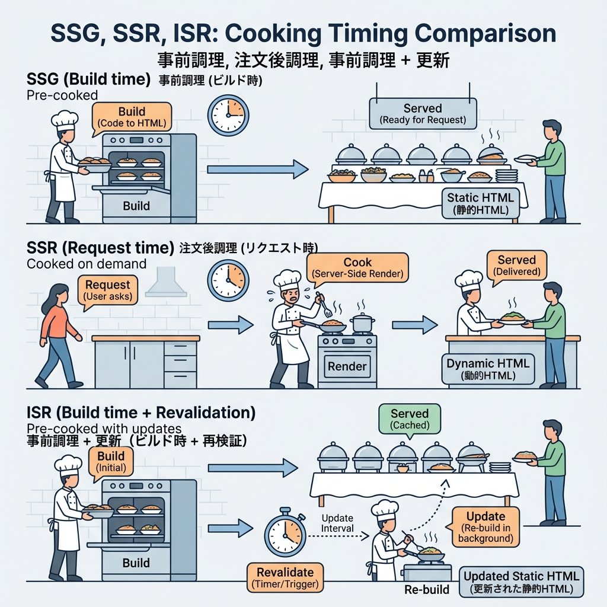
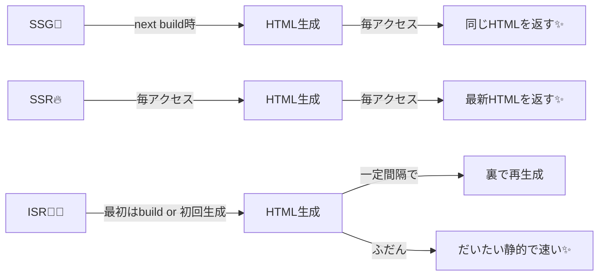

# 第6章：Next.jsの「レンダリング種類」ざっくり（SSR/SSG/ISR）🧠

この章はね、ひとことで言うと👇
**「HTMLを“いつ作るか”で、速さと新しさが変わるよ〜！」**って話だよ😊💖

---

## 今日のゴール🏁🌸

* ✅ SSR / SSG / ISR の違いを、ひとことで言えるようになる🎤✨
* ✅ App Routerで「静的 / 動的 / ちょい更新」を作り分けられる🧩
* ✅ 3ページ作って体感できる🎮🚀

---

## 5分説明⌛：SSR / SSG / ISR ってなに？🍰

### SSG（Static Site Generation）🧊

* **ビルド時（`next build`）にHTMLを作って**、それをずっと使う感じ✨
* だから速い！CDNにも乗せやすい！🛰️
  SSGは「HTMLをビルド時に生成して再利用する」って説明されてるよ。([Next.js][1])

### SSR（Server-side Rendering）🔥

* **アクセスされるたびに、サーバーでHTMLを作る**感じ！
* 新しい情報（ログイン中のユーザーごとの表示とか）に強い💪
  SSRは「毎リクエストでHTML生成（Dynamic Renderingとも呼ぶ）」って説明があるよ。([Next.js][2])

### ISR（Incremental Static Regeneration）🧊🔁

* **基本はSSG（静的）だけど、一定間隔で“裏で更新”できる**感じ！
* 「全部ビルドし直さなくても更新できる」ってのが強み✨
  ISRの目的（ビルドし直さず更新できる等）は公式ガイドにまとまってるよ。([Next.js][3])

---

## 図解🧩：いつHTMLが作られるの？（超ざっくり）





---

## まずこれだけ覚えよ💡（選び方のコツ3つ）🎯

1. **内容がほぼ変わらない** → SSG🧊
2. **アクセスごとに変わる（個人化/最新性）** → SSR🔥
3. **基本は固定だけど、たまに更新したい** → ISR🧊🔁

App Routerは「基本Server Components」で、静的/動的/キャッシュを組み合わせやすいよ〜って公式でも説明されてるよ。([Next.js][4])

---

## 10分実装💻：SSG/SSR/ISRの3ページを作って体感🎮✨

### フォルダ構成（作るもの）📁

* `app/ssg/page.tsx`（SSGっぽい🧊）
* `app/ssr/page.tsx`（SSR🔥）
* `app/isr/page.tsx`（ISR🧊🔁）
* `app/page.tsx`（トップにリンク置く🔗）

---

### 0) トップページにリンクを置く🏠🔗

`app/page.tsx` をこんな感じに👇

```tsx
import Link from 'next/link';

export default function Home() {
  return (
    <main style={{ padding: 24, display: 'grid', gap: 12 }}>
      <h1>レンダリング3兄弟（SSG/SSR/ISR）🧠✨</h1>

      <ul style={{ display: 'grid', gap: 8 }}>
        <li><Link href="/ssg">SSG🧊（ビルド時に固定）</Link></li>
        <li><Link href="/ssr">SSR🔥（毎回つくる）</Link></li>
        <li><Link href="/isr">ISR🧊🔁（たまに更新）</Link></li>
      </ul>
    </main>
  );
}
```

---

### 1) SSG🧊：固定ページ（ビルド時の内容が基本）

`app/ssg/page.tsx`

```tsx
export default function Page() {
  const builtLikeTime = new Date().toISOString();

  return (
    <main style={{ padding: 24, display: 'grid', gap: 12 }}>
      <h1>SSG🧊</h1>
      <p>このページは「静的」寄りのイメージだよ✨</p>
      <p>表示してる時刻：<b>{builtLikeTime}</b></p>
      <p style={{ opacity: 0.8 }}>
        ※本番では「ビルド時にHTML生成して再利用」がSSGの基本だよ🧊
      </p>
    </main>
  );
}
```

SSGは「ビルド時にHTMLが生成され、リクエストごとに再利用」って公式にあるよ。([Next.js][1])

---

### 2) SSR🔥：毎回生成を“強制”してみる

`app/ssr/page.tsx`

```tsx
export const dynamic = 'force-dynamic'; // 毎リクエストで描画に寄せる🔥

export default function Page() {
  const now = new Date().toISOString();
  const random = Math.random().toString(16).slice(2);

  return (
    <main style={{ padding: 24, display: 'grid', gap: 12 }}>
      <h1>SSR🔥</h1>
      <p>リロードするたびに変わってほしいページ！🎮</p>

      <p>いまの時刻：<b>{now}</b> ⏰</p>
      <p>ランダム：<b>{random}</b> 🎲</p>
    </main>
  );
}
```

`dynamic = 'force-dynamic'` は「動的レンダリングを強制（=リクエスト時に描画）」って公式のRoute Segment Configにあるよ。([Next.js][5])
SSRは「毎リクエストでHTML生成（Dynamic Rendering）」って説明もあるよ。([Next.js][2])

---

### 3) ISR🧊🔁：60秒ごとに更新してみる

`app/isr/page.tsx`

```tsx
export const revalidate = 10; // 10秒に1回まで、裏で更新🧊🔁

export default function Page() {
  const renderedAt = new Date().toISOString();

  return (
    <main style={{ padding: 24, display: 'grid', gap: 12 }}>
      <h1>ISR🧊🔁</h1>
      <p>基本は静的だけど、一定間隔で更新できるよ✨</p>

      <p>表示してる時刻：<b>{renderedAt}</b> ⏱️</p>
      <p style={{ opacity: 0.8 }}>
        ※このページは revalidate で“再生成”されるイメージだよ🧊🔁
      </p>
    </main>
  );
}
```

ISRは「サイト全体をビルドし直さずに静的ページを更新できる」って公式ガイドにあるよ。([Next.js][3])
`revalidate` はRoute Segment Configとして公式に書けるよ。([Next.js][5])

---

## 超たいじ⚠️：`next dev` だとISRが分かりにくいかも😵

開発中（`next dev`）は「ページは常にオンデマンドで描画され、キャッシュされない」って説明があるの…！([Next.js][5])
だから **ISRの“時間で更新される感じ”を体感したいなら**、一回これで見るのがオススメ👇

```bash
npm run build
npm start
```

---

## 3分ふりかえり📝✨（チェック✅）

* ✅ SSG🧊：ビルド時に作って使い回し（速い）([Next.js][1])
* ✅ SSR🔥：毎回作る（最新・個人化に強い）([Next.js][2])
* ✅ ISR🧊🔁：基本静的＋たまに更新（いいとこ取り）([Next.js][3])

---

## ミニ課題🎓💖

* `/isr` の `revalidate` を **3秒**にして、更新の頻度を変えてみよ⏱️✨
* `/ssr` に「アクセス回数（適当でOK）」っぽい表示を足してみよ📈🎀

次は第7章で「SSR/SSG/ISRが“キャッシュとfetch”でどう動くのか」をもっと気持ちよく整理できるよ〜🧊💧🚀

[1]: https://nextjs.org/docs/pages/building-your-application/rendering/static-site-generation?utm_source=chatgpt.com "Rendering: Static Site Generation (SSG)"
[2]: https://nextjs.org/docs/pages/building-your-application/rendering/server-side-rendering?utm_source=chatgpt.com "Server-side Rendering (SSR)"
[3]: https://nextjs.org/docs/app/guides/incremental-static-regeneration "Guides: ISR | Next.js"
[4]: https://nextjs.org/docs/14/app/building-your-application/rendering/server-components "Rendering: Server Components | Next.js"
[5]: https://nextjs.org/docs/app/api-reference/file-conventions/route-segment-config "File-system conventions: Route Segment Config | Next.js"
