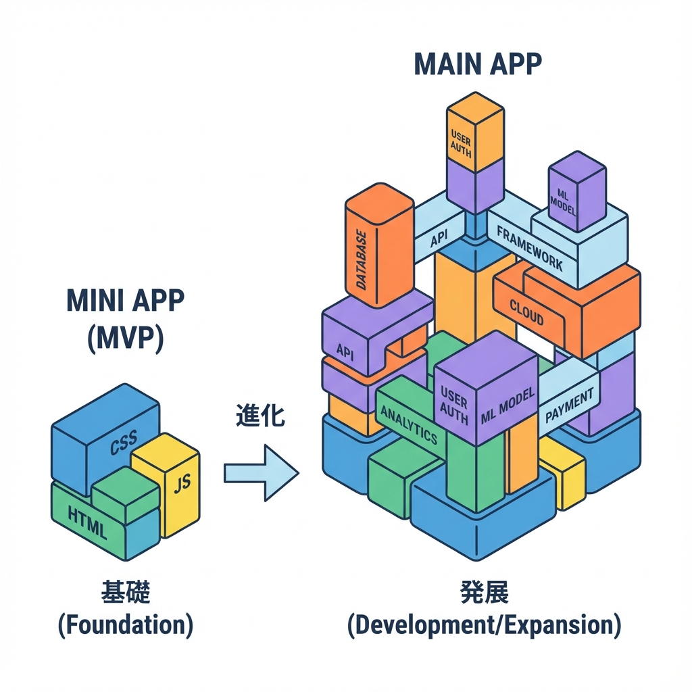
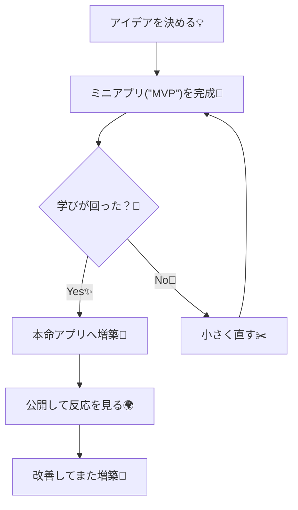

# 第7章：開発のゴール：ミニアプリ→本命アプリへ🏁

この章はね、「Next.jsって結局なに作れるの？」を **“作る順番”として腹落ち**させる回だよ〜！😊💡
いきなり大作に行くと迷子になりがちだから、**小さく作って→育てる** のが勝ち筋です🌱➡️🌳

---

## この章のゴール🎯（できるようになること）

* **ミニアプリ（MVP）** と **本命アプリ（育てる版）** の違いがわかる🧠✨
* 「どこまで作れば完成？」を **自分で決められる** ようになる✅
* 学習が進むロードマップの中で、**何をどの順で足すか** が見える👀🧩

---

## まず結論：ゴールは2段階にするのが最強💪💖

* 🥚 **ミニアプリ（MVP）**：小さく完成させる（短時間で達成感）
* 🐣 **本命アプリ**：ミニアプリをベースに、章が進むたびに増築していく

「完成」って、作り手が決めないと永遠に終わらないの…！😵‍💫
だから **先に“完成ライン”を引く** のがめちゃ大事だよ🖍️✨

---

## ミニアプリ（MVP）ってどこまで？🍙✨

ミニアプリは、**小さいけど“ちゃんとアプリ”** になってる状態が理想だよ😊
目安はこの4点👇

* 🧭 **ページが2〜3個ある**（例：一覧 / 詳細 / おまけ）
* 📥 **データを表示できる**（最初は公開APIでもOK）
* 🎮 **ちょっと操作できる**（検索・絞り込み・並び替え…どれか1つ）
* 🧯 **読み込み中・失敗時の見せ方** が用意されてる（可愛くてOK）

「全部盛り」はしない！🙅‍♀️✨
**“1個だけできることがあるアプリ”** が最強のスタートです🌸

---

## 本命アプリは「ミニアプリに足す」だけ🧩✨

ミニアプリを土台にして、ロードマップの章が進むたびに…

* ➕ データ取得を強くする（キャッシュ感覚も）🧊
* ➕ API（Route Handlers）を足す🚪
* ➕ フォーム（Server Actions）で体験を良くする📨
* ➕ DBで永続化する🗃️
* ➕ 認証を足して守る🔐
* ➕ SEO・画像・テスト・デプロイ…🌍✨

っていう感じで **“レゴみたいに増築”** していくよ🧱🧱🧱

---

## 図解：ミニアプリ → 本命アプリの流れ📈✨（Mermaid）

---

## ミニアプリのおすすめテーマ案💖（迷ったらこれ！）

### ① 学科紹介ミニサイト🌸

* 一覧：学科リスト
* 詳細：学科の説明ページ
* おまけ：キャンパスFAQ

### ② 推し本・映画ログ📚🎬

* 一覧：作品一覧
* 詳細：作品ページ
* 操作：検索（タイトルフィルター）

### ③ カフェメモ☕✨

* 一覧：行きたいカフェ
* 詳細：地図リンク（あとで）
* 操作：エリアで絞り込み

---

## 10分ワーク✍️✨「あなたのミニアプリ、決めよう！」

VSCodeでメモ用に `goal.md` を作って、これを埋めてみてね😊🩷（コピペOK）

* 🧁 ミニアプリの名前：
* 🎯 できること（1行で）：
* 🧭 ページ（2〜3個まで）：

  * `/`：
  * `/detail`：
  * （あれば）`/about`：
* 🎮 操作はこれだけ（1つだけ！）：
* 🏁 「完成」の条件（チェック式）：

  * [ ] ページが動く
  * [ ] データが表示される
  * [ ] 操作が1つできる
  * [ ] 読み込み中/失敗時の表示がある

ポイントは **操作は1つだけ**！😆✨
増やしたくなったら、それは本命アプリ側で足そう〜🧱💖

---

## 3分ふりかえり🫶（自分に聞く質問）

* 今日決めた「完成ライン」、ちゃんと小さい？🍙
* 操作が増えそうなら、どれを“次の章の宿題”に回す？📦
* このミニアプリ、後の章で「DB」「認証」を足せそう？🔐🗃️

---

## この章のチェックリスト✅✨

* [ ] ミニアプリのテーマが1つ決まった💡
* [ ] ページ数は2〜3個に絞った🧭
* [ ] 操作は1つだけにした🎮
* [ ] 「完成」の条件を文章にできた🏁

---

次の章（第8章）以降は、この **“小さく完成→増築”** をずっと使っていくよ〜！😊💖
ミニアプリ案、もし「この3つで迷う😭」みたいなのがあったら、候補を投げてくれたら一緒に“最短で育つやつ”選ぶよ🫶✨
