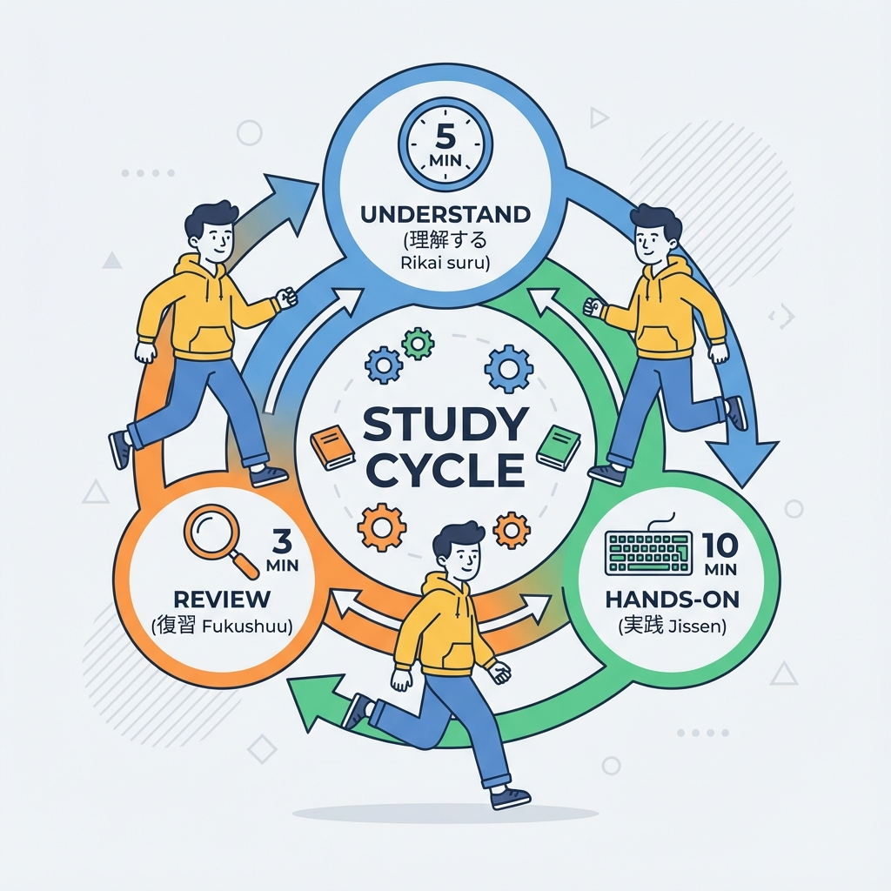
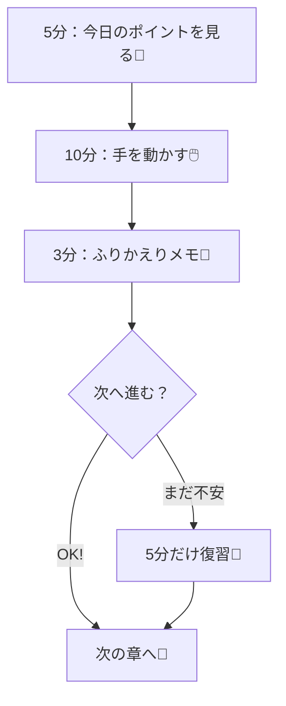
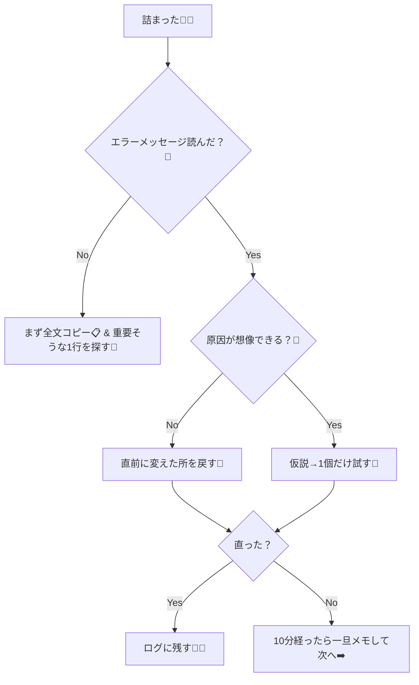

# 第8章：教材の進め方：毎章ちょい達成で気持ちよく進む😆

この章は「勉強のやり方」を先に固定して、**迷わず進める型**を作る回だよ〜🧭✨
Next.jsは情報量が多いから、やり方がフワッとしてると一気に疲れちゃうの…🥺💦
だから **“毎章ちょい達成”** のループを作って、気持ちよく進もうね🌸🎀

---

## 1) 今日のゴール🏁✨

この章が終わったら、これができてればOKだよ✅💕

* 「1章の進め方テンプレ（型）」ができてる🧩
* 「詰まった時の対処フロー」がある🧯
* 「達成チェック（Done条件）」がある✅
* 学習ログ（ミニ日記）が開始できる📓✨

---

## 2) “毎章ちょい達成”ってなに？🍬

**毎章で「小さく終わらせる」**ってことだよ😆✨
大きな成功より、**小さな成功を毎回**の方が続きやすいの🎯💕

### ちょい達成の例👇

* 「ページを1つ増やした」📄➕
* 「エラーの原因を特定できた」🔎✨
* 「フォルダ構成が理解できた」🗂️😊
* 「見た目をちょっと整えた」🎨💕

---

## 3) 1章の進め方テンプレ（これで全部回す）🔁✨



おすすめの型はこれ！
**5分理解 → 10分手を動かす → 3分ふりかえり** ⏱️🌷



### ✅コツ

* 10分で終わらなくてもOK！🙆‍♀️
  でも **“章をまたいで沼る”** のだけは避けたいの🥺
* 「今日はここまでで勝ち！」を毎回作るのが大事🏆✨

---

## 4) Done条件（この章クリア！の基準）✅🎀

毎章、最後にこれだけチェックしよう💕

* [ ] その章のキーワードを1行で言える🗣️
* [ ] コード or 設定で“1つ変化”を起こした🧪
* [ ] 何につまずいたか（or つまずかなかった）をメモした📝
* [ ] 次にやることが1行で書ける➡️

**Done条件があると**「終わっていい」って脳が納得するよ😌💗

---

## 5) 今日の実装（10分）：学習ログとチェックリストを作る📓✅

ここはガチで効くよ〜！続く人はだいたいこれやってる✨

### ① プロジェクト直下に `LEARNING_LOG.md` を作る📝

中身はこれをコピペでOKだよ👇

```md
# 学習ログ✨

## 今日やった章
- 第__章：________

## 今日のちょい達成🏆
- ✅ ________

## つまずきメモ🧯
- ❓ ________
- ✅ 解決：________（分からなければ「未解決」でもOK）

## 次にやること➡️
- ________

## ひとこと（気分）💖
- ________
```

### ② `TODO.md` を作って“章のチェック”を可視化する✅

```md
# 進捗チェック✅

## Module 1
- [ ] 第1章
- [ ] 第2章
- [ ] 第3章
- [ ] 第4章
- [ ] 第5章
- [ ] 第6章
- [x] 第7章
- [ ] 第8章
- [ ] 第9章
- [ ] 第10章
```

ポイント：**チェックが増えるだけで嬉しくなる**よ😆✨（ほんとに）

---

## 6) 詰まった時の“救急フロー”🧯🚑

沼る前に、これで切り上げ判断しよう〜！🥺💦



### ✅沼らないコツ（重要）💡

* **試すのは1回に1個だけ**🧪（同時に変えると原因が消える…）
* **10分で切り上げてもいい**⏱️（次の章でスッと分かること多い！）

---

## 7) “やる気が落ちる日”の最小ムーブ🌧️➡️🌤️

落ちる日は落ちる！人間だもん🥺💗
そんな日はこれだけで勝ちにしよ✨

* ✅ ログだけ書く（1分）📝
* ✅ TODOのチェックを見る（気分上げ）✅
* ✅ コードは触らなくてOK🙆‍♀️
* ✅ 次にやることを1行だけ書く➡️

**ゼロにしない**のが強いよ💪💕

---

## 8) 3分ふりかえり（この章のチェック）🫶✨

最後にこれだけやって終わろ〜🎀

* [ ] 「1章の型（5-10-3）」を採用するって決めた⏱️
* [ ] `LEARNING_LOG.md` を作った📓
* [ ] `TODO.md` を作った✅
* [ ] 詰まったら「10分で一旦メモして次へ」をOKにした🧯

---

## まとめ🎉💖

* **進め方を決めるだけで挫折率が激減**するよ🧭✨
* 毎章「ちょい達成」を作ると続く🍬
* 「Done条件」と「救急フロー」で沼らない🧯✅

---

次は（第9章）「よくある誤解：Next.jsは難しい…じゃなくて機能が多いだけ🫶」に行けるよ〜！😆💞
