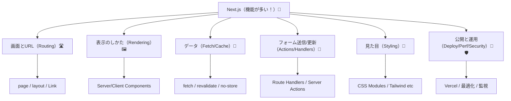
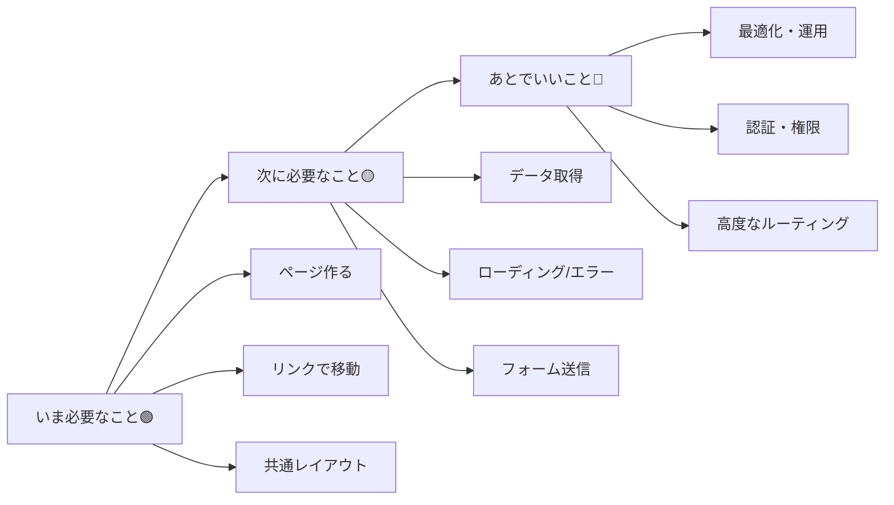

# 第9章：よくある誤解：Next.jsは「難しい」じゃなくて「機能が多い」だけ🫶

ね、Next.jsって最初「うわ…むず…😵‍💫」って見えるんだけど、正体はだいたいコレ👇
**“難易度が高い”というより、“できることが多すぎて一気に見える”** だけなんだよね🧺💡
この章では、そのモヤモヤをほどいて「安心して進める状態」にしちゃうよ〜🌸🫶

---

## この章のゴール🎯✨

* 「難しい…」の理由を**言語化**できる🗣️
* Next.jsの機能を**ジャンル別に仕分け**できる📦
* “今はやらなくていいもの”がわかって、気持ちが軽くなる😮‍💨💕

---

## まず結論：Next.jsが“難しく見える”3つの理由😵‍💫➡️😌

1. **用語が多い**（Route / Layout / Server / Client / Cache…）📚
2. **選択肢が多い**（書き方が1つじゃない）🤹‍♀️
3. **全部入り感**がある（Webアプリの機能がまとまってる）🧰✨

でもこれ、裏を返すと…
**「一歩ずつ使えば、ちゃんと優しい」**ってことなんだよね🫶🌷

---

## Next.jsは“機能のデパート”🏬✨（だから全部見えてビビる）

デパートって広いけど、最初から全部回らないよね？🛍️😆
Next.jsも同じで、**必要な売り場だけ行けばOK**！

### ざっくり売り場マップ🗺️✨（＝機能の分類）

この章で覚えてほしいのは、細かい中身じゃなくて
**「分類できたら勝ち」**って感覚だよ〜📦✨

---

## よくある誤解あるある5連発💥（ぜんぶ安心してOK🙆‍♀️）

### 誤解①「Next.jsってSSRとかサーバーの知識が必須でしょ？😨」

➡️ **必須じゃないよ！**
最初は **“画面とURL（ルーティング）”** だけで普通に進められる🏠🔗

### 誤解②「Server Componentとか、最初から理解しないとダメ？😵」

➡️ **最初は“ふーん、そういうのがあるんだ”でOK**😌🍵
だって最初の目的は「動くものを作る」だからね🏁✨

### 誤解③「全部TypeScriptでガチガチにしないとダメ？🧷」

➡️ **最初は“安全にしてくれる道具”くらいでOK**🫶
厳密さは、慣れてから強化すれば大丈夫💪✨

### 誤解④「Next.jsは新しい書き方が多すぎて覚えられない😫」

➡️ 覚えるんじゃなくて、**使う場面が来たら取り出す**方式でOK📚🎒
“暗記”じゃなくて“道具箱”🧰✨

### 誤解⑤「Next.jsって結局、何から手をつければいいの？🥺」

➡️ いちばん最初はこれだけ👇
**「ページを作る」→「移動する」→「レイアウトを整える」**
この3つだけで、もう楽しい世界が始まるよ🌈😆

---

## “難しい”を“分けて小さく”する魔法✂️✨

Next.jsが怖くなる瞬間って、だいたい
**「全部まとめて理解しようとする時」**なんだよね😵‍💫

そこで、勝ちパターン👇✨
**「いま必要なことだけ」→「次に必要なこと」→「あとでいいこと」**の順！

この教材もこの順で進むから、安心してね🫶🌸

---

## ミニワーク💡「これは今やる？あとでいい？」仕分けゲーム📦🎮

次の項目を、直感でOKだから3つに分けてみてね👇✨

* A：ページを増やす（/about みたいな）📄
* B：ログイン機能🔑
* C：画面移動（リンク）🔗
* D：エラー画面（404など）🚪
* E：DBでデータ保存🗃️
* F：画像最適化🖼️

**おすすめの答え（いまの段階）**🫶

* 🟢いま：A / C / D
* 🟡次：F / E
* 🔵あとで：B

※ログインは強いけど、早すぎると情報量で溺れやすいの🥺🌊

---

## この章のまとめ🌸✨

* Next.jsは「難しい」というより **“機能が多くて、全部見えるから怖い”**だけ😌🫶
* 勝ち方は **分類📦 → 必要なものだけ使う🧰 → 小さく進む✂️**
* 次の章以降は、ちゃんと“必要な順”で出していくから安心してね😊💕

---

次の第10章は、今の考え方をさらに強くする合言葉🔥
**「困ったら“分けて小さく”で勝てる✂️」** を一緒に体にしみこませよ〜😆🫶✨
