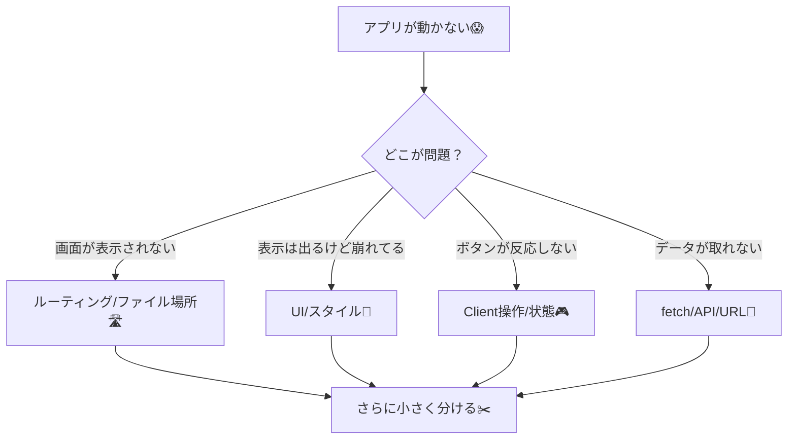
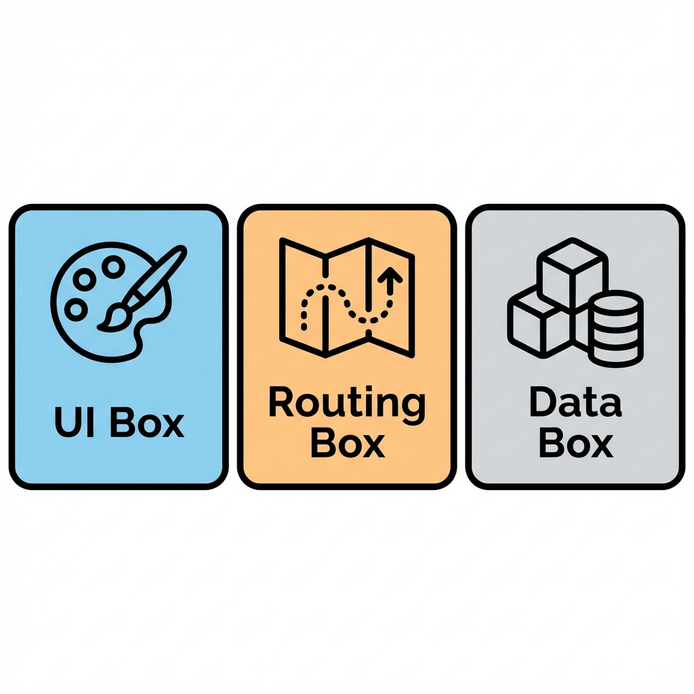
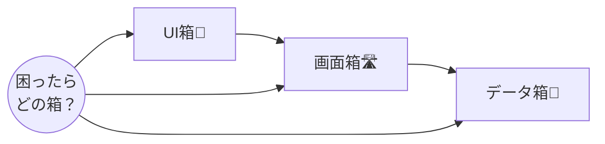

# 第10章：最初の約束：困ったら“分けて小さく”で勝てる✂️

## この章のゴール🎯

* つまづいた時に「何から手を付けるか」が分かる🙂🧭
* 大きい問題を “小さい勝てる問題” に分解できる✂️✨
* Next.js学習が **怖くなくなる**（これ超大事！）💖

---

## まず約束ね🤝💕

困ったら、こう考えるだけでOK👇

✅ **「大きいまま戦わない」** 🙅‍♀️
✅ **「分けて、小さくして、順番に倒す」** ✂️➡️🐣➡️🏆

---

## “分けて小さく”って、どういうこと？🧠✨

たとえば「アプリが動かない😱」って言われても、デカすぎて勝てないよね…🥲
だから “問題のサイズ” を縮めるよ！



ポイントはこれ👇
**「問題を“種類”で分ける」** と、急に落ち着くよ〜☺️🍵

---

## Next.jsで分けると最強な“3つの箱”📦📦📦



悩んだら、まずこの3つに分類してね🫶

1. **UI箱🎨**：見た目（コンポーネント、CSS）
2. **画面箱🛣️**：ページ構成（ルーティング、layout）
3. **データ箱🧊**：取得・保存（fetch、API、DB）



---

## 困った時の“必勝手順”🏆✨（これだけ覚えて！）

### ✅ 手順①：まず「動く最小」を作る🐣

* 画面に **文字が出る** だけでOK🙂
* そこから少しずつ足していく➕✨

### ✅ 手順②：原因を1個にする🎯

* いま触ってる変更を **いったん1つだけ** にする
* 2つ同時に変えると迷子になる🌀🥲

### ✅ 手順③：切り分ける（ON/OFF作戦）🔁

* CSSを一旦外す
* コンポーネントを一旦1個にする
* データ取得を仮の固定データにする
  みたいに、**怪しい要素をOFF** にしていくよ🧯

### ✅ 手順④：小さく再現する🧪

* “この画面だけ” “この部品だけ” で同じ問題が起きる？
* 起きるなら、そこが犯人の近く👀✨

### ✅ 手順⑤：直ったら「戻さない工夫」を1個入れる🧷

* 例：型を付ける / 関数名を分かりやすく / 1行コメント
  ちょいでOK！未来の自分が助かる💖

---

## 10分ミニ実装✍️✨：1ページを「分けて小さく」してみよう

ここでは **“デカいページを分ける”** 練習をするよ✂️😊
（動けば勝ち！キレイさはあとでOK🙆‍♀️）

### 0) 前提：いま `npm run dev` で動いてる状態ね🌈

---

### 1) `app/page.tsx` を「表示だけ」にする🏠✨

`app/page.tsx` をこんな感じにしてね👇

```tsx
// app/page.tsx
import { Title } from "@/components/Title";
import { ProfileCard } from "@/components/ProfileCard";

export default function Home() {
  return (
    <main style={{ padding: 24 }}>
      <Title text="ようこそ Next.js 👋✨" />
      <ProfileCard name="あかり" dept="情報学部" />
    </main>
  );
}
```

---

### 2) 部品を作る（分ける✂️）🧩

`components` フォルダを作って、2つファイル追加してね😊

#### `components/Title.tsx`

```tsx
// components/Title.tsx
type Props = {
  text: string;
};

export function Title({ text }: Props) {
  return <h1 style={{ fontSize: 28, marginBottom: 16 }}>{text}</h1>;
}
```

#### `components/ProfileCard.tsx`

```tsx
// components/ProfileCard.tsx
type Props = {
  name: string;
  dept: string;
};

export function ProfileCard({ name, dept }: Props) {
  return (
    <section
      style={{
        border: "1px solid #ddd",
        borderRadius: 12,
        padding: 16,
        maxWidth: 360,
      }}
    >
      <div style={{ fontSize: 18, fontWeight: 700 }}>{name}さん</div>
      <div style={{ marginTop: 8, opacity: 0.8 }}>{dept}</div>
    </section>
  );
}
```

✅ これで「ページ」「タイトル」「カード」が分かれたね！🎉
つまり、今後バグっても「どこが怪しいか」が一気に絞れる👏✨

---

## つまづき例と“分けて勝つ”リアル例🧯✨

### 例：カードの見た目が崩れた😵‍💫

👉 **UI箱🎨の問題**っぽい！

* `ProfileCard.tsx` だけ見る
* CSS/スタイル部分だけ触る
* ページ側は触らない（巻き込まない）🙅‍♀️

### 例：ページが真っ白になった😱

👉 **画面箱🛣️の問題**の可能性

* `app/page.tsx` の export default がある？
* ファイル名/場所が正しい？
* エラー表示（ターミナル/ブラウザ）を確認👀

### 例：ボタンが反応しない（まだボタン無いけど未来の話）🎮

👉 **Client操作🎮**の可能性

* その部品に `"use client"` が必要な場面かも
* まずは “ボタンだけの超小さい部品” に切って試す🧪

---

## ありがちな負けパターン🙅‍♀️（これ避けるだけで勝率UP）

* いっぺんに5箇所直す💥 → どれで直ったか不明😇
* 公式の難しいページを読み続ける📚 → 目的が消える🫠
* 直らないから全部書き直す🔥 → だいたい悪化する🥲

✅ 代わりに：**分ける✂️ / 1個ずつ / 小さく再現🧪** だよ🫶

---

## 3分ふりかえり📝💖

* 今日いちばん大事だと思った“約束”はどれ？🤝✨
* 自分が困った時、まず「どの箱📦」から疑う？

  * UI🎨 / 画面🛣️ / データ🧊
* 次の章でやるなら、どの分け方をもっと使いたい？✂️😊

---

次は、もし「Next.jsって機能多すぎてムリ😱」ってなっても、**この章のやり方で必ず勝てる**ようになるよ〜！✂️🏆💖
