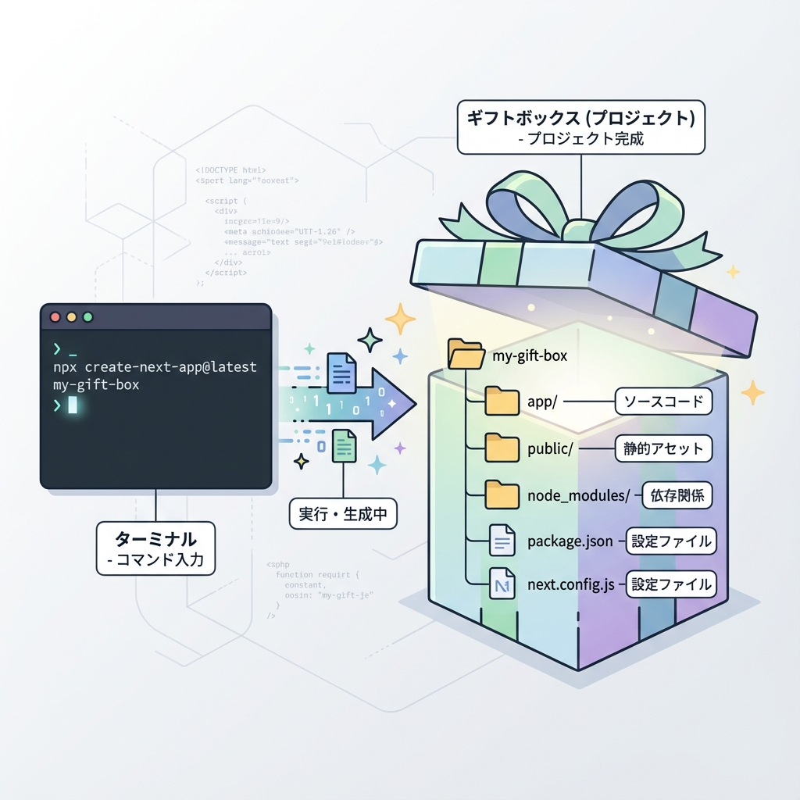
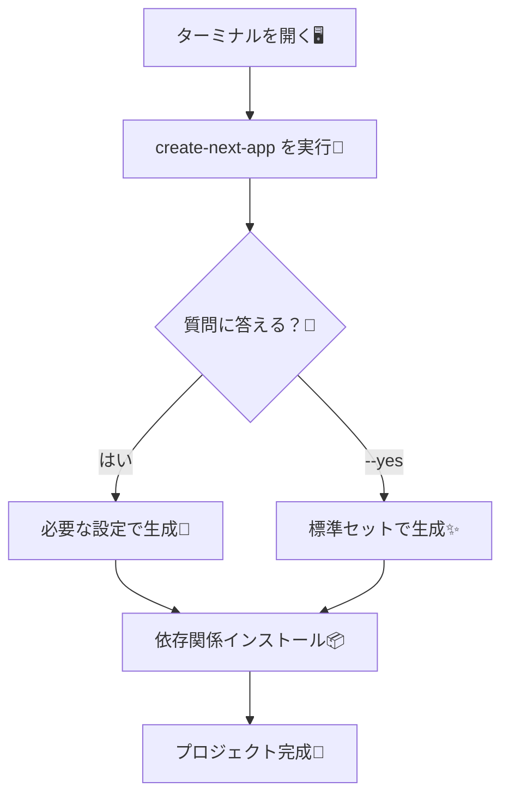

# 第11章：`npx create-next-app@latest` で作る🎉

この章のゴールはこれだよ〜！✨
**Next.js の新規プロジェクトを、コマンド一発で“ひな形”として作れるようになる**こと！💪😊

---

## 1) まずは作業場所を決めよ〜📁✨

例えばこんな感じがおすすめ👇（Windowsだとわかりやすい💕）

* `C:\dev\` の中にプロジェクトを作る

エクスプローラーで `C:\dev` を作っておくと楽ちんだよ〜😆🧁

---

## 2) VS Code でターミナルを開くよ〜🖥️💖

VS Code を開いたら👇

* メニュー → **ターミナル** → **新しいターミナル**

（ショートカット：`Ctrl + @` でもOKなこと多いよ〜⚡）

---

## 3) Node.js のバージョンだけ確認✅🔎

Next.js の作成ツールは **Node.js 20.9 以上**が目安だよ〜🍀
（公式の要件に書いてあるよ）([Next.js][1])

ターミナルで👇

```bash
node -v
```

`v20.9.0` 以上ならOK🙆‍♀️✨
もし古かったら、Node.js を更新してから進もう〜🔁💡

---

## 4) いよいよ作る！🎉✨（基本コマンド）

`C:\dev` に移動してから、プロジェクト作成するよ〜！

```bash
cd C:\dev
npx create-next-app@latest my-app
```

* `my-app` は好きな名前にしてOKだよ〜🫶（例：`campus-notes` とか📒✨）

作るときに「最新版入れていい？🙂」みたいに聞かれたら、だいたい👇でOK！

* `Ok to proceed? (y)` → **y** を押して Enter 🎯

これは `create-next-app` っていう公式CLIが、必要なものを入れてくれてる感じだよ〜🧰✨ ([Next.js][2])

---

## 5) 質問がいっぱい出てきたら？🤔💭

作成中にいくつか質問（TypeScript使う？など）が出ることがあるよ〜！
ここは次の章で丁寧にやるけど、迷ったらいったん「おすすめ寄り」で進めても大丈夫🙆‍♀️🌸

ちなみに **質問をスキップして“だいたい標準セット”で作る**こともできるよ👇

```bash
npx create-next-app@latest my-app --yes
```

この `--yes` は、保存済み設定 or デフォルトで一気に作ってくれるやつで、**TypeScript / Tailwind / ESLint / App Router / Turbopack / import alias `@/*`** が既定で有効になるよ〜🧁✨ ([Next.js][1])

---

## 6) 作れたかチェック👀✅

作成が終わったら、フォルダができてるはず！🎊

```bash
cd my-app
```

そして VS Code でそのフォルダを開くなら👇どっちでもOK！

* エクスプローラーから `my-app` を右クリック → Codeで開く
* もしくは VS Code で「フォルダーを開く」📂✨

---

## 図解：`create-next-app` の流れ（ざっくり）🧠➡️🏗️





---

## よくあるつまずき（この章で潰す🧯）😵‍💫➡️😆

### ✅ 1) `node` が古いって怒られる

→ Node.js を更新したらOK！✨（目安：20.9+）([Next.js][1])

### ✅ 2) `Ok to proceed?` が出て止まった

→ **y** を押して Enter だよ〜🎯

### ✅ 3) 会社/学校Wi-Fiで落ちる（たまにある😭）

→ いったん別回線（スマホテザリング等）で作って、あとで戻すのもアリ📶✨

---

## ミニ練習🎮💗（3分でできる！）

次のどっちかで新規作成してみてね👇

* A案：質問に答えながら作る

  ```bash
  npx create-next-app@latest campus-notes
  ```

* B案：いったん標準セットでサクッと作る

  ```bash
  npx create-next-app@latest campus-notes --yes
  ```

作れたら `C:\dev\campus-notes` が存在してたら勝ち〜🏆🎉

---

## ふりかえり（超だいじ🫶✨）

今日できたことはこれ！✅

* `npx create-next-app@latest` で **Next.js の土台を生成できた**🎉
* `--yes` で **標準セット生成**もできるって知った✨ ([Next.js][1])

ここまでできたら、次章で「質問の意味」をちゃんと理解して、迷わず選べるようにするよ〜😆💕

[1]: https://nextjs.org/docs/app/getting-started/installation?utm_source=chatgpt.com "Getting Started: Installation"
[2]: https://nextjs.org/docs/app/api-reference/cli/create-next-app?utm_source=chatgpt.com "CLI: create-next-app"
