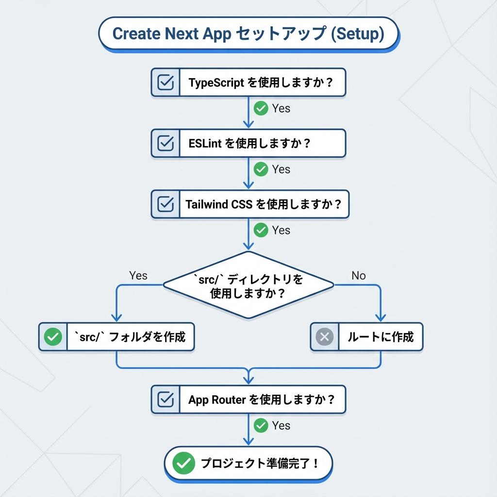
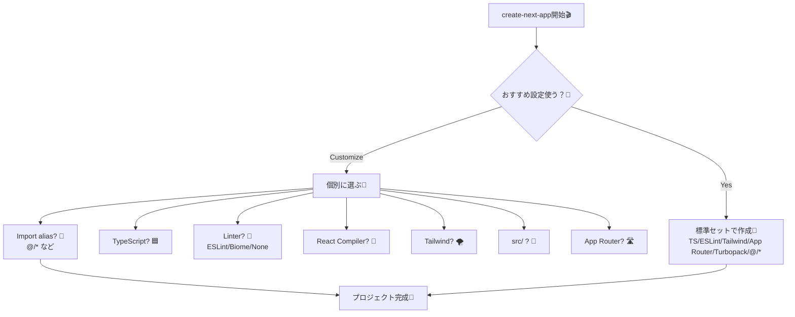

# 第12章：作成時の質問（TS/ESLint/alias）を理解する✅

この章のゴールはね…💡
**`create-next-app` の質問に「意味をわかって」答えられるようになること**だよ〜！😊🎯
（“なんとなくYes” から卒業しよっ👩‍🎓✨）

---

## 0) まず結論：迷ったらこれでOK🥳🌸

作成中に出てくる👇この質問が最重要！

* **Would you like to use the recommended Next.js defaults?**（おすすめ設定にする？）

ここは基本、**Yes（おすすめ設定）**でOK〜！🎉
おすすめ設定には **TypeScript / ESLint / Tailwind / App Router / Turbopack** が含まれるよ〜（公式）([Next.js][1])

---

## 1) どんな質問が出るの？（最新版の並び）🧾✨

公式ドキュメントに載ってる、今の質問セットはこんな感じだよ👇([Next.js][1])

* プロジェクト名は？
* おすすめ設定使う？（Yes / 前回設定 / 自分でカスタム）
* （カスタムを選ぶと）

  * TypeScript 使う？
  * Linter はどれ？（ESLint / Biome / None）
  * React Compiler 使う？
  * Tailwind CSS 使う？
  * `src/` 配下にコード入れる？
  * App Router 使う？（おすすめ）
  * import alias（`@/*`）カスタムする？ → どの名前にする？

---

## 2) 「おすすめ設定」って実際なに？🌟（まずここを理解）

### ✅ Yes（おすすめ）を選ぶと…

**Next.jsが“今っぽい標準セット”を自動でON**にしてくれる感じだよ〜🛠️✨
具体的にはこう👇（公式）([Next.js][1])

* TypeScript ✅
* ESLint ✅
* Tailwind CSS ✅
* App Router ✅
* Turbopack ✅
* import alias：`@/*` ✅

つまり、「最初の土台づくり」を全部おまかせできる！😆💕

---

## 3) カスタムを選んだ時の質問をやさしく解説🧸💬

ここからが本題！✨
それぞれの質問は「プロジェクトの初期ルール決め」だよ〜📌

---

### 3-1) TypeScript 使う？（No / Yes）🟦🧷

**Yes**にすると👇

* `.ts` / `.tsx` が使える
* 型でミスを減らせる
* Next.js的にも “標準寄り” ([Next.js][2])

**No**にすると👇

* `.js` / `.jsx` でスタート
* 後からTSに切り替えることもできる（でも最初からの方が楽なこと多い🙂）

📌 迷ったら：**Yes** が無難〜！✨

---

### 3-2) Linterどれにする？（ESLint / Biome / None）🧹✨

これは「コードのクセやミスを注意してくれる先生👩‍🏫」みたいなやつ！

* **ESLint**：定番。Next.js専用ルールも入る（公式）([Next.js][2])
* **Biome**：速くて、Lint + Format をまとめてやりたい派に人気（公式）([Next.js][2])
* **None**：何も入れない（あとで追加もできる）

📌 迷ったら：**ESLint** が安心だよ〜✅

---

### 3-3) React Compiler 使う？（No / Yes）🧠⚙️

これは「Reactの最適化を、コンパイラが助けてくれる」系のオプションだよ〜！
Next.js 側でも選べるようになってる（質問として出る）([Next.js][1])

* **Yes**：最適化の助けになる可能性✨（でも新しめなので、最初は様子見でもOK）
* **No**：まずは普通に学びやすい👍

📌 迷ったら：**No** でOK〜！（あとで触っても全然いい💖）

---

### 3-4) Tailwind CSS 使う？（No / Yes）🌪️👗

* **Yes**：class名でガンガン見た目を作れる（爆速）⚡
* **No**：普通のCSS（CSS Modulesなど）でやる方向になりやすい

📌 迷ったら：

* 早くそれっぽくしたい → **Yes**
* CSSをゆっくり学びたい → **No**
  （どっちでもOKだよ〜😊）

---

### 3-5) `src/` の中にコード入れる？（No / Yes）📁✨

**Yes**にすると、コードがこうなるイメージ👇

* ルート直下：設定ファイル多め
* `src/`：アプリ本体（`src/app` とか）

公式でも「`src` フォルダは任意」って扱いだよ〜([Next.js][1])

📌 迷ったら：**Yes**（整理しやすい🧺✨）

---

### 3-6) App Router 使う？（No / Yes）🛣️✨

質問でも **(recommended)** って付いてるやつ！([Next.js][1])
いまのNext.jsのメインルートはこっちだよ〜😊

📌 基本：**Yes**！

---

### 3-7) import alias（`@/*`）どうする？🧭✨

これは「相対パス地獄」を避けるための仕組みだよ〜😵‍💫➡️😆

* 例：

  * Before：`../../../components/Button`
  * After：`@/components/Button`

公式でもこの使い方が紹介されてるよ([Next.js][1])

そして質問はこう👇（公式）([Next.js][1])

* `@/*` をカスタムする？
* するなら、どの文字にする？

📌 迷ったら：**デフォルトの `@/*` のままでOK**🙆‍♀️💕

---

## 図解：質問の分岐（これだけ覚えたら勝ち🏆）🗺️✨

---

## ミニ練習（1分）🎮✨：自分の“回答テンプレ”を決めよう

次に作るとき、あなたはどっち派？😆💕

* 🅰️ **おすすめ設定でいく！**（迷わない最強）

  * recommended defaults：**Yes** ✅

* 🅱️ **カスタムでいく！**（意味わかった人向け）

  * TypeScript：Yes
  * Linter：ESLint
  * React Compiler：No（慣れたらYesもアリ）
  * Tailwind：好み
  * src：Yes
  * App Router：Yes
  * import alias：`@/*`（そのまま）

---

## ふりかえり🫶✨

この章でできたのはこれ！✅🎉

* `create-next-app` の質問が「何を決めてるのか」説明できるようになった😊
* 特に **TypeScript / Linter / import alias** が “初期ルール” だって理解できた💡

次に進むと、いよいよ起動して「動いた〜！」をやる流れになるよ〜🚀🌈

[1]: https://nextjs.org/docs/app/getting-started/installation "Getting Started: Installation | Next.js"
[2]: https://nextjs.org/docs/app/api-reference/cli/create-next-app "CLI: create-next-app | Next.js"
