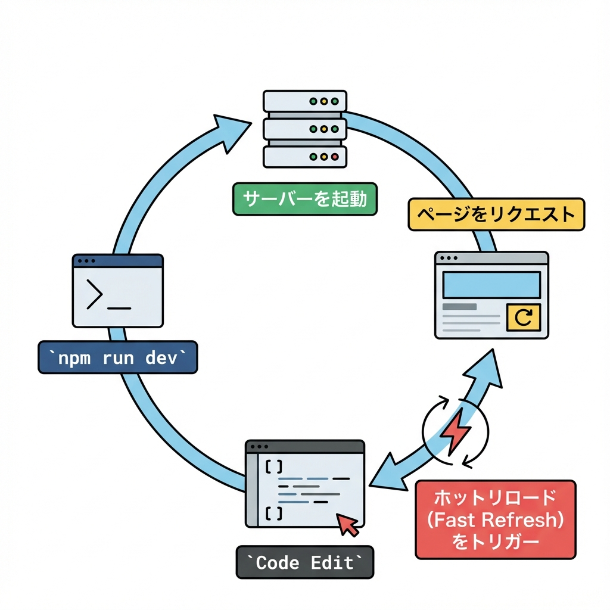
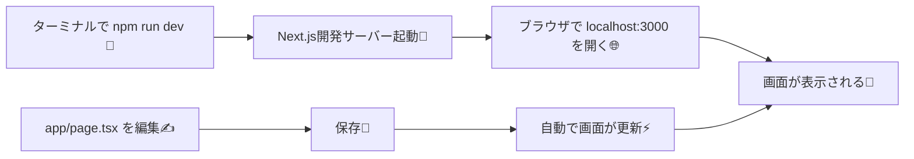

# 第13章：起動してみる：`npm run dev` 🌈

この章は「とにかく動かして、開発サーバーに慣れる回」だよ〜！✨
Next.js を**起動 → ブラウザで確認 → ちょっと編集して反映**まで一気にやろう💪💖

---

## この章のゴール🎯✨

* `npm run dev` で開発サーバーを起動できる🌱
* ブラウザで `http://localhost:3000` を開ける🧭
* ファイルを少し編集して、画面に反映されるのを体験できる⚡🪄
* 止め方（Ctrl + C）もわかる🛑😊

---

## まずは全体の流れをイメージしよ🧠💡（図解）





---

## 5分説明⌛📖（やってることはこれだけ！）

### ✅ `npm run dev` ってなに？🤔

* “開発中用”のサーバーを起動するコマンドだよ🚀
* 画面の変更が**ほぼ即座に反映**される（ホットリロード）⚡✨
* ブラウザで見るためのURLがだいたい `http://localhost:3000` になるよ🏠🌸

### ✅ `localhost` ってなに？🏠

* 自分のPCの中を指す特別な住所みたいなものだよ📍💻
* つまり「自分のPCで動いてるアプリを自分で見てる」状態😊

---

## 10分実装🛠️✨（実際に起動しよう！）

### ① VSCodeでプロジェクトを開く📂💖

* もう作ってあるNext.jsプロジェクトのフォルダをVSCodeで開いてね👀✨
  （例：`my-next-app` みたいなフォルダ）

### ② ターミナルを開く🧑‍💻

* VSCode上部メニューの **「ターミナル」→「新しいターミナル」** を押すよ🎀
  （下に黒い画面が出てきたらOK！）

### ③（念のため）今いる場所を確認📍

```bash
pwd
```

※WindowsのPowerShellだと `pwd` が使えるよ🫶
表示されたパスが **プロジェクトのフォルダ** ならOK🙆‍♀️✨

### ④ 開発サーバー起動！🌈🚀

```bash
npm run dev
```

しばらくすると、ターミナルにこんな雰囲気の表示が出るよ（見た目は多少違ってOK）😊

* `Local: http://localhost:3000` みたいなのが出たら成功🎉🎉🎉

### ⑤ ブラウザで開く🌐💞

ブラウザでここを開くよ👇
`http://localhost:3000`

**Next.js の初期画面**が出たらクリア〜〜！🥳✨

---

## 体験しよう🪄⚡「編集したら変わる」をやってみる！

### ① `app/page.tsx` を開く📄

VSCodeのファイル一覧から👇を探して開くよ
`app/page.tsx`

### ② 文字をちょい変更して保存💾

例えばページ内のどこかの文字を、こういう感じで変えてみてね👇

```tsx
export default function Home() {
  return (
    <main>
      <h1>起動できたー！🎉✨</h1>
    </main>
  );
}
```

保存したら（Ctrl + S）…
ブラウザが**勝手に更新**されて、文字が変わったら大成功！⚡😍

---

## 止め方🛑（これ超大事！）

開発サーバーは「起動しっぱなし」になるから、終わるときは止めるよ💡

* ターミナルをクリック
* **Ctrl + C** を押す（1回で止まらなければもう1回！）

止まったらOK😊🌸

---

## よくあるつまずき集🧯💦（ここ見ればだいたい勝てる！）

### 🌀 1) `localhost:3000` が開けない

* ターミナルに `Local: http://localhost:3000` が出てる？👀
  出てなければ、まず `npm run dev` が動いてないかも💦

### 🌀 2) “3000番ポートが使われてる” っぽいエラー

別のアプリが3000を使ってる時があるよ〜😵‍💫
その場合、Next.jsが「じゃあ3001ね！」って変えて起動してくれることもある✨
ターミナルの `Local:` のURLを見て、そっちを開いてね🧭💖

### 🌀 3) `node_modules` がない系（見つからない）エラー

依存関係が入ってない時はこれでOK👇

```bash
npm install
npm run dev
```

---

## 3分ふりかえり📝💗（チェックできたら合格！）

* [ ] `npm run dev` を実行できた🚀
* [ ] ブラウザで `localhost` を開けた🌐
* [ ] `app/page.tsx` を編集して反映された⚡
* [ ] Ctrl + C で止められた🛑

できたら、もう「開発のスタートライン」は超えたよ〜！🥳🌸✨
