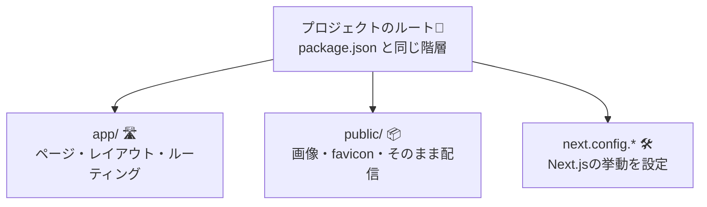

# 第14章：フォルダを観察：`app/` `public/` `next.config.*` 👀

この章は「お家（プロジェクト）の間取り図」を覚える回だよ〜🏠💕
ここが分かると、次から迷子になりにくいっ😆🧭✨ ([Next.js][1])

---

## この章のゴール🎯🌸

* `app/` が「ページ（ルート）を置く場所」って分かる🛣️✨ ([Next.js][1])
* `public/` が「そのまま配信される置き場」って分かる📦🖼️ ([Next.js][2])
* `next.config.*` が「Next.jsの設定ファイル」って雰囲気がつかめる🛠️✨ ([Next.js][3])

---

## 図解：プロジェクトの“よく見る3点セット”🧠✨




---

## 1) `app/` ってなに？🛣️🏠

`app/` は、**URL（ページ）を作る中心地**だよ〜✨
たとえば `app/page.tsx` はトップページ（`/`）担当！って感じ😊 ([Next.js][1])

よく出会うファイル（今は「へぇ〜」でOK）👇

* `app/page.tsx`：ページ本体📄
* `app/layout.tsx`：全体の外枠（共通レイアウト）🧱
* `app/loading.tsx`：読み込み中の表示⏳
* `app/error.tsx`：エラー時の保険🧯

---

## 2) `public/` ってなに？📦🖼️

`public/` は、**中身がそのままWebに置かれる倉庫**だよ〜📦✨
ここに入れたファイルは、基本的に **`/ファイル名`** でアクセスできる！ ([Next.js][2])

たとえば👇

* `public/logo.png` を置く → ブラウザで `http://localhost:3000/logo.png` で見える🖼️✨ ([Next.js][2])

---

## 3) `next.config.*` ってなに？🛠️⚙️

Next.jsの動きをカスタマイズする **設定ファイル**だよ〜！✨
置き場所は **プロジェクトのルート（`package.json` と同じ階層）**。 ([Next.js][3])

よくある名前👇

* `next.config.js`（いちばん基本） ([Next.js][3])
* `next.config.mjs`（ES Modules形式で書きたいとき） ([Next.js 日本語翻訳ドキュメント][4])

※この章では「触らなくてOK」！“存在を知る”だけで勝ち🏆😊

---

## ちょい実験🪄：`public/` のファイルが見えるか確認しよ📄✨

### ① `public/hello.txt` を作る📝

1. VSCodeで `public` フォルダを右クリック
2. 新しいファイル → `hello.txt`
3. 中身にこれを書いて保存👇

```txt
こんにちは！public から配信されてるよ〜🎉
```

### ② ブラウザで開く🌐

開発サーバーが起動中（`npm run dev`）のまま、これを開いてね👇
`http://localhost:3000/hello.txt`

文字が見えたら大成功〜〜！🥳💖 ([Next.js][2])

---

## よくある「迷子ポイント」🧭💦

* 「`public` に置いたのに import しなきゃ？」
  → しなくてOK！**URLでそのまま見える**のが特徴だよ📦✨ ([Next.js][2])

* 「`app` にコンポーネント置いていいの？」
  → 置けるけど、まずは **“ページ＝app”** って覚えるのがラク😊🛣️ ([Next.js][1])

* 「`next.config.*` 見当たらない！」
  → 最初は無いこともあるよ〜！必要になったら作ればOK👌✨ ([Next.js][3])

---

## ふりかえりチェック✅💗

* [ ] `app/` はページ（URL）中心って分かった🛣️
* [ ] `public/` はそのまま配信される倉庫って分かった📦
* [ ] `next.config.*` はルートに置く設定ファイルって分かった🛠️

次の章から「ファイルを見てもビビらない力」が効いてくるよ〜！😆✨

[1]: https://nextjs.org/docs/app/getting-started/project-structure?utm_source=chatgpt.com "Getting Started: Project Structure"
[2]: https://nextjs.org/docs/app/api-reference/file-conventions/public-folder?utm_source=chatgpt.com "File-system conventions: public"
[3]: https://nextjs.org/docs/app/api-reference/config/next-config-js?utm_source=chatgpt.com "Configuration: next.config.js"
[4]: https://nextjs-ja-translation-docs.vercel.app/docs/api-reference/next.config.js/introduction?utm_source=chatgpt.com "next.config.js: はじめに"
