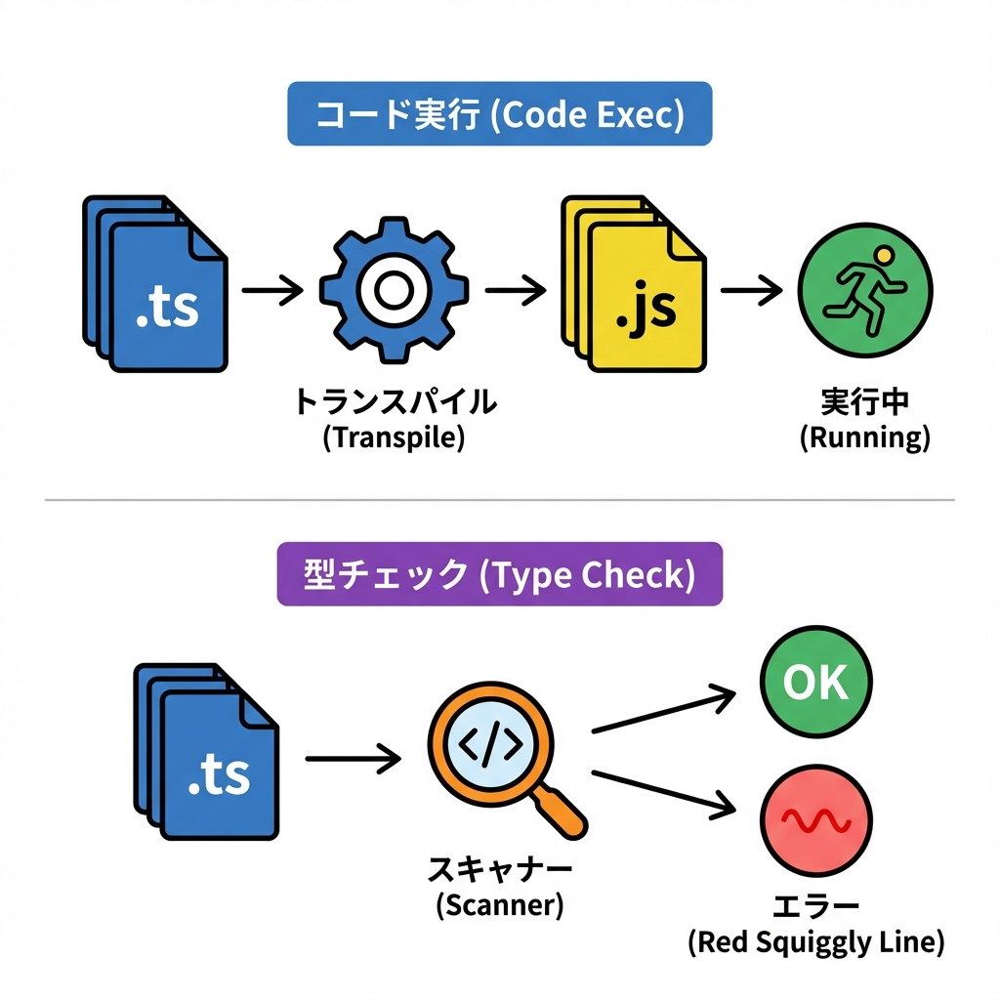
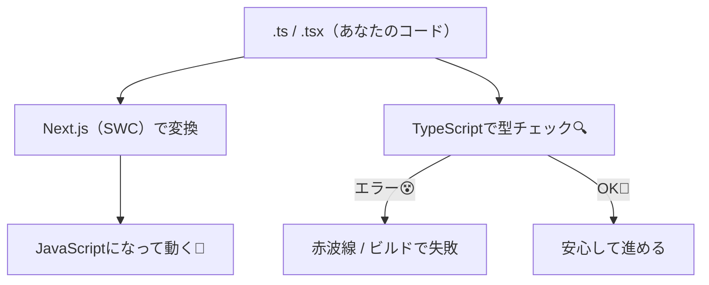

# 第15章：TypeScriptの設定：最初に見るべき `tsconfig.json` 🧩

この章でやること👇

* `tsconfig.json` を「読む」✨（いじりすぎない！）
* Next.jsで **“ここだけ見ればOK”** なポイントを押さえる👀
* VS Codeで型チェックが気持ちよく効く状態にする🛠️

---

## 1) `tsconfig.json` ってなに？🤔📘

`tsconfig.json` は、TypeScriptに対して「このプロジェクト、こういうルールで型チェックしてね！」って伝える設定ファイルだよ🧠✨

Next.js は TypeScript を最初からよしなに扱ってくれて、プロジェクト作成時や、既存プロジェクトで `.ts/.tsx` を使い始めたときに **推奨設定の `tsconfig.json` を自動で用意**してくれるよ🙌
([Next.js][1])

---

## 2) Next.jsの世界での “型チェック” の立ち位置 🧊🧠



Next.jsは「コード変換（実行できるJSにする）」と「型チェック」を分けて考えるのがコツだよ〜🪄
ざっくりイメージ👇



---

## 3) まず “3つの場所” だけ見よう 👀🧩

`tsconfig.json` はだいたいこの3ブロックに分かれてるよ👇

* `compilerOptions`：ルール本体（型チェックの性格）🧠
* `include`：型チェック対象に入れるファイル📂
* `exclude`：型チェック対象から外すファイル🚫

Next.js的に特に大事なのが `include` で、`next-env.d.ts` や `.next/types/**/*.ts` をちゃんと含めるのがポイントだよ✅
（Next.jsが生成する型情報が、ここで読み込まれる！）
([Next.js][1])

---

## 4) “ここだけ見ればOK” な重要オプション7選 🌟🧷

`compilerOptions` の中、全部理解しなくてOK！🥹
最初はこのへんだけ見て「なるほど〜」ってなれば勝ち💪✨

### ① `strict`（厳しさレベル）🎚️

* `true` だと型チェックが厳しくなる（強いけど、最初は大変になりがち）😵‍💫
* `false` だとやさしめ（学習中は助かることも多い）🫶
  ※ここはチーム/教材方針で変わるので、今は “確認” だけでOKだよ👀

### ② `noEmit`（TypeScriptがJSを出すか）🚫

* Next.jsは自分で変換するので、TypeScriptにJS出力させない設計が基本になりやすいよ✨
  （「型チェック専用」にする感じ🧠）

### ③ `jsx`（JSXの扱い）🧩

* Next.jsは `jsx: "preserve"` を使うことが多いよ（変換はNext側でやる）
  うっかり変えると、Nextが戻してくることがある🙃
  ([Stack Overflow][2])

### ④ `plugins: [{ "name": "next" }]`（Next.jsの型サポート）🧩✨

* Next.jsのTypeScriptプラグインで、`"use client"` 周りやルーティング系の型サポートが強くなるよ💪
* `next dev` で自動的に入ったり戻ったりすることもあるよ🌀
  ([Next.js][1])

### ⑤ `moduleResolution` / `module`（importの解決ルール）📦

* ここは “壊すと地獄” になりがち😇
* いったん **触らないのが正解** 🙆‍♀️✨

### ⑥ `baseUrl` / `paths`（パスエイリアス）🗺️

* これは便利だけど、ロードマップだと後の章でしっかりやるやつ💡
* この章では「そういうのもあるんだ〜」でOK😉

### ⑦ `skipLibCheck`（ライブラリ型チェックを省く）🏃‍♀️💨

* `true` だと速くなりやすい✨
* 依存が多いほど効くことがあるよ🧊
  TypeScript公式の `tsconfig` リファレンスで、各項目の意味を確認できるよ📘
  ([typescriptlang.org][3])

---

## 5) VS Code側の設定：これだけやると気持ちいい 💙🛠️

Next.jsのTypeScriptプラグインを効かせるために、VS Codeで **WorkspaceのTypeScript** を使う設定がオススメだよ✅

手順👇

1. `Ctrl + Shift + P`（コマンドパレット）
2. “TypeScript: Select TypeScript Version”
3. “Use Workspace Version” を選ぶ✨

([Next.js][1])

---

## 6) ちょい練習：型エラーを “わざと” 出してみる 🧪😆

1. 例えば `app/type-test.ts` を作って、これを書いてみて👇

```ts
const price: number = "1000";
```

2. 保存すると、VS Codeがだいたい怒るよね😺💢（赤波線）
3. 直してみよ👇

```ts
const price: number = 1000;
```

4. 仕上げにターミナルで型チェックもできるよ🧪
   （Next.jsは `next build` で型エラーがあると失敗する前提だよ）
   ([Next.js][1])

```bash
npx tsc --noEmit
```

---

## 7) もし “設定を分けたい” ってなったら（上級の入口）🚪✨

「普段は厳しく、ビルドだけ少し緩めたい」みたいなときは、Next.jsは **別のtsconfigを使う** 設定もできるよ🧩
`next.config.ts` で `typescript.tsconfigPath` を指定するやつ！
([Next.js][1])

（今は「そんな方法もあるんだ〜」でOKだよ😊）

---

## まとめ：第15章のゴール ✅💖

* `tsconfig.json` は **TypeScriptのルール帳** 📘✨
* 最初は **読むだけ** でOK（触るのは最小限）🫶
* 見る場所は「`compilerOptions` / `include` / `exclude`」の3つ👀
* Next.js特有のポイントは

  * `include` に `next-env.d.ts` や `.next/types/**/*.ts` ✅ ([Next.js][1])
  * `plugins: [{ name: "next" }]` の存在感✨ ([Next.js][1])
  * VS Codeは “Use Workspace Version” が気持ちいい💙 ([Next.js][1])

次の章から、開発がどんどん安定していくよ〜！🎀😊

[1]: https://nextjs.org/docs/app/api-reference/config/typescript "Configuration: TypeScript | Next.js"
[2]: https://stackoverflow.com/questions/79046311/next-js-automatically-resets-tsconfig-json-jsx-option-causing-react-import-wa?utm_source=chatgpt.com "Next.js automatically resets tsconfig.json 'jsx' option ..."
[3]: https://www.typescriptlang.org/tsconfig/?utm_source=chatgpt.com "TSConfig Reference - Docs on every TSConfig option"
