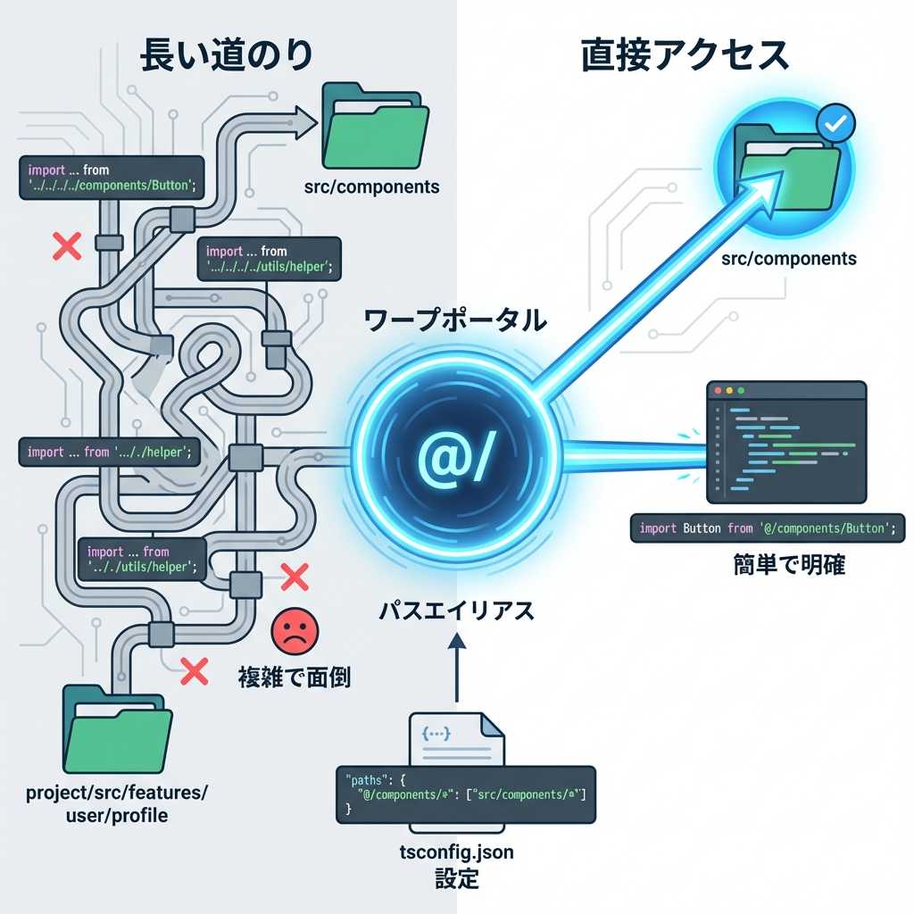
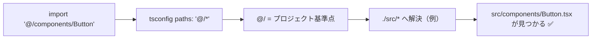

# 第17章：パスエイリアス（`@/`）を使って迷子防止🗺️

この章では、`../../../` みたいな「相対パス地獄」から卒業して、`@/` でスッキリ迷子防止するよ〜！😊🧭💕

---

## 1) なんで `@/` が必要なの？🥺💭

相対パスって、最初はラクなんだけど…

* ファイルが深い場所に行くほど `../../..` が増える😵‍💫
* フォルダ移動すると import が壊れやすい💥
* 「今どこからどこ？」って脳が迷子になる🌀

そこで **`@/`（プロジェクトの基準点）** を使うと、

* どこからでも同じ形で import できる🎉
* 読みやすい・壊れにくい・探しやすい✅

---

## 2) Next.js は `tsconfig.json` の alias を標準対応してるよ🛠️✨

Next.js は `tsconfig.json` / `jsconfig.json` の **`baseUrl` と `paths`** を使ったエイリアスに対応してるよ（自前でwebpack設定しなくてOKなことが多いよ〜！）😌🧡 ([Next.js][1])

さらに、`create-next-app` の推奨デフォルトだと **import alias が `@/*` で最初から入ってる**ことも多いよ✨ ([Next.js][2])

---

## 3) まずは現状チェック👀🗂️

プロジェクト直下の `tsconfig.json` を開いて、ここを探してみてね👇

* `"baseUrl": "."`
* `"paths": { ... }`

もしすでに入ってたら、この章は「使い方を覚える回」になるよ〜☺️🌸

---

## 4) 設定の基本（`tsconfig.json`）🧩✨

よくある形はこの2パターンだよ👇
（プロジェクトに `src/` があるかどうかで変わりがち！）

### A. `src/` ディレクトリを使ってる場合（よくある）📁

```json
{
  "compilerOptions": {
    "baseUrl": ".",
    "paths": {
      "@/*": ["./src/*"]
    }
  }
}
```

### B. `src/` を使ってない場合（直下に `app/` や `components/` がある）📦

```json
{
  "compilerOptions": {
    "baseUrl": ".",
    "paths": {
      "@/*": ["./*"]
    }
  }
}
```

> `paths` は「この import は、ここを見に行ってね」っていう **TypeScriptの解決ルール**だよ〜🔍 ([typescriptlang.org][3])

---

## 5) 使い方：import がこう変わるよ🪄✨

たとえば `components/button.tsx` を読みたいとき👇

### before（相対パス地獄😭）

```tsx
import { Button } from "../../../components/button";
```

### after（スッキリ😍）

```tsx
import { Button } from "@/components/button";
```

Next.jsのドキュメントでも、こういう “before/after” の形で紹介されてるよ🫶 ([Next.js][1])

---

## 6) フォルダ配置のおすすめ（迷子防止セット）🧸📦

こんな感じにしておくと、`@/` がめちゃ効くよ〜✨

```txt
src/
  app/
    page.tsx
  components/
    Button.tsx
  lib/
    formatDate.ts
```

このとき import はこうなる👍💕

```tsx
import { Button } from "@/components/Button";
import { formatDate } from "@/lib/formatDate";
```

---

## 7) 図解：`@/` がどこに繋がってるの？🧠🗺️（Mermaid）





---

## 8) ありがちな詰まりポイント（すぐ直る系）🧯💡

### ✅ 1) VSCodeで補完やジャンプが効かない😢

* だいたいこれで直る：**TypeScriptサーバー再起動**
  VSCodeで `Ctrl + Shift + P` → **TypeScript: Restart TS server** 🔄✨

### ✅ 2) `paths` の `"./"` が抜けてる

* `["src/*"]` じゃなくて、まずは `["./src/*"]` が無難👌✨

### ✅ 3) `src/` を使ってるのに `["./*"]` になってる

* その場合、`@/components/...` が **見つからない**ってなりやすい🥲
  → `["./src/*"]` にする👍

---

## 9) ミニ練習（5分）🏃‍♀️💨✨

### 練習①：`@/components` から import してみよう🧁

1. `src/components/Hello.tsx` を作る
2. 中身はこれでOK👇

```tsx
export function Hello() {
  return <p>こんにちは〜！🌸</p>;
}
```

3. `src/app/page.tsx` でこう読む👇

```tsx
import { Hello } from "@/components/Hello";

export default function Page() {
  return (
    <main>
      <h1>トップだよ〜🎀</h1>
      <Hello />
    </main>
  );
}
```

### 練習②：`@/lib` を作って関数を読む📚✨

* `src/lib/sum.ts`

```ts
export const sum = (a: number, b: number) => a + b;
```

* `page.tsx` で使う

```tsx
import { sum } from "@/lib/sum";

export default function Page() {
  return <p>1 + 2 = {sum(1, 2)} 🎉</p>;
}
```

---

## 10) この章のまとめ📌💖

* `@/` は **相対パス地獄を消す魔法**🪄✨
* 設定は `tsconfig.json` の `"baseUrl"` と `"paths"` がカギ🔑 ([Next.js][1])
* `src/` の有無で `@/*` の向き先が変わるから要チェック👀✅

次の章に進むと、さらに「整ったコード」になって気持ちよくなるよ〜😆🌈

[1]: https://nextjs.org/docs/14/app/building-your-application/configuring/absolute-imports-and-module-aliases?utm_source=chatgpt.com "Configuring: Absolute Imports and Module Path Aliases"
[2]: https://nextjs.org/docs/app/getting-started/installation?utm_source=chatgpt.com "Getting Started: Installation"
[3]: https://www.typescriptlang.org/tsconfig/paths.html?utm_source=chatgpt.com "TSConfig Option: paths"
