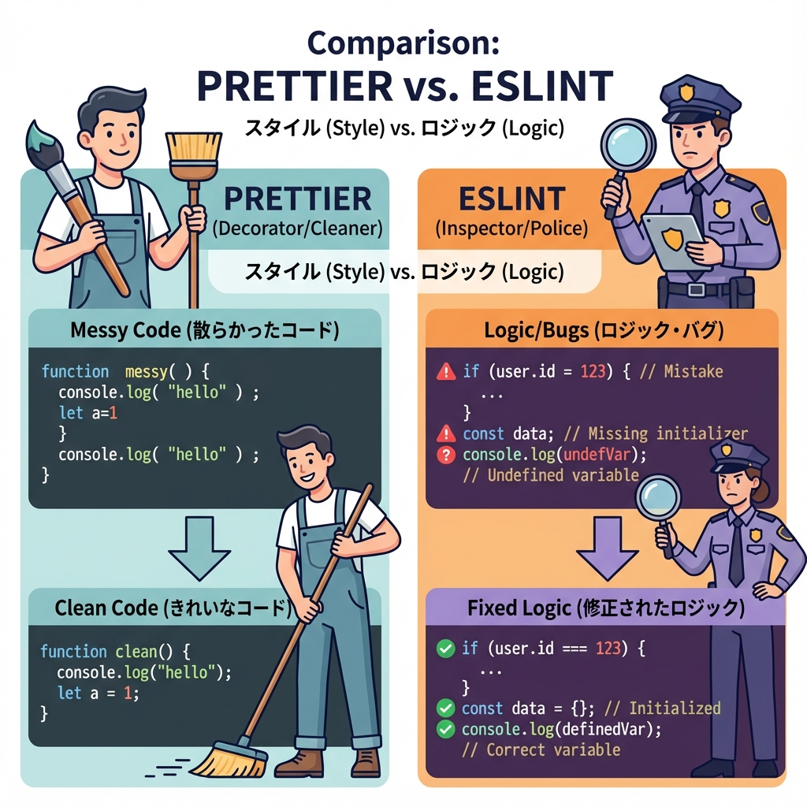
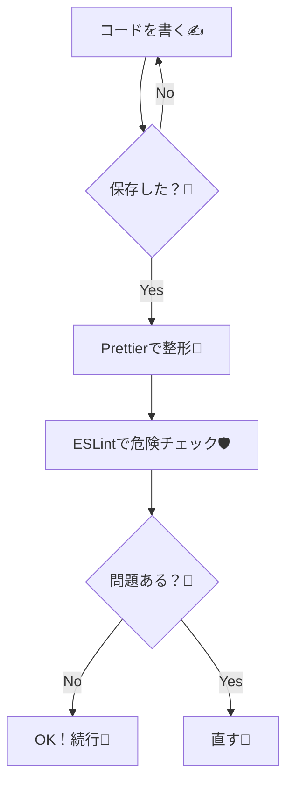

# 第18章：Prettierはどうする？（方針だけ決める）🎀

この章は「Prettierを入れる？入れない？どう回す？」を**先に決めて迷子を防ぐ回**だよ〜😊🧭
（ガチ設定はまだやらなくてOK！方針だけで勝ち🏆✨）

---

## 1) Prettierってなに？🧸💡

Prettierは **コードを自動で整形してくれるフォーマッター**だよ✂️✨

* インデントそろえる
* カンマや改行を整える
* “人の好み”を減らしてケンカをなくす🤣💕

設定は `.prettierrc` などで置けるよ〜📄✨ ([prettier.io][1])

---

## 2) まず決める「3つの方針」✅🎀

ここだけ決めると、後がラクになるよ😊✨

### 方針①：Prettierを入れる？入れない？🤔

* ✅ 入れる：**保存するたびに見た目が整って気持ちいい**😆✨
* ⏸ 入れない：小規模ならESLintだけでも進められる（ただし見た目は揺れやすい）🫠

> Next.js は ESLint の仕組みが標準で整ってるよ（`eslint-config-next`）([Next.js][2])
> ただ、**ESLintは「正しさ」寄り**、Prettierは**「見た目」寄り**って感じに分担するとスムーズ🍱✨

### 方針②：ESLintとぶつけない（ここ大事）⚔️🚫

ESLintにも整形系ルールがあって、Prettierと衝突しがち🥲
そこで **`eslint-config-prettier`** を使って、衝突するルールをOFFにするのが定番だよ🫶✨ ([GitHub][3])

### 方針③：いつ整形する？⏰✨

おすすめはこのどれか👇

* 🌸 いちばん楽：**保存時に自動整形（Format on Save）**
* 🔒 しっかり：**コミット前 / CIで formatチェック**
* 🐣 最初だけ：**手動で format コマンドを時々実行**

---

## 3) 迷ったらこの「初心者に優しい結論」💖😆

この教材では、まずはコレで行くのがラクだよ👇

* ✅ Prettierは入れる🎀
* ✅ ESLintとは `eslint-config-prettier` で衝突回避🧯
* ✅ VSCodeの保存時整形で自動運用🌈

（チーム開発でもだいたいこの方針が多いよ〜！）

---

## 4) 図解：フォーマットとチェックの流れ🗺️✨（Mermaid）





---

## 5) “最小だけ”入れるなら（参考）🧰✨

方針が「入れる」に決まったら、最小はこれだけでOKだよ🙆‍♀️🎀

### ① インストール（PowerShell / ターミナル）🖥️

```bash
npm i -D prettier eslint-config-prettier
```

### ② `.prettierrc.json` を1つ置く📄

（細かく悩まない用・例だよ〜）

```json
{
  "printWidth": 100,
  "semi": true,
  "singleQuote": true,
  "trailingComma": "es5"
}
```

Prettierのオプションは公式にまとまってるよ🧠✨ ([prettier.io][4])

### ③ `.prettierignore` で対象外を作る🧹

```txt
.next
node_modules
```

---

## 6) ESLint設定は「Prettierを最後に足す」だけ意識🧸✨

ESLintと一緒に使うなら、**Prettier関連は最後に置く**のが基本だよ🎀
（衝突ルールを無効化するのが目的だからね）([GitHub][3])

---

## 7) おまけ：Prettier以外の選択肢もあるよ🧃✨

最近は **Biome** みたいに「フォーマット＋リント」をまとめてやるツールもあるよ⚡
移行コマンドも用意されてたりする😳 ([Biome][5])

でもこの章はPrettierの話なので、いったんは「PrettierでOK！」で進めるのが安心だよ〜🫶💕

---

## まとめ🎀✅

* Prettierは「見た目統一」で迷子防止🗺️✨
* ESLintとは衝突しやすいから `eslint-config-prettier` で回避🧯 ([GitHub][3])
* 方針は「入れる＋保存時整形」がいちばんラク🌸😊

[1]: https://prettier.io/docs/configuration?utm_source=chatgpt.com "Configuration File"
[2]: https://nextjs.org/docs/app/api-reference/config/eslint?utm_source=chatgpt.com "Configuration: ESLint"
[3]: https://github.com/prettier/eslint-config-prettier?utm_source=chatgpt.com "prettier/eslint-config-prettier: Turns off all rules that ..."
[4]: https://prettier.io/docs/options?utm_source=chatgpt.com "Options"
[5]: https://biomejs.dev/?utm_source=chatgpt.com "Biome, toolchain of the web"
