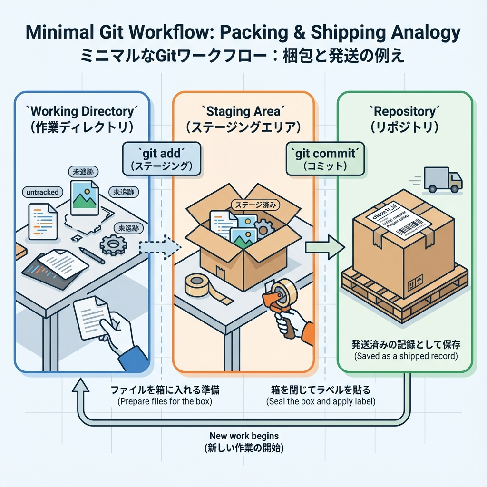
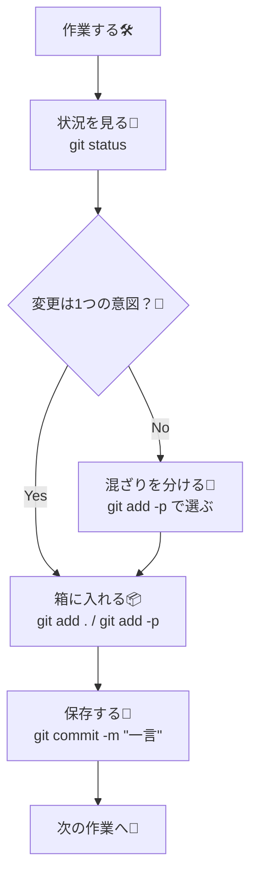

# 第19章：Gitの最小運用：コミット粒度のコツ🧊

この章は「**最低限のGit運用**」で、しかも後から見返して気持ちいい✨コミットを作れるようになる回だよ〜！😆💕

---

## 1) まず結論：コミットは「1つの意図＝1コミット」🧠✅

コミット粒度（どれくらいのまとまりで保存するか）のコツはこれだけ覚えればOK👇✨

* **1コミット = 1つの理由（意図）** 🎯
  例：

  * 「トップページの文言を変更した」📝
  * 「ヘッダーの見た目を整えた」🎨
  * 「不要なコードを整理した」🧹

* **大きすぎるコミットは、未来の自分が泣く**😭
  「全部いっぺんに変えた」コミットは、後で原因調査が地獄になりがち…🔥

* **小さすぎるコミットもやりすぎ注意**🫠
  「スペース1個」みたいなのは流石に分けなくてOK（目安：後で説明できる単位）📌

---

## 2) 最小セット：この3つだけ覚えよ🐣✨

まずはこの3コマンドで勝てるよ〜！💪💕

```bash
git status
git add .
git commit -m "メッセージ"
```

* `git status`：いま何が起きてるか見る👀
* `git add .`：コミットする変更を「箱に入れる」📦（＝ステージング）
* `git commit -m "..."`：箱の中身を「保存」🧊

> 💡 “add したものだけ” がコミットに入るよ！

---

## 3) コミット粒度をうまくする「3つの質問」🧊🔎

コミットする前に、これを自分に聞いてみてね👇😺

1. **いまの変更は「何のため」？** 🎯
2. **この変更だけ戻したくなる可能性ある？** 🔙
3. **説明するなら一言で言える？** 🗣️

✅全部「うん！」なら、そのまとまりでコミットしてOK〜！🎉

---

## 4) “混ぜない”が最強：変更が混ざったら分けて入れる🍱✨

「見た目の変更」と「ロジックの変更」が同じコミットに混ざると、後で追うのが大変😵‍💫
そんなときは **一部だけ add** するのがコツだよ〜！🪄

### ✅ 便利：`git add -p`（変更を選んで箱に入れる）🧺✨

```bash
git add -p
```

* `y`：この変更を入れる✅
* `n`：入れない❌
* `s`：さらに細かく分割✂️
* `q`：やめる🛑

> VSCodeでも「Source Control」からファイル単位・行単位でステージできるよ🖱️✨

---

## 5) コミットメッセージのコツ（短く・具体的に）📝💖

「未来の自分（とチーム）」が読んでわかるのが正義〜！😆

### ✅ いい例✨

* `Update hero text on top page` 🏠
* `Add basic header layout` 🧱
* `Fix button alignment on mobile` 📱

### ❌ ありがち例🥲

* `fix`（何を？😇）
* `update`（どこを？😇）
* `色々修正`（色々ってなに〜！😂）

💡おすすめルール：

* **動詞から始める**（Add / Update / Fix / Remove）✍️
* **1行で言い切る**（長文日記にしない）🧊

---

## 6) 失敗しても大丈夫！よくある事故の直し方🧯✨

### A) 間違って入れたファイルを “コミット前に” 外したい🙅‍♀️

```bash
git restore --staged path/to/file
```

### B) コミットメッセージを “直前だけ” 直したい🪄

```bash
git commit --amend -m "新しいメッセージ"
```

### C) コミット前の変更を取り消したい（戻す）🔙

```bash
git restore path/to/file
```

> ⚠️ `restore` は変更が消えることがあるから、怖い時は先に `git status` で確認してね👀💦

---

## 7) 図解：最小Gitの流れ（これでOK）🧊➡️✅





---

## 8) ミニ練習：コミット粒度を体で覚える💃✨（所要10〜15分）

### ① 文言だけ変えるコミット📝

* `app/page.tsx` の見出し文だけ変更
* コミット：`Update top page headline`

```bash
git status
git add app/page.tsx
git commit -m "Update top page headline"
```

### ② 見た目だけ整えるコミット🎨

* 余白やフォントサイズを少し調整（CSS/クラス名など）
* コミット：`Tweak spacing on top page`

```bash
git add -p
git commit -m "Tweak spacing on top page"
```

### ③ 整理（リファクタ）だけのコミット🧹

* 使ってない変数、重複行を整理
* コミット：`Refactor: cleanup top page`

```bash
git add -p
git commit -m "Refactor: cleanup top page"
```

✅ これで「意図ごとに分かれた3コミット」完成〜！🎉🎉🎉
あとから「見た目だけ戻したい」とかが超ラクになるよ🥹💖

---

## 9) 今日の持ち帰り（ここだけ覚えれば勝ち）🏆✨

* **1コミット = 1つの意図** 🎯
* **混ざったら `git add -p` で分ける** 🍱
* **メッセージは短く具体的に** 📝
* **失敗しても直せる**（`--amend` / `restore`）🧯

次の章から、もっと安心して作業できるようになるよ〜！😆💕
