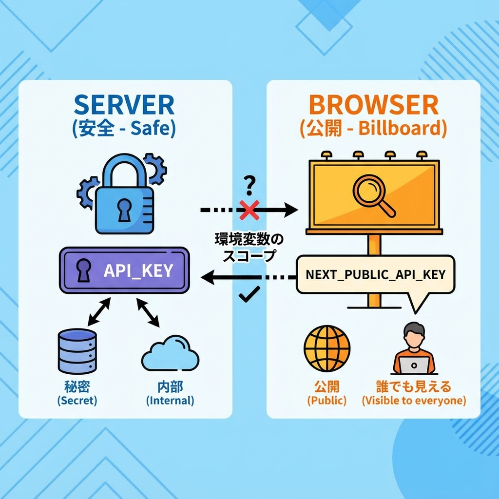
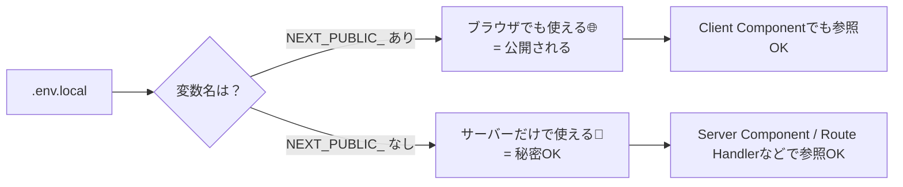

# 第20章：環境変数 `.env.local` の基本🔐

この章は「**秘密の設定をコードから分けて安全に扱う**」ための超大事回だよ〜！😆🌸
APIキーとかURLとか、“そのままコードに書かない”のがポイント🙅‍♀️💥

---

## 1) 環境変数ってなに？ざっくり🧠💡

環境変数は「**設定を外から差し込む仕組み**」だよ✨

* 例：APIのURL、DB接続情報、秘密のキー🔑
* **コードは同じ**でも、**設定だけ変えて**動かせるのが強い💪

---

## 2) `.env.local` は「ローカル専用の秘密ノート」📓🔒

Next.jsではプロジェクトのルートに `.env.local` を置くと、環境変数を読み込めるよ✨

✅ こんな使い分けイメージ👇

* `.env.local`：**自分のPCだけ**の設定（秘密系）🔐
* `.env`：共有してもいい一般設定（あまり使わなくてもOK）📄
* `.env.production`：本番用（デプロイ用）🚀

---

## 3) NEXT_PUBLIC_ の意味（超だいじ）🔓


ここめちゃ大事〜！！😳💦

* **サーバーだけで使う**（秘密OK）

  * `process.env.SECRET_TOKEN` ✅
* **ブラウザでも使う**（公開される！）

  * `process.env.NEXT_PUBLIC_SITE_NAME` ✅

つまり…

* `NEXT_PUBLIC_` が付いた変数は **ブラウザに届く**（＝見える）👀
* だから **秘密は絶対 `NEXT_PUBLIC_` にしない** 🙅‍♀️🔥

---

## 4) 実際に作ってみよう（Windows）🪟✍️

プロジェクト直下（`package.json` がある場所）に **`.env.local`** を作るよ〜！

### ① `.env.local` を作成

VSCodeで新規ファイル → 名前を **`.env.local`** にするだけでOK✨

### ② 中身を書く（例）

```env
# サーバーだけで使う（秘密OK）
SECRET_TOKEN=super_secret_123

# ブラウザでも使う（公開OK）
NEXT_PUBLIC_SITE_NAME=My Cute Next App
```

---

## 5) 使ってみよう：Server Component で表示してみる🏠✨

`app/page.tsx`（トップページ）で試すよ〜！

```tsx
export default function Home() {
  // Server Component（デフォルト）なので、SECRET_TOKENも読めちゃう（でも表示はしないでね💦）
  const siteName = process.env.NEXT_PUBLIC_SITE_NAME ?? "No Name";

  return (
    <main style={{ padding: 24 }}>
      <h1>ようこそ！🎉</h1>
      <p>サイト名：{siteName} 🐣</p>
    </main>
  );
}
```

✅ ブラウザで表示されれば成功〜！😆✨

---

## 6) 変更したら「devサーバー再起動」必要だよ🔁⚡

`.env.local` を編集したのに反映されないときは、だいたいこれ！😂

1. ターミナルで `Ctrl + C`（止める）🛑
2. もう一回起動👇

```bash
npm run dev
```

---

## 7) うっかり事故防止：`.env.local` はGitに入れない🙅‍♀️📦

基本、`.env.local` は **コミットしない** よ！🔐
（秘密が漏れちゃう可能性があるからね…😱）

たいてい `create-next-app` した時点で `.gitignore` に入ってるけど、念のためチェック✅

`.gitignore` にこういうのがあると安心👇

```gitignore
.env*.local
```

---

## 8) 図解：どこで使える？（サーバー vs ブラウザ）🗺️✨



---

## 9) ミニ練習：2つ作って確認しよ🧪💖

### ✅ お題

1. `.env.local` に `NEXT_PUBLIC_FAVORITE_FOOD` を追加🍰
2. `app/page.tsx` で表示してみる
3. ついでに `SECRET_TOKEN` は **表示しない**（ここ大事！）🙅‍♀️

例：

```env
NEXT_PUBLIC_FAVORITE_FOOD=いちごパフェ
```

---

## 10) 今日の持ち帰り（これだけで勝ち）🏆✨

* `.env.local` は **ローカル専用の設定置き場**🔐
* `NEXT_PUBLIC_` が付くと **ブラウザに出る**（公開！）🌐
* `.env.local` 変えたら **`npm run dev` 再起動**🔁
* `.env.local` は **Gitに入れない**🙅‍♀️📦

次の章で、もっと「開発の快適さ」が上がってくよ〜！😆⚡
