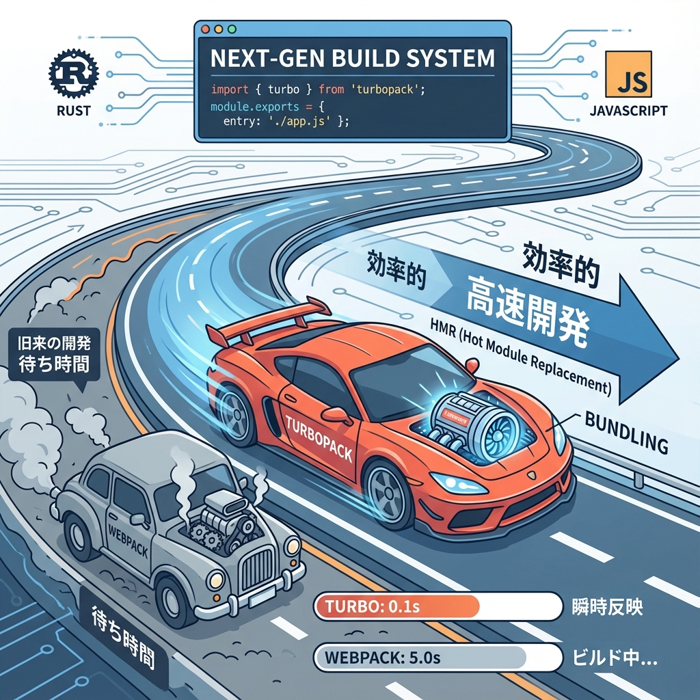
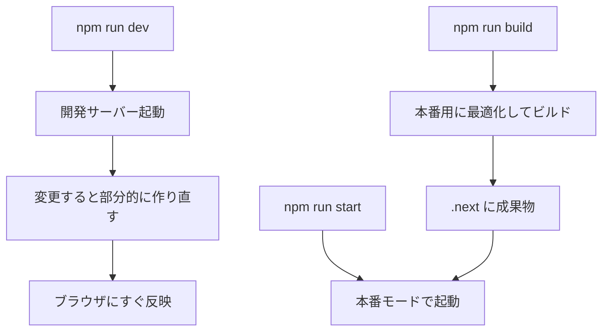

# 第21章：開発中に便利：Turbo/ビルドの雰囲気だけ知る⚡

この章は「細かい仕組みを暗記する」じゃなくて、**開発の空気感**をつかむ回だよ〜😊💡
Next.jsって、ちゃんと“速く動くための裏側”が用意されてるんだな〜って分かると安心する👍✨

---

## この章でつかむこと🎯✨

* **Turbo（= Turbopack）って何者？** ⚡🦀
* **開発（dev）と本番（build/start）って何が違う？** 🧠🔁
* いつも使う3つのコマンドの役割がスッキリする💪🧡

---

## Turboってなに？（正体はTurbopack）⚡🦀



Turboはざっくり言うと、**開発中の“組み立て役（バンドラー）”がめっちゃ速い版**だよ🏎️💨
Next.jsには **Turbopack** という仕組みが入っていて、JavaScript/TypeScriptの開発を速くするために作られてるの✨
今は **Next.jsのデフォルトのバンドラー**になっていて、基本は設定なしで使えるよ🙆‍♀️✨ ([Next.js][1])

> イメージ：
> 🧩 変更したところだけを賢く作り直す → だから体感がサクサク✨

---

## dev / build / start の違い（超だいじ）🧁📦🚀

* `npm run dev`：**開発モード**（編集→すぐ反映、エラーも親切）🛠️✨
* `npm run build`：**本番用に最適化して組み立てる**（チェックも厳しめ）📦🔍
* `npm run start`：**本番モードで起動**（※ build 済みが前提）🚀🏁 ([Next.js][2])

図で見るとこんな感じ👇🎀



---

## 5分ミッション：雰囲気を体験しよ🕔✨

### ① 開発で動かす（いつものやつ）🌈

```bash
npm run dev
```

ブラウザで `http://localhost:3000` を開いて、適当に文字を変えて保存してみてね📝✨
**すぐ画面が変わったらOK！**（これが開発の気持ちよさ💖）

### ② 本番ビルドしてみる（ちょい緊張）📦😳

いったん dev を止めて（ターミナルで `Ctrl + C`）👇

```bash
npm run build
```

ここで出るエラーは、**「本番では危ないかも！」のサイン**になりやすいよ🚨
（開発で動いても、本番ビルドで落ちることは普通にある〜🥺）

### ③ 本番っぽく起動する🚀

```bash
npm run start
```

これで **本番に近い動き**をローカルで確認できるよ👀✨ ([Next.js][3])

---

## もし困ったら（ありがち3つ）🧯💡

### 1) 3000番ポートが埋まってる😵‍💫

別ポートで起動しよ👇

```bash
npm run dev -- -p 3001
```

`-p`（port）はNext.js CLIのオプションだよ🔌✨ ([Next.js][2])

### 2) Turbopackの相性が微妙なとき（たまにある）🌀

一時的に **Webpackに切り替え**できるよ（お助けスイッチ）🛟
`package.json` の scripts をこうする👇

```json
{
  "scripts": {
    "dev": "next dev --webpack",
    "build": "next build --webpack",
    "start": "next start"
  }
}
```

公式に「必要ならWebpackへ切り替えOK」ってなってるよ🙆‍♀️ ([Next.js][1])

### 3) build だけ失敗する😭

まずは落ち着いて、**エラーメッセージの先頭から読む**のがコツ📌
buildは本番チェックが強いから、そこで見つかるのはむしろ良いこと✨（事故防止🛡️）

---

## 今日のまとめ🎀✨

* Turbo = **Turbopack** で、開発が速くなる仕組み⚡ ([Next.js][1])
* `dev` は開発用、`build` は本番用の組み立て、`start` は本番起動🚀 ([Next.js][2])
* 困ったら `-p` でポート変更、相性が悪ければ `--webpack` で避難できる🛟✨ ([Next.js][2])

[1]: https://nextjs.org/docs/app/api-reference/turbopack "API Reference: Turbopack | Next.js"
[2]: https://nextjs.org/docs/app/api-reference/cli/next "CLI: next CLI | Next.js"
[3]: https://nextjs.org/docs/pages/getting-started/deploying "Getting Started: Deploying | Next.js"
