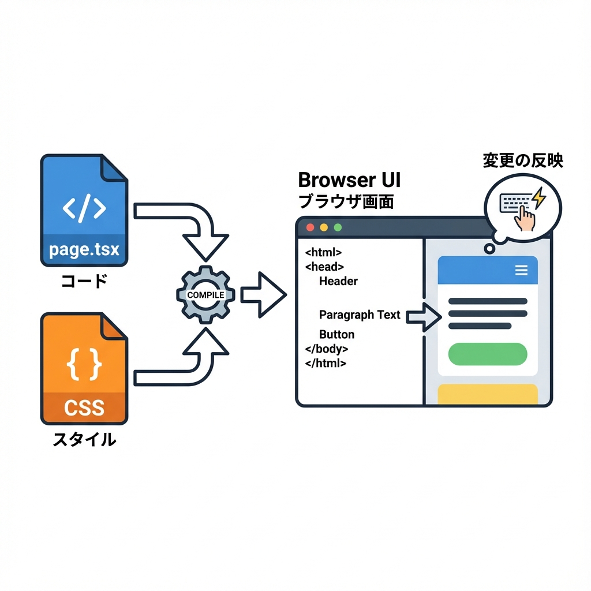
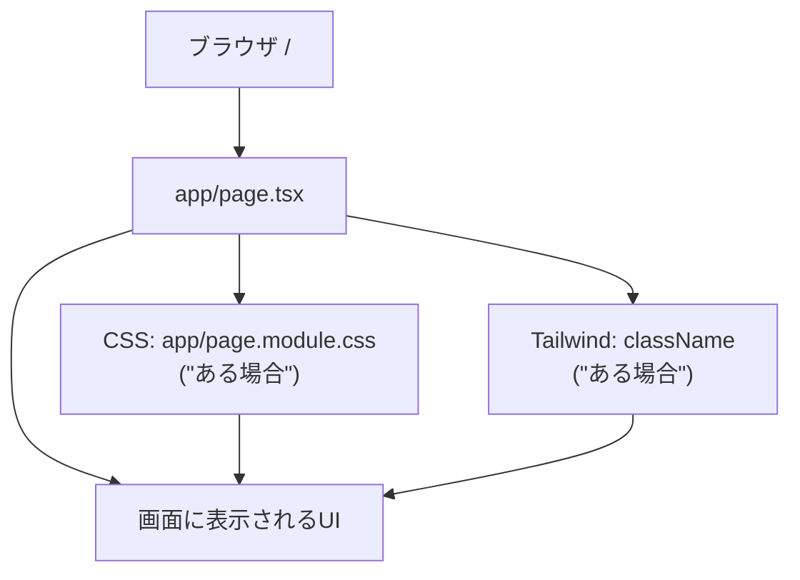

# 第22章：練習：トップページの文言と見た目を軽く変える🎨

この章は「**とりあえず触って変えられた！**」っていう成功体験を作る回だよ〜😊💖
トップページ（`/`）を、**自分の好きな文章＆ちょい可愛い見た目**にしてみよ〜！🌸✨

---

## ゴール🎯💡

* `app/page.tsx` の文章を好きに変えられる📝✨
* ちょっとだけ見た目を整えられる（CSS or Tailwind）💅🌈
* 保存したらブラウザで反映されるのを体験する👀⚡

---

## まずどこを触る？（ファイルの位置）🗂️👀





---

## STEP 0：開発サーバーを起動する🚀

まだ起動してなかったら、プロジェクトのフォルダで👇

```bash
npm run dev
```

ブラウザで👇を開いてね🧸✨
`http://localhost:3000`

---

## STEP 1：`app/page.tsx` の文言を変える📝✨

### 1) VSCodeで開く場所📌

* `app/page.tsx`

そこに書いてある文章（見出しとか説明文）を、こんな感じに変えてみよ〜🌷

> ※テンプレが **CSS Modules型** と **Tailwind型** で違うことがあるから、どっちでもできるように書くね😊

---

### A：CSS Modulesっぽい（`page.module.css` がある）場合🧵

`app/page.tsx` をこんな感じに（近い形でOK！）👇

```tsx
export default function Home() {
  return (
    <main style={{ padding: 24 }}>
      <h1 style={{ fontSize: 36, marginBottom: 8 }}>
        わたしのNext.jsノート📚✨
      </h1>

      <p style={{ fontSize: 16, lineHeight: 1.8, marginBottom: 16 }}>
        ここはトップページだよ〜！今日は文言と見た目をちょこっと変更してみたよ😊🌸
      </p>

      <a
        href="https://nextjs.org"
        target="_blank"
        rel="noreferrer"
        style={{
          display: "inline-block",
          padding: "10px 14px",
          borderRadius: 12,
          border: "1px solid #ddd",
          textDecoration: "none",
        }}
      >
        Next.js公式を見る👀➡️
      </a>
    </main>
  );
}
```

✅ これでまず「文言を変えた！」「見た目ちょい変わった！」が体験できるよ🎉
（この章ではいったん **inline style** でOK！ 次の章でCSSをちゃんとやるから安心してね🫶✨）

---

### B：Tailwindっぽい（`className="..."` が多い）場合🌪️

`app/page.tsx` をこんな感じにしてみてね👇

```tsx
export default function Home() {
  return (
    <main className="min-h-screen p-8">
      <h1 className="text-4xl font-bold mb-2">わたしのNext.jsノート📚✨</h1>

      <p className="text-base leading-7 mb-4">
        ここはトップページだよ〜！今日は文言と見た目をちょこっと変更してみたよ😊🌸
      </p>

      <a
        className="inline-block px-4 py-2 rounded-xl border border-gray-300 hover:bg-gray-50"
        href="https://nextjs.org"
        target="_blank"
        rel="noreferrer"
      >
        Next.js公式を見る👀➡️
      </a>
    </main>
  );
}
```

✅ Tailwindが入ってるなら、これだけでそれっぽくなるよ〜✨💖

---

## STEP 2：保存してブラウザで確認👀⚡

* `Ctrl + S` で保存💾
* ブラウザを見て、見出しや文章が変わってたら成功🎉🎉🎉

---

## よくあるつまづき（すぐ直せる）🧯💡

### 1) 画面が変わらない😵

* ブラウザ更新（`F5`）してみる🔄
* ターミナルにエラーが出てないか見る👀⚠️

### 2) エラーが出た😭

だいたいこれ👇

* `</main>` など閉じタグが足りない
* カンマ`,`やカッコ`}`が抜けてる

VSCodeが赤線で教えてくれるから、その辺りを見ればOKだよ🫶✨

---

## ミニ課題（できたら最高）🌟🎀

次の3つを自分好みに変えてみてね👇

* タイトル（見出し）を好きな名前にする📛✨
* 説明文に「今日やったこと」を1行書く📝😊
* ボタンの文言を変える（例：`スタートする🚀`）🎮💖

---

必要なら、今の `app/page.tsx` をここに貼ってくれたら、**「もっと可愛く整える案」**をこちらで出すよ〜🌸✨
