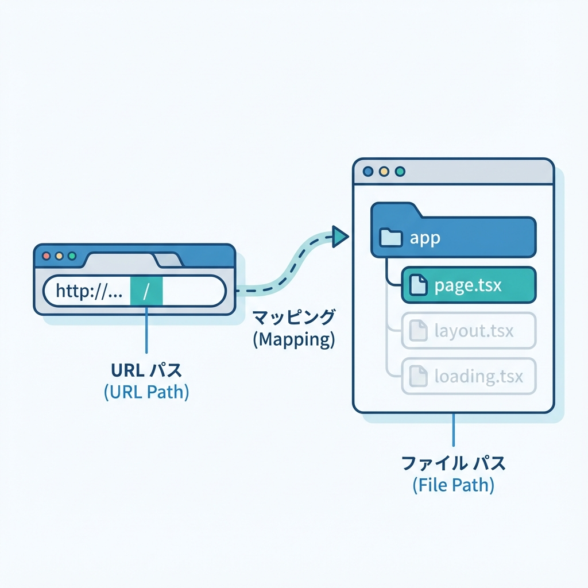
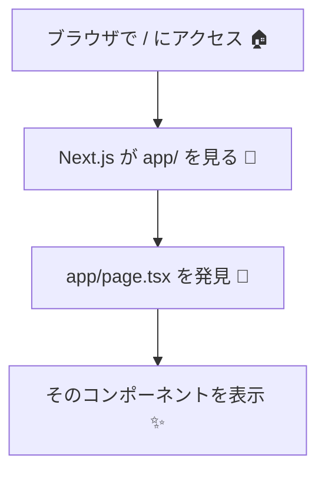

# 第23章：`app/page.tsx` が「/」だよ🏠

この章では、「トップページ（`/`）ってどこで作るの？」をスッキリ理解して、実際に表示を変えられるようになります😊💡

---

## 1) 結論：`app/page.tsx` = トップページ（`/`）🎯

Next.js（App Router）では **フォルダ構成がそのままURL** になります🌈
その中で **`page.tsx` が“そのURLの画面本体”** です！

* `app/page.tsx` → `/`（トップページ）🏠
* `app/about/page.tsx` → `/about`（次の章でやるやつだね📄）

---

## 2) まずはイメージ図で理解しよ〜🗺️✨（Mermaid）





「`/` に行く → `app/page.tsx` を探す → 表示する」って覚えればOKです😆🫶

---

## 3) `app/page.tsx` を開いてみよう👀🧡

VSCodeでプロジェクトを開いたら、だいたいこういう場所にあります👇

* `プロジェクトルート/app/page.tsx`

もし `app` フォルダがあるなら、もうApp Router方式になってます✅✨

---

## 4) 最小の `app/page.tsx` を書いてみよう✍️🌸

いったん、トップページを「自分の言葉」に差し替えてみよ〜！🎀
`app/page.tsx` をこんな感じにして保存します👇

```tsx
export default function Home() {
  return (
    <main style={{ padding: 24 }}>
      <h1>こんにちは！トップページだよ🏠✨</h1>
      <p>この画面は app/page.tsx で作ってるよ〜😊</p>
    </main>
  );
}
```

保存したら、開発サーバーで確認💨

* ターミナルで：`npm run dev` ▶️
* ブラウザで：`http://localhost:3000` 🌐

トップが変わってたら成功！🎉🥳

---

## 5) ちょい理解を深めるコツ🧠🧩

### ✅ `page.tsx` は「そのURLの主役」

`app/page.tsx` はトップページの主役、つまり「画面の中身担当」だよ🎭✨

### ✅ フォルダを増やすとURLが増える

たとえば将来こうなる👇（次の章でやるやつ！）

* `app/about/page.tsx` → `/about` 📄

---

## 6) よくあるミス3つ（ここだけ注意！）⚠️😵‍💫

### ① `pages/` と混ざって迷子になる🌀

App Routerなら基本は `app/` を見ます👀
（`pages/` が残ってると混乱しやすいので、教材の進行では `app/` を主役でOK！）

### ② `app/page.tsx` の場所を間違える

`app/page.tsx` です！
`src/app/page.tsx` になってる人もいるけど、それはプロジェクト作成時の構成次第だよ〜（どっちでもルールは同じ）🧭✨

### ③ 保存したのに変わらない

だいたいこれ👇

* そもそも別ファイルを編集してた😇
* `npm run dev` が止まってた💤
* ブラウザが古い表示を持ってた（更新🔄）

---

## 7) ミニ練習（30秒）⏱️💖

`<h1>` の文言を、あなたの好きな感じに変えてみてね🎀✨
例：

* 「今日もえらい！自分！💪🥰」
* 「Next.js はじめました🌸🧁」
* 「トップページ完成っ🎉✨」

---

## まとめ🎁✨

* **`app/page.tsx` はトップページ（`/`）** 🏠
* **App Routerは“フォルダ＝URL”で覚えると強い** 🗺️
* まずは `app/page.tsx` を編集できれば、Next.jsの第一歩クリアだよ〜！🥳💕

次の章では、外枠を作る `layout.tsx` に進めば「サイトっぽさ」が一気に出ます🧱✨
