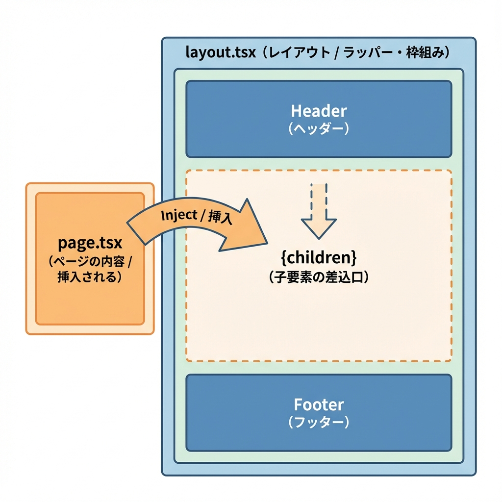
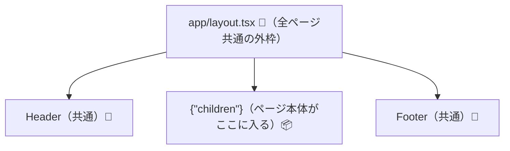
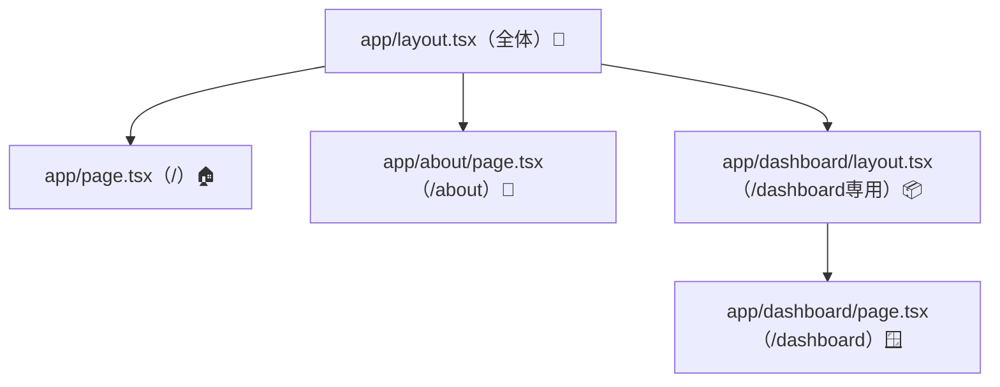

# 第24章：`layout.tsx` が外枠（ヘッダー/フッター）になる🧱

この章では「どのページでも共通で出したいヘッダーとかフッターって、どこに書くの？」をやっていくよ〜😊💖
答えは **`layout.tsx`** ですっ🧱✨（しかも超大事！）

---

## 1) `layout.tsx` ってなに？🧩

`layout.tsx` は、そのフォルダ配下のページを **まとめて包む“外枠”** だよ〜🏠✨
たとえばヘッダー・フッター・ナビとか、「毎回同じでいい部分」をここに置く感じ！🧸🎀

しかも **App Router では root layout（`app/layout.tsx`）が必須**で、`<html>` と `<body>` を書く必要があるよ🫣（書かないとエラーになるやつ…！） ([Next.js][1])

---

## 2) まずは全体の包み方イメージ🧠✨（Mermaid）





`{children}` のところに、各URLの `page.tsx` がスポッて入るイメージだよ〜📦✨

---

## 3) どこを編集する？👀（場所チェック）

だいたいどっちかにあります👇

* `app/layout.tsx`
* `src/app/layout.tsx`

（プロジェクト作成時の構成で変わるよ〜🌸）

---

## 4) `app/layout.tsx` を “ヘッダー＋フッター付き” にしてみよう💅✨

`app/layout.tsx` を開いて、こんな感じにして保存してみてね👇
（見た目はシンプル！でも「外枠ができた感」出るよ〜🥳）

```tsx
export default function RootLayout({
  children,
}: {
  children: React.ReactNode;
}) {
  return (
    <html lang="ja">
      <body style={{ margin: 0, fontFamily: "system-ui, sans-serif" }}>
        <header
          style={{
            padding: "16px 24px",
            borderBottom: "1px solid #ddd",
            position: "sticky",
            top: 0,
            background: "white",
          }}
        >
          <strong>学科ミニサイト🌸</strong>
          <span style={{ marginLeft: 12, color: "#666" }}>
            （ヘッダーは layout.tsx）
          </span>
        </header>

        <main style={{ padding: 24 }}>{children}</main>

        <footer
          style={{
            padding: "16px 24px",
            borderTop: "1px solid #ddd",
            color: "#666",
          }}
        >
          © {new Date().getFullYear()} わたしのNext.js練習帳📚✨
        </footer>
      </body>
    </html>
  );
}
```

ポイントはここっ👇💡

* **`<html>` と `<body>` がある**（root layoutの必須ルール） ([Next.js][1])
* **`{children}` が “ページ本体の差し込み口”** 📦✨

---

## 5) 動作確認しよ〜💨🌈

開発サーバー起動（まだなら）👇

```bash
npm run dev
```

ブラウザで👇
`http://localhost:3000` を開くと…

✅ **ヘッダーとフッターが出てたら勝ち〜！！🎉🥰**

---

## 6) 「layoutが入れ子になる」もチラ見せ👀🧁

`layout.tsx` は、フォルダの中にも作れるよ！
たとえば `app/dashboard/layout.tsx` を作ると、`/dashboard` 配下だけ別の外枠にできるの✨ ([Next.js][2])

イメージ👇



---

## 7) よくあるミス（ここだけ注意だよ〜⚠️🥺）

* **`<html>` と `<body>` を消しちゃった！**
  → root layoutは必須！エラー出たらここ見直し🫠 ([Next.js][3])

* **`{children}` を書き忘れた！**
  → 画面が出なくなる（ページ本体の差し込み口がない）😇

---

## ミニ練習（1分）⏱️💖

ヘッダーのタイトルを、自分の好きな名前に変えてみてね🎀✨
例：

* 「Next.js はじめての外枠づくり🧱🌸」
* 「わたしの学科紹介サイト🎓✨」

---

## まとめ🎁✨

* `layout.tsx` は **共通の外枠（ヘッダー/フッター）** 🧱
* root の `app/layout.tsx` は **必須**で、`<html>` と `<body>` が必要だよ🫶 ([Next.js][1])
* `{children}` が **ページの差し込み口** 📦✨

[1]: https://nextjs.org/docs/app/getting-started/layouts-and-pages?utm_source=chatgpt.com "Getting Started: Layouts and Pages"
[2]: https://nextjs.org/docs/app/api-reference/file-conventions/layout?utm_source=chatgpt.com "File-system conventions: layout.js"
[3]: https://nextjs.org/docs/messages/missing-root-layout-tags?utm_source=chatgpt.com "Missing Root Layout tags"
