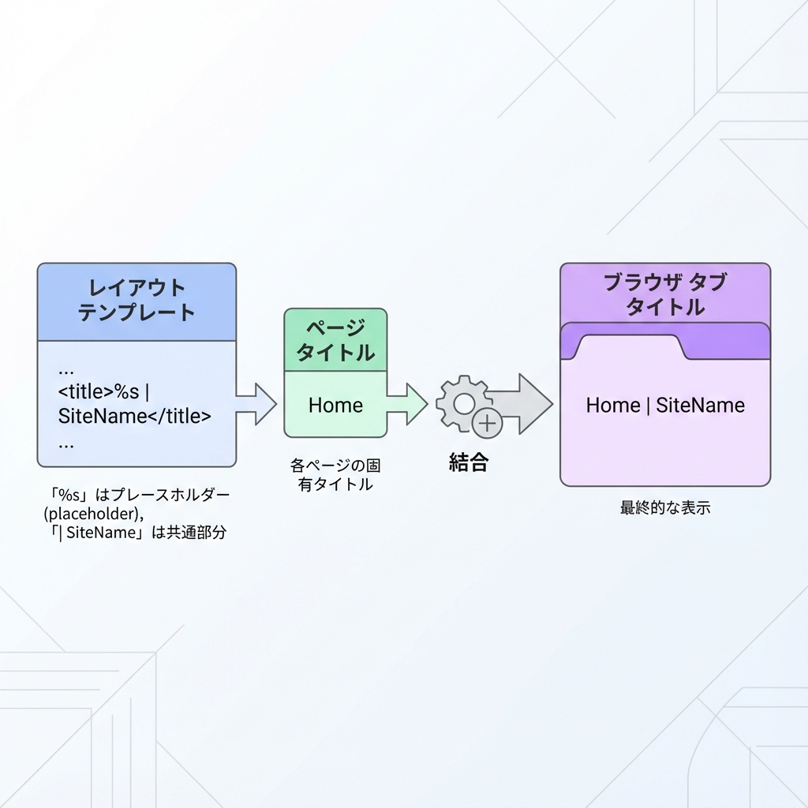
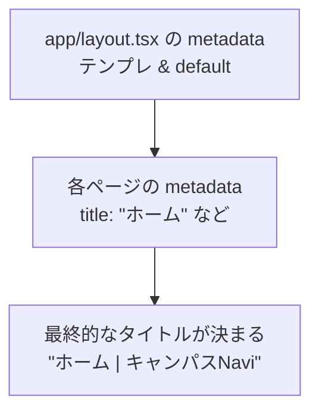

# 第25章：`metadata` でタイトルを付ける（SEOの第一歩）🔎

この章では、Next.js（App Router）で **ページのタイトル（`<title>`）** を付ける方法をやるよ〜😊💖
ブラウザのタブに出るあの文字！あれが整うだけで「それっぽいWeb」感が一気に上がる✨

---

## 1) `metadata` ってなに？🤔🧠

Next.jsの App Router では、`layout.tsx` や `page.tsx` で **`export const metadata`** を書くと、Next.jsが自動で `<head>` の中身（タイトルなど）を作ってくれるよ🪄✨
SEO（検索）にも、SNSでシェアされた時にも効いてくる入口だよ〜🔎📣
（Next.jsの公式機能だよ） ([Next.js][1])

---

## 2) まずは「ページのタイトル」を付けてみよう📛🧁

### ✅ 例：トップページ（`app/page.tsx`）にタイトルを付ける

`app/page.tsx` にこれを追加してみてね👇

```tsx
import type { Metadata } from "next";

export const metadata: Metadata = {
  title: "ホーム",
};

export default function Page() {
  return (
    <main style={{ padding: 24 }}>
      <h1>ホーム</h1>
      <p>ここがトップページだよ〜😊</p>
    </main>
  );
}
```

💡確認ポイント👀✨

* ブラウザのタブが **「ホーム」** になってたら成功🎉
* DevTools（F12）→ Elements → `<head>` を見ると `<title>` が入ってるはず🙆‍♀️

（`metadata` の基本は公式にも載ってるよ） ([Next.js][1])

---

## 3) さらに「サイト共通の型」を作る（おすすめ）🏷️💗

毎ページ「ホーム」「About」とか付けるだけだと、サイト名がなくてちょっと寂しい🥺
そこで、**`app/layout.tsx`** に「タイトルのテンプレ」を置くと最強💪✨

### ✅ `app/layout.tsx` でテンプレ設定

```tsx
import type { Metadata } from "next";

export const metadata: Metadata = {
  title: {
    template: "%s | キャンパスNavi",
    default: "キャンパスNavi",
  },
  description: "学生生活をちょっと便利にするミニサイト🌸",
};

export default function RootLayout({
  children,
}: {
  children: React.ReactNode;
}) {
  return (
    <html lang="ja">
      <body>{children}</body>
    </html>
  );
}
```

### ✅ するとこうなるよ😍✨

* `app/page.tsx` が `title: "ホーム"` → **「ホーム | キャンパスNavi」**
* もしページ側で `title` を書かない → **「キャンパスNavi」**（default）

この “`%s | サイト名`” 形式、めちゃくちゃ定番で便利だよ〜🫶✨
（Next.jsの学習ページでも同じ感じの例があるよ） ([Next.js][2])

---

## 4) タイトルは「どれが勝つ？」を図でイメージ🗺️✨





---

## 5) よくあるハマりポイント集🪤😵‍💫➡️😊

### 🧩 (1) `metadata` はどこに書くの？

* 基本は **`layout.tsx` と `page.tsx`** に書くよ🙆‍♀️ ([Next.js][1])

### 🧩 (2) タイトルが変わらない！

* 保存できてない / サーバー再起動が必要なこともあるよ🔁
* まずは **タブの文字** を見てね👀

### 🧩 (3) 「動的にタイトル変えたい」になったら？

* それは次の段階で **`generateMetadata`** を使うよ✨
  （記事詳細ページで「記事タイトルを入れたい」とか！） ([Next.js][1])

---

## 6) ミニ練習（3分）⏱️🌸

1. `app/layout.tsx` にテンプレ（`"%s | キャンパスNavi"`）を設定✨
2. `app/page.tsx` の `title` を「トップ」に変える🎀
3. タブが **「トップ | キャンパスNavi」** になったらクリア🎉🎉🎉

---

ここまでできたら、もう **“タイトルのあるちゃんとしたサイト”** になってきたよ〜🥰📛✨

[1]: https://nextjs.org/docs/app/api-reference/functions/generate-metadata?utm_source=chatgpt.com "Functions: generateMetadata"
[2]: https://nextjs.org/learn/dashboard-app/adding-metadata?utm_source=chatgpt.com "Adding Metadata - App Router"
