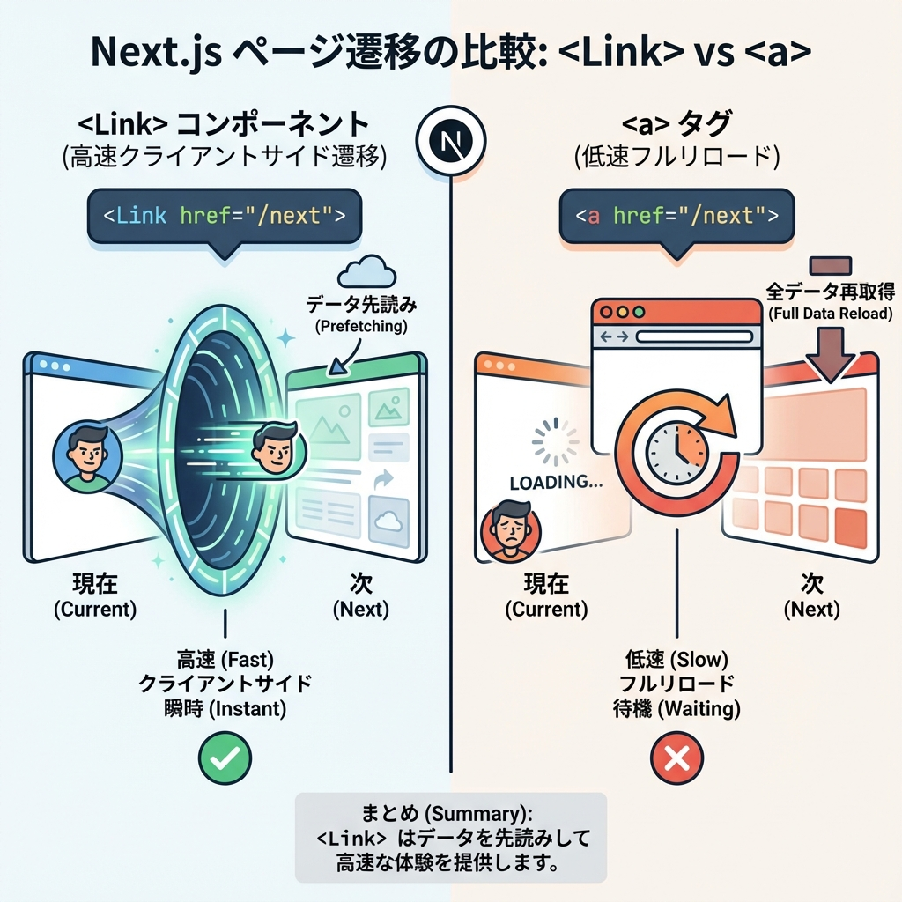
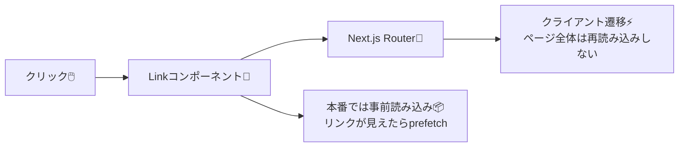

# 第26章：`Link` で画面移動（aタグじゃない理由）🔗

Next.js（App Router）では、ページ移動は基本 **`<Link>`** を使うよ〜😊💗
「`<a href="">` じゃダメなの？」ってなると思うけど、ちゃんと理由があるの〜！💡

---

## 1) なんで `a` タグじゃなくて `Link`？🤔🧠

### ✅ `a` タグで内部ページへ行くと…

* **ページが丸ごと再読み込み**（フルリロード）になりやすい😵‍💫
* 体感がちょっと重くなることもある🐢

### ✅ `Link` を使うと…

* **アプリっぽくサクッと遷移**（クライアント遷移）⚡
* さらに Next.js が **事前に読み込み（prefetch）** してくれて、速く感じやすい✨
  （リンクが画面に入ったら自動でprefetchする、など） ([Next.js][1])

---

## 2) まずは最小の `Link` を書いてみよう🔗🌸

### ✅ トップページにナビを置く（`app/page.tsx`）

```tsx
import Link from "next/link";

export default function Page() {
  return (
    <main style={{ padding: 24 }}>
      <h1>ホーム🏠</h1>

      <nav style={{ display: "flex", gap: 12, marginTop: 12 }}>
        <Link href="/">ホームへ</Link>
        <Link href="/about">Aboutへ</Link>
      </nav>

      <p style={{ marginTop: 16 }}>リンクで移動してみてね😊✨</p>
    </main>
  );
}
```

> `Link` は **内部ページ移動の主役**だよ〜！ ([Next.js][2])

---

## 3) クリック確認用に `/about` を用意（超ミニ）📄✨

リンク先がないと押しても迷子になるから、動作確認だけ用に作っちゃおう😊

### ✅ `app/about/page.tsx` を作る

```tsx
import Link from "next/link";

export default function Page() {
  return (
    <main style={{ padding: 24 }}>
      <h1>About🌷</h1>
      <p>ここはAboutページだよ〜！</p>

      <div style={{ marginTop: 12 }}>
        <Link href="/">← ホームへ戻る</Link>
      </div>
    </main>
  );
}
```

これで `http://localhost:3000/` から **サクサク行き来**できたらOK🎉🎉

---

## 4) 画面移動のイメージ図（ざっくり）🗺️✨





`Link` は「移動する前にちょっと準備しとくね〜💪」ができる感じ✨ ([Next.js][1])

---

## 5) じゃあ `a` タグはいつ使うの？🌍✉️

**外部サイト**に行くときは `a` タグがわかりやすいよ😊
（例：別ドメイン、PDF直リンク、`mailto:` など）

```html
<a href="https://example.com" target="_blank" rel="noreferrer">
  外部サイトへ🌎
</a>
```

内部（自分のアプリの中） → `Link` 🔗
外部（別サイト・別ドメイン） → `a` 🌍
この使い分けでOKだよ〜！ ([Next.js][1])

---

## 6) ミニまとめ✅💖

* 内部のページ移動は **`Link`** が基本🔗
* `Link` は **クライアント遷移**で体感が軽くなりやすい⚡ ([Next.js][3])
* 本番では **prefetch** が働いて速く感じやすい📦✨ ([Next.js][1])

次は「ページを増やす（ルート追加）」がもっと楽しくなるよ〜😊🌸

[1]: https://nextjs.org/docs/app/getting-started/linking-and-navigating?utm_source=chatgpt.com "Getting Started: Linking and Navigating"
[2]: https://nextjs.org/docs/app/api-reference/components/link?utm_source=chatgpt.com "Link Component"
[3]: https://nextjs.org/docs/pages/building-your-application/routing/linking-and-navigating?utm_source=chatgpt.com "Routing: Linking and Navigating - Next.js"
