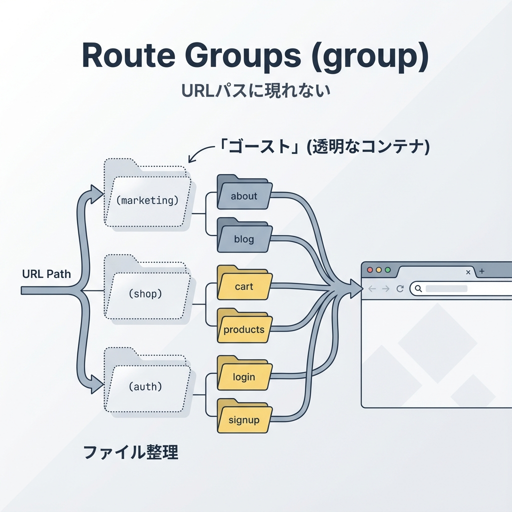
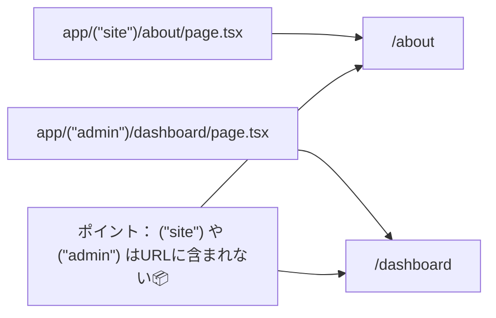
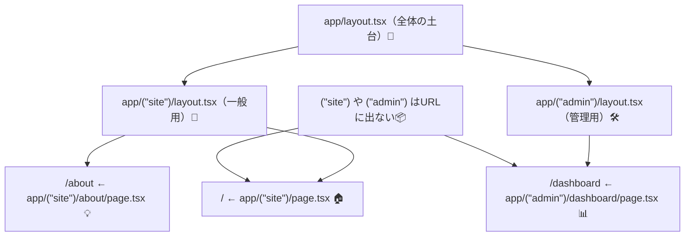

# 第28章：Route Group `(group)` でURLを変えずに整理📦

## 🎯 この章でできるようになること

* フォルダ名を `(site)` みたいに **カッコ付き**にして、URLを変えずに整理できる📁✨
* 「見た目の枠（layout）」を **一部のページだけ**に当てられるようになる🎀
* 「サイト用」「管理画面用」みたいに分けて、迷子になりにくい構成にできる🗺️

---

## 📦 Route Groupってなに？（超ざっくり）

Next.jsのApp Routerでは、ふつう `app/〇〇/` はURLの `/〇〇` になります。
でも、フォルダ名を **`( )` で包む**と、そのフォルダは **URLに出ません**😳✨

* `app/(site)/about/page.tsx` → URLは **`/about`**（`/site/about` にはならない！）
* つまり `(site)` は **整理用ラベル**みたいなもの📛

公式ドキュメントでも「`(folderName)` にするとURLに含めない」って説明されています。 ([Next.js][1])

---

## 🗺️ 図でイメージする：Route GroupはURLに出ない🫥➡️🌐





---

## 🧁 いつ使うの？（使いどころ3つ）✨

### ① ルートを“見た目の役割”で分けたい🎨

* 一般ページ：ヘッダーあり、フッターあり
* 管理画面：サイドバーあり、雰囲気ちがう

### ② 一部のページだけ同じ layout を当てたい🧱

「このページ群だけ共通ヘッダーにしたい！」みたいな時に便利です。 ([Next.js][2])

### ③ フォルダ構成をキレイにして迷子を防ぐ🗂️

`app/` がぐちゃぐちゃになる前に、グループで整頓🧹✨

---

## 🛠️ 実践：`(site)` と `(admin)` で整理してみよう🎮✨

### ✅ 1) フォルダ構成をこうする（例）

「URLはそのまま」で、見た目の枠だけ分ける構成です💡

```txt
app/
  layout.tsx                ← ルートレイアウト（全体の土台）
  (site)/
    layout.tsx              ← 一般サイト用の枠
    page.tsx                ← /（トップ）
    about/
      page.tsx              ← /about
  (admin)/
    layout.tsx              ← 管理画面用の枠
    dashboard/
      page.tsx              ← /dashboard
```

> ✅ `(site)` や `(admin)` って名前は自由だよ〜！
> `(marketing)`, `(auth)`, `(dashboard)` とかもよく使われます📦✨ ([Next.js][1])

---

### ✅ 2) `(site)` 側の `layout.tsx` を作る（ヘッダー付き）💖

`app/(site)/layout.tsx`

```tsx
import Link from "next/link";
import type { ReactNode } from "react";

export default function SiteLayout({ children }: { children: ReactNode }) {
  return (
    <div style={{ maxWidth: 900, margin: "0 auto", padding: 16 }}>
      <header style={{ display: "flex", gap: 12, alignItems: "center" }}>
        <strong>My Campus Site 🎓</strong>
        <nav style={{ display: "flex", gap: 10 }}>
          <Link href="/">Home 🏠</Link>
          <Link href="/about">About 💡</Link>
        </nav>
      </header>

      <main style={{ marginTop: 18 }}>{children}</main>

      <footer style={{ marginTop: 40, opacity: 0.7 }}>
        <small>© 2025 My App ✨</small>
      </footer>
    </div>
  );
}
```

---

### ✅ 3) `(admin)` 側の `layout.tsx` を作る（管理っぽい枠）🧑‍💻🔧

`app/(admin)/layout.tsx`

```tsx
import Link from "next/link";
import type { ReactNode } from "react";

export default function AdminLayout({ children }: { children: ReactNode }) {
  return (
    <div style={{ display: "grid", gridTemplateColumns: "220px 1fr", minHeight: "100vh" }}>
      <aside style={{ padding: 16, borderRight: "1px solid #ddd" }}>
        <strong>Admin Panel 🛠️</strong>
        <nav style={{ marginTop: 12, display: "grid", gap: 8 }}>
          <Link href="/dashboard">Dashboard 📊</Link>
          <Link href="/">← Siteへ戻る 🏠</Link>
        </nav>
      </aside>

      <main style={{ padding: 16 }}>{children}</main>
    </div>
  );
}
```

---

### ✅ 4) ページも用意（最小でOK）🌷

`app/(site)/page.tsx`（`/`）

```tsx
export default function HomePage() {
  return (
    <>
      <h1>Home 🏠✨</h1>
      <p>ここは (site) グループだよ〜！URLは / のまま🎀</p>
    </>
  );
}
```

`app/(site)/about/page.tsx`（`/about`）

```tsx
export default function AboutPage() {
  return (
    <>
      <h1>About 💡</h1>
      <p>(site) に入ってるから、ヘッダー＆フッターが付くよ🍰</p>
    </>
  );
}
```

`app/(admin)/dashboard/page.tsx`（`/dashboard`）

```tsx
export default function DashboardPage() {
  return (
    <>
      <h1>Dashboard 📊</h1>
      <p>(admin) グループなので、管理画面レイアウトになるよ🔧✨</p>
    </>
  );
}
```

---

## 👀 仕上げのイメージ図：layoutが分かれる🌈



---

## 💥 よくあるハマりどころ（ここ大事！）⚠️

* **同じURLになるページを2つ作れない**
  例：`app/(a)/about/page.tsx` と `app/(b)/about/page.tsx` は、どっちも `/about` になって衝突💥
* **`(group)` 自体にはアクセスできない**
  `(site)` は整理ラベルなので、`/site` みたいなURLは生えません🙅‍♀️
* **フォルダ名はカッコ必須**
  `site` じゃなくて `(site)` にするのがポイント📦✨（Windowsでも普通に作れます！）

---

## 📝 ミニ課題（5〜10分）⌛✨

1. `(site)` の中に `contact/page.tsx` を作って `/contact` を表示📮
2. `(admin)` の中に `settings/page.tsx` を作って `/settings` を表示⚙️
3. それぞれの layout にリンクを追加して、行き来できるようにする🔗💕

---

## ✅ まとめ（今日のゴール達成〜！）🎉

* `(group)` を使うと **URLを変えずにフォルダ整理**できる📦✨ ([Next.js][1])
* グループごとに `layout.tsx` を置けば、**一部のページだけ見た目を変える**のも簡単🎀🛠️
* 「サイト」「管理画面」「認証」みたいに分けると、プロジェクトが一気に読みやすくなるよ〜🗺️💖

[1]: https://nextjs.org/docs/app/api-reference/file-conventions/route-groups?utm_source=chatgpt.com "File-system conventions: Route Groups"
[2]: https://nextjs.org/docs/app/getting-started/project-structure?utm_source=chatgpt.com "Getting Started: Project Structure"
