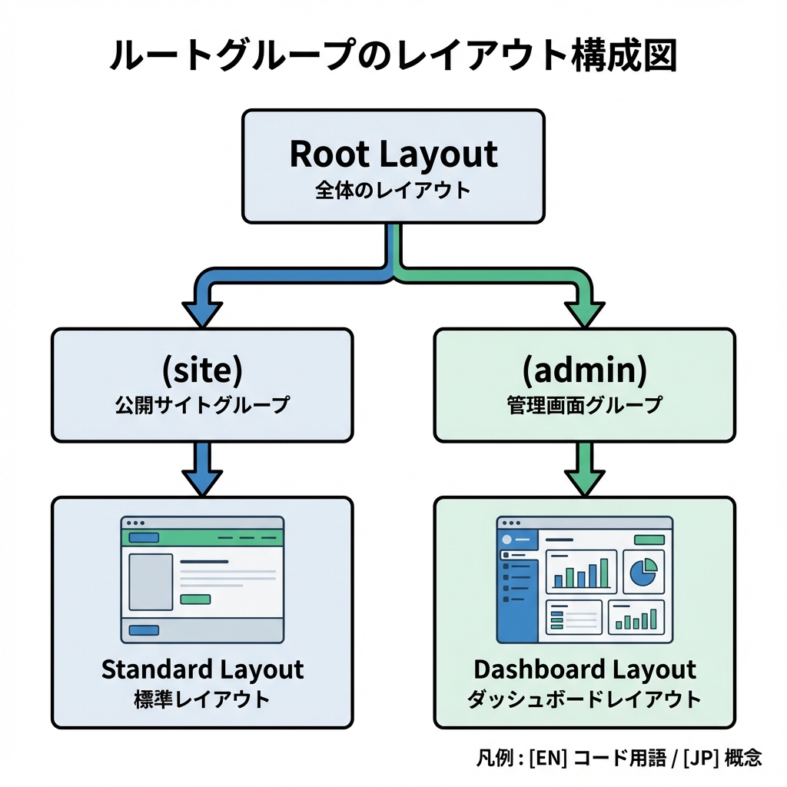
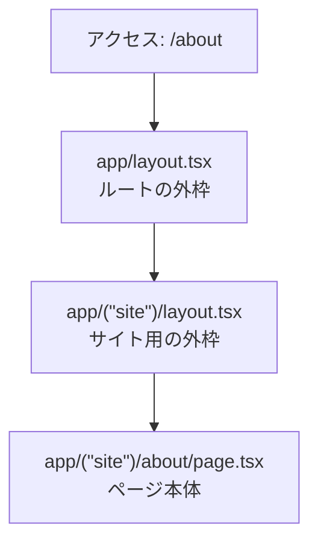
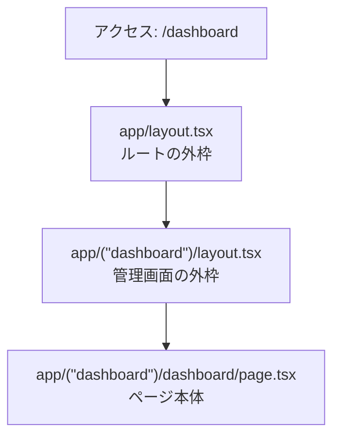
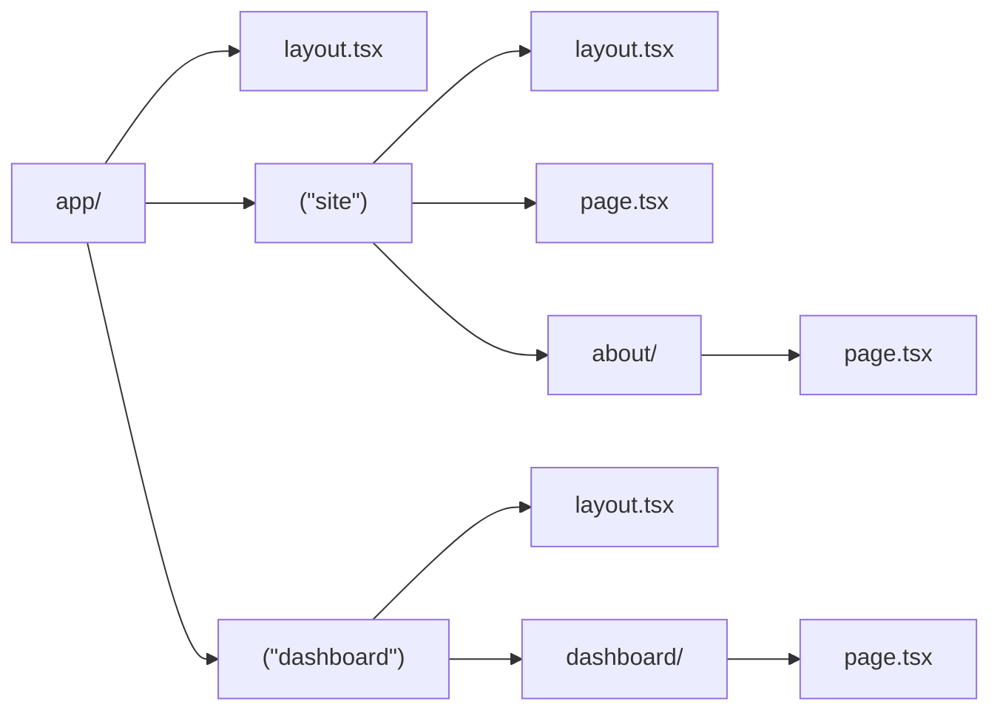

# 第29章：共通UI：`app/(site)/layout.tsx` みたいに分ける🧰

この章では「**同じURL設計のまま**、ページの“外枠UI”だけをグループごとに分ける」やり方をやるよ〜！😊
たとえば…

* 🌸 **一般向けサイト**：ヘッダー＋フッターがある
* 🛠️ **管理画面**：サイドバーがある

みたいに、**見た目の枠（layout）を分離**できるようになるよ✨

---

## 今日できるようになること✅

* Route Group（`(site)`みたいなやつ）で **見た目の枠を分ける** 🧩
* `app/layout.tsx`（全体）＋ `app/(site)/layout.tsx`（サイト用）みたいに **layoutを重ねる** 🧱
* しかも **URLに `(site)` は出ない** 😳✨

---

## まず結論：Route Group は「フォルダ整理＋共通UI分岐」📦💡

`app/(site)/about/page.tsx` を作っても、URLはこうなるよ👇

* `app/(site)/page.tsx` → `/`
* `app/(site)/about/page.tsx` → `/about`

`(site)` は **URLに出ない**（これがRoute Groupの良さ！）😊

---

## 図解：`layout` がどう重なるの？🧱🧠





管理画面も同じで、別グループのlayoutが使われるよ👇



---

## ハンズオン：サイト用と管理画面用で“外枠”を分けよう😆✨

### 1) まずフォルダ構成を作る📁

こんな感じにするよ！（`(site)` と `(dashboard)` がポイント）



> 💡 `(site)` / `(dashboard)` は「グループ名」なので、URLには入りません✨

---

### 2) `app/layout.tsx`（全体の一番外側）を用意する🌍

✅ ここだけは `html` / `body` を書くのが基本だよ（下のレイアウトには書かない！）🙅‍♀️

```tsx
// app/layout.tsx
import type { Metadata } from "next";
import "./globals.css";

export const metadata: Metadata = {
  title: "Layout 分割デモ",
  description: "Route Group と layout の練習",
};

export default function RootLayout({
  children,
}: {
  children: React.ReactNode;
}) {
  return (
    <html lang="ja">
      <body>{children}</body>
    </html>
  );
}
```

---

### 3) サイト用の共通UI：`app/(site)/layout.tsx` 🌸

ヘッダーとフッターをここに置いちゃうよ〜！✨

```tsx
// app/(site)/layout.tsx
import Link from "next/link";

export default function SiteLayout({
  children,
}: {
  children: React.ReactNode;
}) {
  return (
    <div style={{ maxWidth: 900, margin: "0 auto", padding: 16 }}>
      <header
        style={{
          display: "flex",
          gap: 12,
          alignItems: "center",
          padding: "12px 0",
          borderBottom: "1px solid #ddd",
        }}
      >
        <strong>🌸 My Site</strong>
        <nav style={{ display: "flex", gap: 12 }}>
          <Link href="/">Home</Link>
          <Link href="/about">About</Link>
          <Link href="/dashboard">Dashboard</Link>
        </nav>
      </header>

      <main style={{ padding: "16px 0" }}>{children}</main>

      <footer style={{ paddingTop: 12, borderTop: "1px solid #ddd" }}>
        <small>© 2025 My Site ✨</small>
      </footer>
    </div>
  );
}
```

---

### 4) 管理画面用の共通UI：`app/(dashboard)/layout.tsx` 🛠️

管理画面は「サイドバー＋メイン」っぽくしてみるよ😊

```tsx
// app/(dashboard)/layout.tsx
import Link from "next/link";

export default function DashboardLayout({
  children,
}: {
  children: React.ReactNode;
}) {
  return (
    <div style={{ display: "flex", minHeight: "100vh" }}>
      <aside
        style={{
          width: 220,
          padding: 16,
          borderRight: "1px solid #ddd",
          background: "#fafafa",
        }}
      >
        <div style={{ fontWeight: "bold", marginBottom: 12 }}>🛠️ Admin</div>
        <nav style={{ display: "flex", flexDirection: "column", gap: 8 }}>
          <Link href="/dashboard">Dashboard Home</Link>
          <Link href="/">← サイトに戻る</Link>
        </nav>
      </aside>

      <div style={{ flex: 1, padding: 20 }}>
        <header style={{ marginBottom: 16 }}>
          <h2 style={{ margin: 0 }}>管理画面 ✨</h2>
          <p style={{ margin: "6px 0 0", color: "#555" }}>
            ここはサイトとは別レイアウトだよ😊
          </p>
        </header>

        {children}
      </div>
    </div>
  );
}
```

---

### 5) ページを作る📄✨

#### `app/(site)/page.tsx`（/）

```tsx
// app/(site)/page.tsx
export default function HomePage() {
  return (
    <div>
      <h1>ホーム🌸</h1>
      <p>ここは「サイト用レイアウト」が適用されるよ〜😊</p>
    </div>
  );
}
```

#### `app/(site)/about/page.tsx`（/about）

```tsx
// app/(site)/about/page.tsx
export default function AboutPage() {
  return (
    <div>
      <h1>About✨</h1>
      <p>ヘッダーとフッターが共通で出てるはず！🎉</p>
    </div>
  );
}
```

#### `app/(dashboard)/dashboard/page.tsx`（/dashboard）

```tsx
// app/(dashboard)/dashboard/page.tsx
export default function DashboardPage() {
  return (
    <div>
      <h3>ダッシュボード📊</h3>
      <p>サイドバー付きの「管理画面レイアウト」になってるはず！😎</p>
    </div>
  );
}
```

---

## 動作チェック✅（ここ大事！）

開発サーバー起動（もう起動してたらOK）💨

```bash
npm run dev
```

ブラウザで確認👀✨

* `http://localhost:3000/` → 🌸サイトのヘッダー/フッターがある？
* `http://localhost:3000/about` → 🌸同じくサイトの枠？
* `http://localhost:3000/dashboard` → 🛠️サイドバーの管理画面の枠？

---

## よくあるハマりポイント🪤（先に潰そ！）

* ❌ **`(site)` をURLに入れちゃう**
  → `/ (site) /...` にはならないよ！URLは普通に `/about` みたいになるよ😊
* ❌ **`(site)/layout.tsx` に `html`/`body` を書いちゃう**
  → `html`/`body` は基本 `app/layout.tsx` だけでOK🙆‍♀️
* ❌ **`children` を表示し忘れる**
  → `{children}` がないとページ本体が出ないよ〜！😭

---

## ミニ練習🎯（5分でOK！）

1. 🌸サイトのヘッダーに `Contact` を追加して、`/contact` ページを作る
2. 🛠️管理画面のサイドバーに `Settings` を追加して、`/settings` ページを作る
3. どっちも **URLに `(site)` や `(dashboard)` が出てない**のを確認する😆✨

---

ここまでできたら、Next.jsの「レイアウト設計」の超重要ポイントを1個ゲットだよ〜！🎉💖
