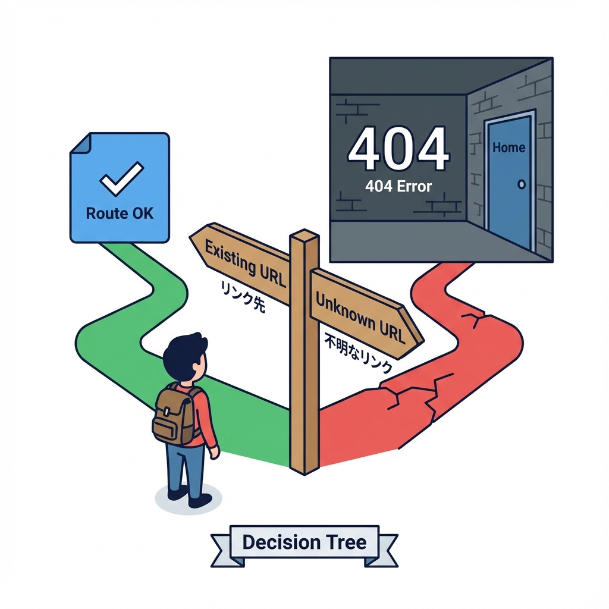
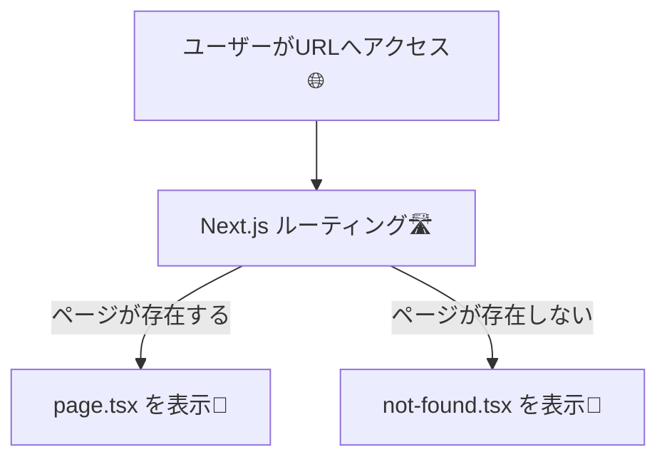
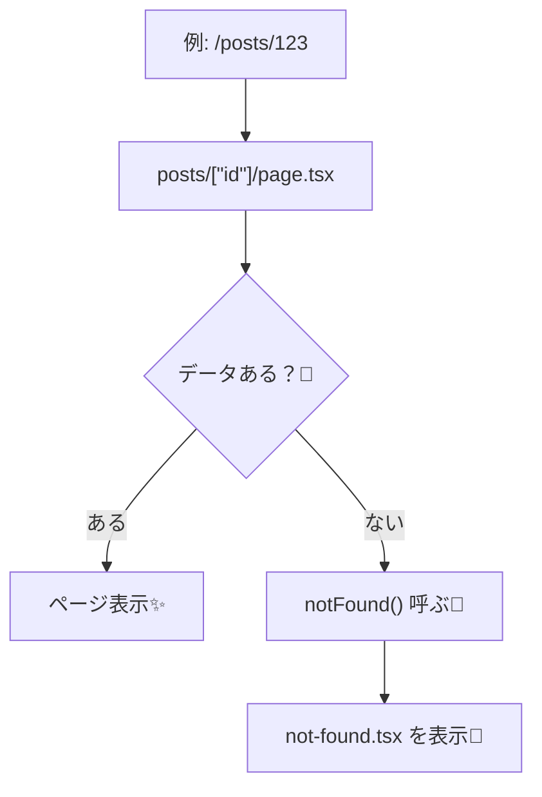

# 第30章：`not-found.tsx` で404を作る🚪

「存在しないページに来ちゃった…😢」って時に、**やさしい案内ページ（404ページ）**を出せるようにする章だよ〜！🫶💖
Next.js（App Router）では **`not-found.tsx` を置くだけ**で基本OK✨ さらに、データが見つからない時に **`notFound()`** を呼ぶと、ちゃんと404にできるよ🚦

---

## 今日できるようになること✅😊

* `app/not-found.tsx` で **サイト全体の404**を作れる🚪
* `notFound()` を使って **「データが無い」時に404へ誘導**できる🔍➡️🚪
* 404ページに **ホームへ戻る導線**を作れる🏠🔗

---

## まずイメージ図🧠✨





「ページはあるけど、**中のデータが無い**」ときも、`notFound()` で404にできるよ👇



---

## 1) まずは「全体404」：`app/not-found.tsx` を作ろう🚪🌸

### 📁 置き場所

* `app/not-found.tsx`

### ✅ 最小の404ページ（おすすめの基本形）

```tsx
// app/not-found.tsx
import Link from "next/link";

export default function NotFound() {
  return (
    <main style={{ maxWidth: 720, margin: "40px auto", padding: 16 }}>
      <h1 style={{ fontSize: 28, marginBottom: 8 }}>404 🚪😢</h1>
      <p style={{ marginBottom: 16 }}>
        ごめんね…そのページは見つからなかったよ🥲💦
      </p>

      <div style={{ display: "flex", gap: 12, alignItems: "center" }}>
        <Link
          href="/"
          style={{
            display: "inline-block",
            padding: "10px 14px",
            border: "1px solid #ddd",
            borderRadius: 10,
            textDecoration: "none",
          }}
        >
          🏠 ホームへ戻る
        </Link>

        <span style={{ color: "#666" }}>迷子になったらホームが安全だよ〜🫶</span>
      </div>
    </main>
  );
}
```

### 動作チェック👀✨

* 存在しないURLへ行く：`http://localhost:3000/aaaa`
* この `not-found.tsx` が出たら成功🎉💖

---

## 2) 「データが無い」時に404へ：`notFound()` を使おう🔍🚪

たとえば「記事IDで詳細を見る」ページで、IDが存在しないなら
**“それっぽいエラー”じゃなくて、ちゃんと404**にしてあげたほうが親切だよね🫶✨

### 📁 例：`app/posts/[id]/page.tsx` を作る

```tsx
// app/posts/[id]/page.tsx
import { notFound } from "next/navigation";

type Props = {
  params: Promise<{ id: string }>;
};

const FAKE_POSTS: Record<string, { title: string; body: string }> = {
  "1": { title: "はじめての投稿✨", body: "Next.js楽しい〜！😆" },
  "2": { title: "ルーティング最高🛣️", body: "ページが増やしやすい！🎉" },
};

export default async function PostPage({ params }: Props) {
  const { id } = await params;
  const post = FAKE_POSTS[id];

  // ✅ 見つからないなら 404 にする
  if (!post) notFound();

  return (
    <main style={{ maxWidth: 720, margin: "40px auto", padding: 16 }}>
      <h1 style={{ fontSize: 26 }}>{post.title}</h1>
      <p style={{ marginTop: 12 }}>{post.body}</p>
    </main>
  );
}
```

### 動作チェック👀✨

* `http://localhost:3000/posts/1` → 表示される🎉
* `http://localhost:3000/posts/999` → 404（not-found）が表示される🚪😢

> ポイント💡：`notFound()` は **主にサーバー側（Server Component/Route Handlerなど）**で使うよ！
> Client Component（`"use client"`）の中で使うのは避けよ〜🙅‍♀️💦

---

## 3) 404ページに「戻る」ボタンも付けたい！🔙✨（やりたい人向け）

`not-found.tsx` は基本サーバー側だから、**ブラウザの履歴で戻る**みたいなことをするなら
“戻るボタンだけ”をClient Componentにして混ぜるのがかわいい🫶🎀

### `components/BackButton.tsx`

```tsx
// components/BackButton.tsx
"use client";

export function BackButton() {
  return (
    <button
      onClick={() => history.back()}
      style={{
        padding: "10px 14px",
        border: "1px solid #ddd",
        borderRadius: 10,
        background: "white",
        cursor: "pointer",
      }}
    >
      🔙 ひとつ前に戻る
    </button>
  );
}
```

### `app/not-found.tsx` で使う

```tsx
// app/not-found.tsx
import Link from "next/link";
import { BackButton } from "@/components/BackButton";

export default function NotFound() {
  return (
    <main style={{ maxWidth: 720, margin: "40px auto", padding: 16 }}>
      <h1 style={{ fontSize: 28, marginBottom: 8 }}>404 🚪😢</h1>
      <p style={{ marginBottom: 16 }}>
        ごめんね…そのページは見つからなかったよ🥲💦
      </p>

      <div style={{ display: "flex", gap: 12, flexWrap: "wrap" }}>
        <Link
          href="/"
          style={{
            display: "inline-block",
            padding: "10px 14px",
            border: "1px solid #ddd",
            borderRadius: 10,
            textDecoration: "none",
          }}
        >
          🏠 ホームへ戻る
        </Link>

        <BackButton />
      </div>
    </main>
  );
}
```

---

## よくあるハマりポイント🪤😵‍💫

* ❌ `not-found.tsx` を `app/` 以外の変な場所に置いた
  → 基本は `app/not-found.tsx` が一番わかりやすいよ😊
* ❌ 「データがない」だけなのに画面に “エラーです” を出しちゃった
  → **存在しないなら404**が親切🫶🚪
* ❌ 404ページに戻り道がない
  → `Link href="/"` は付けとくと神✨🙏

---

## ミニ練習🎯✨（10分）

1. `app/not-found.tsx` に **「人気ページリンク」**を2つ追加する🔗✨（例：`/about` と `/posts/1`）
2. `posts/[id]` で `3` を開いたら404になるようにして、表示を確認👀🚪
3. 余裕あれば `BackButton` を追加して、押したら戻れるか確認🔙😊

---

次に進む準備できたね〜！🎉
404は「失敗」じゃなくて、**ユーザーを救う案内板**だよ🪧💖
