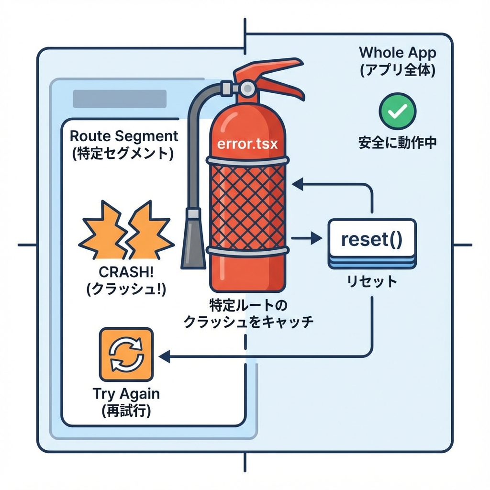
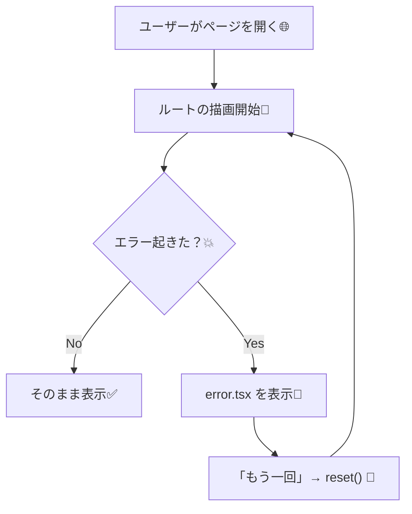
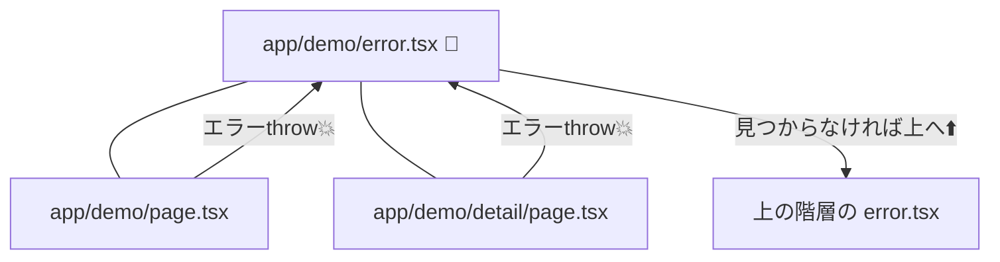

# 第31章：`error.tsx` でクラッシュ時の保険🧯

Next.js（App Router）では、**ページ描画中に起きた“想定外のエラー”**を、`error.tsx` で受け止めて「やさしい画面」にできます😊
しかも **そのルート部分だけ**を守れるから、アプリ全体が真っ白になりにくいのが最高〜！🫶
（`error.tsx` はルートセグメント＋配下の子ルートを Error Boundary で包みます）([Next.js][1])

---

## 1) まず結論：`error.tsx` って何？🤔🧯

* `app/xxx/error.tsx` を置くと、その **`xxx` セグメント内で起きたクラッシュ**をキャッチして
  **代わりの画面（フォールバックUI）**を表示できるよ〜！😌([Next.js][1])
* `error.tsx` は **Client Component 必須**なので、先頭に `"use client"` が必要だよ⚠️([Next.js][1])
* `error.tsx` には `error` と `reset()` が渡ってきます👇（`reset()` は再描画チャレンジ🔁）([Next.js][1])

---

## 2) 動き方イメージ（図解）🧠➡️🧯





---

## 3) ハンズオン：わざと落として、`error.tsx` で助ける🧪🧯

ここでは例として **`/demo`** を作るね😊
（すでにNext.jsプロジェクトがある前提でOK！）

### 手順①：`app/demo/page.tsx` を作る（わざと落とす💥）

```tsx
// app/demo/page.tsx
export default function DemoPage() {
  throw new Error("わざと落としたよ💥（demo）");

  // return <div>ここは表示されないよ</div>
}
```

### 手順②：同じフォルダに `app/demo/error.tsx` を作る🧯✨

ポイントは3つだけ👇

* `"use client"` 必須
* `error` と `reset` を受け取る
* ボタンで `reset()` する（再試行🔁）

```tsx
// app/demo/error.tsx
"use client";

import { useEffect } from "react";

export default function Error({
  error,
  reset,
}: {
  error: Error & { digest?: string };
  reset: () => void;
}) {
  useEffect(() => {
    // 本番はここで監視サービスに送ったりする想定📌
    console.error("demoでエラー発生:", error);
  }, [error]);

  return (
    <div style={{ padding: 16 }}>
      <h2>ごめんね、エラーになっちゃった🥲🧯</h2>
      <p style={{ marginTop: 8 }}>
        一時的な不具合かも…！もう一回試してみよ？✨
      </p>

      <button
        onClick={() => reset()}
        style={{ marginTop: 12, padding: "8px 12px", cursor: "pointer" }}
      >
        もう一回🔁
      </button>

      <p style={{ marginTop: 12, fontSize: 12, opacity: 0.7 }}>
        （開発中は詳しいメッセージが見えやすいけど、本番では安全のため情報が丸められることがあるよ🔒）
      </p>
    </div>
  );
}
```

`reset()` は **そのセグメントを再レンダリング**して復帰を試みます([Next.js][1])
あと `error.message` は **開発中と本番で扱いが違う**ことがあります（本番は情報漏えい防止でメッセージが一般化されることがある）([Next.js][1])

### 手順③：動かす（Windows / VSCodeターミナル）🖥️💨

```bash
npm run dev
```

ブラウザで `http://localhost:3000/demo` を開くと…
`error.tsx` の画面が出て「もう一回🔁」が押せるはず！😊

> もし開発中に Next.js の赤いエラー画面が強く出る場合は、それはデバッグ用の表示だよ🧑‍🔧
> 「本番っぽい挙動」で見たいときは👇も試せます
>
> ```bash
> npm run build
> npm start
> ```

---

## 4) “どこまで守れるの？”（範囲の感覚）🛡️📦

`app/demo/error.tsx` は、だいたいこんな感じで **`demo` 配下をまとめて守る**よ〜！✨
（エラーは近い `error.tsx` に吸い込まれて、なければ上にバブルするイメージ）([Next.js][2])



---

## 5) よくあるハマり集（ここ超大事💡）😵‍💫➡️😌

### ✅ `"use client"` を忘れる

`error.tsx` は **Client Component 必須**！忘れると動きません⚠️([Next.js][1])

### ✅ クリックイベントの中のエラーは、基本 `error.tsx` では捕まらない

Error Boundary は「描画中のエラー」を守る仕組みなので、イベントハンドラ内は `try/catch` で扱うのが基本だよ🧤([Next.js][2])

### ✅ 同じセグメントの `layout.tsx` で落ちると、`error.tsx` だけじゃ拾えないことがある

この場合は `app/global-error.tsx`（全体の保険）を使う場面があります🧯
グローバル側は `<html><body>` を自分で書く必要があるのもポイント！([Next.js][3])

---

## 6) ミニ課題（5〜10分）🎯✨

### お題：50%の確率で落ちるページを作って、`reset()` で復帰する🎰🔁

1. `app/demo/page.tsx` を「50%で throw」するように変更
2. `error.tsx` の「もう一回🔁」で、運が良ければ復帰✅
3. 「復帰したら表示される画面」を作ってニヤニヤする😆

ヒント（例）👇

```tsx
// app/demo/page.tsx
export default function DemoPage() {
  if (Math.random() < 0.5) {
    throw new Error("今日はご機嫌ナナメ💥");
  }
  return <h1>復活成功〜！🎉</h1>;
}
```

---

## 7) 今日のチェックリスト✅🧯

* [ ] `app/ルート/` の中に `error.tsx` を置ける
* [ ] `"use client"` が必要だとわかる([Next.js][1])
* [ ] `error` と `reset()` の役割を説明できる([Next.js][1])
* [ ] `reset()` で「再レンダリング」して復帰を試せる([Next.js][1])

---

必要なら、この章の続きとして「`demo` 配下にさらに子ルートを作って、どこまで同じ `error.tsx` が守るか」を一緒に実験用に組んだ版も出せるよ😊🧪🧯

[1]: https://nextjs.org/docs/app/api-reference/file-conventions/error "File-system conventions: error.js | Next.js"
[2]: https://nextjs.org/docs/app/getting-started/error-handling "Getting Started: Error Handling | Next.js"
[3]: https://nextjs.org/docs/app/api-reference/file-conventions/error?utm_source=chatgpt.com "File-system conventions: error.js"
