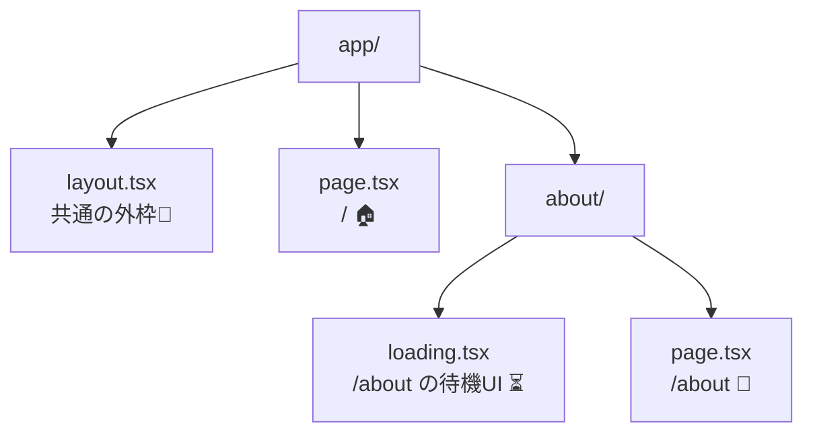
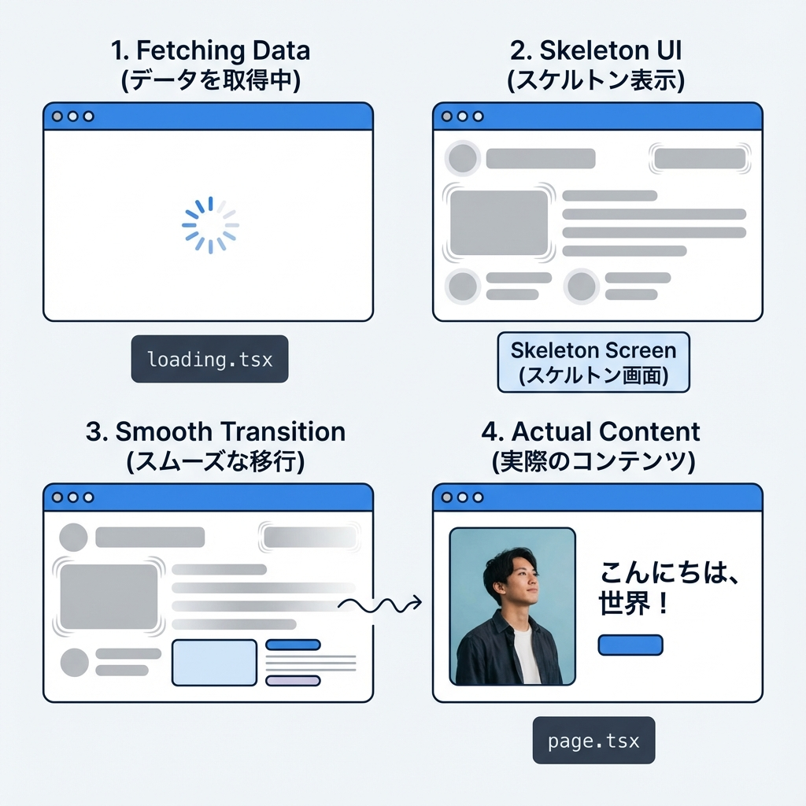
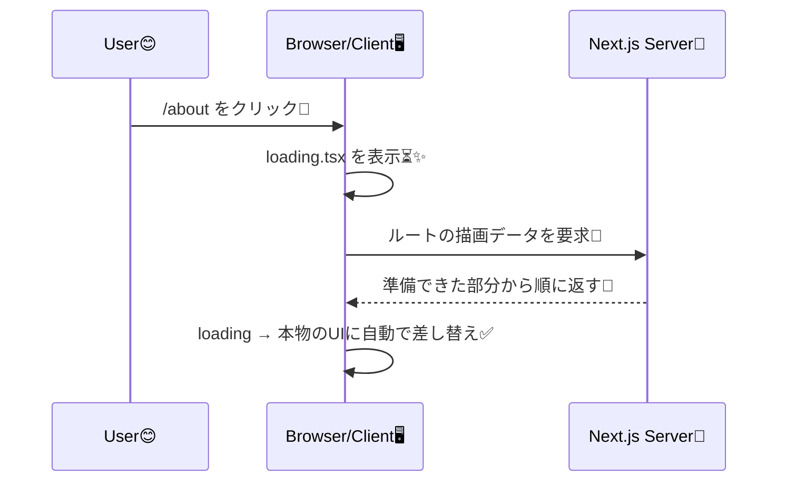

# 第32章：`loading.tsx` で読み込み中を可愛くする⏳

## 今日のゴール🎯

* ルート（ページ）を開く途中に出る「待っててねUI」を `loading.tsx` で作れるようになる✨
* “どこに置くと、どこに効くか” がわかるようになる🗺️

---

## `loading.tsx` ってなに？🍩

`loading.tsx` は、**そのルート（正確には route segment）の中身が準備できるまでの間だけ表示される**「待機用UI」だよ〜⏳
Next.js が **React Suspense と streaming** を使って、先にローディングUIを出して、準備できたら自動で本物の画面に差し替えてくれるイメージ☺️✨ ([Next.js][1])

しかも裏側で、Next.js が **`page.tsx` を `<Suspense>` で自動的に包む**から、基本は置くだけでOK🫶 ([Next.js][2])

---

## どこに置くの？（効く範囲）🗂️

**置いたフォルダ＝そのルート区間（segment）に効く**よ🎯
例：`app/about/loading.tsx` を作ると、`/about` が準備中の間に表示される✨



---

## まずは「わざと遅いページ」を作って、確実に見えるようにしよ🐢💨

ローディングって、ページが速すぎると一瞬で終わって見えないことがあるの🥲
なので、**/about を2秒だけ遅らせる**よ〜⏳✨

### 1) `app/about/page.tsx` を作る📄

```tsx
// app/about/page.tsx
import Link from 'next/link'

const sleep = (ms: number) => new Promise((r) => setTimeout(r, ms))

export default async function AboutPage() {
  // わざと遅くして、loading.tsx が見えるようにする🐢
  await sleep(2000)

  return (
    <main style={{ padding: 24 }}>
      <h1 style={{ margin: 0 }}>学科紹介🌸</h1>
      <p>ここに学科の説明が入るよ〜📚✨（今はサンプル）</p>

      <Link href="/" style={{ display: 'inline-block', marginTop: 12 }}>
        ← ホームへ戻る🏠
      </Link>
    </main>
  )
}
```

### 2) ホームから `/about` へ行けるリンクを置く（まだ無ければ）🔗

```tsx
// app/page.tsx
import Link from 'next/link'

export default function Home() {
  return (
    <main style={{ padding: 24 }}>
      <h1 style={{ margin: 0 }}>ホーム🏠</h1>
      <p>次のページでローディングを見てみよ〜💗</p>

      <Link href="/about">学科紹介へ → 🌸</Link>
    </main>
  )
}
```

---

## `loading.tsx` を作る（かわいいスケルトンUI）🧁✨

### 1) `app/about/loading.tsx`

```tsx
// app/about/loading.tsx
import styles from './loading.module.css'

export default function Loading() {
  return (
    <main className={styles.wrap} aria-busy="true" aria-live="polite">
      <div className={styles.card}>
        <div className={`${styles.skel} ${styles.title}`} />
        <div className={`${styles.skel} ${styles.line}`} />
        <div className={`${styles.skel} ${styles.line}`} />
        <div className={`${styles.skel} ${styles.lineShort}`} />
      </div>

      <p className={styles.text}>読み込み中だよ…⏳💗 ちょっと待ってね〜🐾</p>
    </main>
  )
}
```

### 2) `app/about/loading.module.css`

```css
/* app/about/loading.module.css */
.wrap {
  padding: 24px;
}

.card {
  border: 1px solid #e8e8ee;
  border-radius: 16px;
  padding: 16px;
  max-width: 520px;
  box-shadow: 0 8px 20px rgba(0, 0, 0, 0.06);
}

.text {
  margin-top: 12px;
  font-size: 14px;
  color: #555;
}

.skel {
  position: relative;
  overflow: hidden;
  background: #f1f2f6;
  border-radius: 10px;
}

.skel::after {
  content: "";
  position: absolute;
  inset: 0;
  transform: translateX(-100%);
  background: linear-gradient(
    90deg,
    rgba(241, 242, 246, 0) 0%,
    rgba(255, 255, 255, 0.9) 50%,
    rgba(241, 242, 246, 0) 100%
  );
  animation: shimmer 1.1s infinite;
}

.title {
  height: 22px;
  width: 55%;
  margin-bottom: 12px;
}

.line {
  height: 14px;
  width: 100%;
  margin-bottom: 10px;
}

.lineShort {
  height: 14px;
  width: 70%;
}

@keyframes shimmer {
  100% {
    transform: translateX(100%);
  }
}
```

---

## 動作チェック✅✨

1. ターミナルで起動：`npm run dev` 💻
2. `http://localhost:3000` を開く🌈
3. 「学科紹介へ → 🌸」をクリック
4. **先にスケルトン（`loading.tsx`）が出て、2秒後に本物のページに切り替わったら成功🎉**

---

## 仕組みをもう1枚でイメージ🧠✨



Next.js は、ナビゲーション中に **ローディングUIを先に見せて**、準備できたら差し替えるよ〜🌊 ([Next.js][1])



---

## よくある「見えない！」ポイント🥲👉解決

* **ページが速すぎる**：一瞬で終わって見えないことあるよ〜（今回は `sleep(2000)` で確実に見えるようにしたよ🐢）
* **`<Link>` のプリフェッチで速い**：本番だと `<Link>` が事前読み込みして速くなることがあるの。必要なら `prefetch={false}` にできるよ🧯 ([Next.js][3])
  例：

  ```tsx
  <Link href="/about" prefetch={false}>学科紹介へ → 🌸</Link>
  ```

---

## ミニ課題🎀（かわいくカスタムしてみよ！）

* スケルトンの角丸をもっと大きくする（`border-radius`）🫧
* 文言を「ロード中…🧸☕」みたいに“キャラ化”する💗
* `title` や `line` の長さを変えて、本物の画面に似せる（体感が一気に良くなる✨）

---

ここまでできたら、**`loading.tsx` はもう使える〜！** ⏳💖

[1]: https://nextjs.org/docs/app/api-reference/file-conventions/loading "File-system conventions: loading.js | Next.js"
[2]: https://nextjs.org/docs/app/getting-started/linking-and-navigating "Getting Started: Linking and Navigating | Next.js"
[3]: https://nextjs.org/docs/app/api-reference/components/link "Components: Link Component | Next.js"
