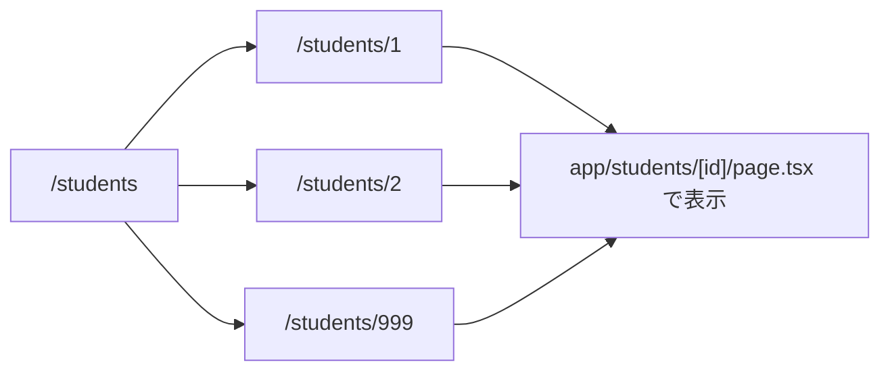

# 第33章：Dynamic Route：`[id]` の基本🧩✨

「URLの一部が毎回変わるページ」を作るのが **Dynamic Route（動的ルート）** だよ〜😊
たとえば👇みたいなやつ！

* `/students/1`
* `/students/2`
* `/students/999`

この `1` や `2` の部分を Next.js では **`[id]`** って書いて受け取れるよ🫶

---

## 1) まずイメージをつかもう👀🗺️

Dynamic Route は **フォルダ名に角カッコ**を使うだけ！かんたん✨



---

## 2) フォルダ構成：`[id]` を作る📁🧩

以下のようにフォルダを作るよ！（WindowsでもOK✨）

```text
app/
  students/
    page.tsx
    [id]/
      page.tsx
```

* `app/students/page.tsx` → 一覧ページ（例：学生リスト）
* `app/students/[id]/page.tsx` → 詳細ページ（例：学生の詳細）

---

## 3) 一覧ページを作る：`/students` 🧾✨

`app/students/page.tsx` を作って、詳細ページへリンクしてみよう😊🔗

```tsx
import Link from "next/link";

const students = [
  { id: "1", name: "さくら" },
  { id: "2", name: "あおい" },
  { id: "3", name: "みお" },
];

export default function StudentsPage() {
  return (
    <main style={{ padding: 16 }}>
      <h1>学生一覧🌸</h1>

      <ul style={{ lineHeight: 2 }}>
        {students.map((s) => (
          <li key={s.id}>
            <Link href={`/students/${s.id}`}>{s.name} さんの詳細へ➡️</Link>
          </li>
        ))}
      </ul>
    </main>
  );
}
```

ポイント🥰

* `<Link href={`/students/${s.id}`}>` で **動的なURL**を作ってるよ！

---

## 4) 詳細ページを作る：`/students/1` みたいな場所🔍✨

次に `app/students/[id]/page.tsx` を作るよ！
ここでは URL の `id` を **`params.id`** で受け取れるのがポイント🧩

```tsx
type Props = {
  params: { id: string };
};

export default function StudentDetailPage({ params }: Props) {
  return (
    <main style={{ padding: 16 }}>
      <h1>学生詳細ページ📘</h1>

      <p>
        今見ているIDは… <b>{params.id}</b> だよ😊✨
      </p>

      <p style={{ marginTop: 12 }}>
        例：このIDを使って「この人のデータ」を取りに行けるようになるよ📡
      </p>
    </main>
  );
}
```

---

## 5) 動作チェックしよう✅🚀

開発サーバー起動（もう起動中ならそのままでOK😊）

```bash
npm run dev
```

ブラウザで見てね👇✨

* `http://localhost:3000/students`
* 一覧のリンクを押す → `/students/1` とかに移動できれば成功🎉

---

## 6) よくあるつまずきポイント集🧯😵‍💫

* **`[id]` をファイル名にしてしまった！**
  ✅ 正解は **フォルダ名が `[id]`** だよ〜（`[id]/page.tsx`）📁

* **`params` が undefined っぽい…**
  ✅ App Router の `page.tsx` なら `{ params }` を受け取れるよ！
  （Client Componentにすると受け取り方が変わるので、まずはこの形でOK😊）

* **`/students?id=1` と混ざる**
  ✅ それは「クエリパラメータ」
  ✅ 今回は「パスの一部」：`/students/1` だよ🛣️✨

---

## 7) ミニ練習🌼（5分でできる！）

やってみてね😊✍️

1. `students` の配列に `{ id: "4", name: "ゆな" }` を追加する
2. `/students/4` を開いて `params.id` が `4` になるか確認する
3. 余裕があれば、詳細ページの文章を「〇〇さんのページです」にしてみる💖

---

ここまでできたら、**「URLの変わるページ」を作れるようになった**ってことだよ〜🧩🎉
次の章（第34章）で、`params` をもっとTypeScriptで安全にしていくと最強になるよ😎✨
