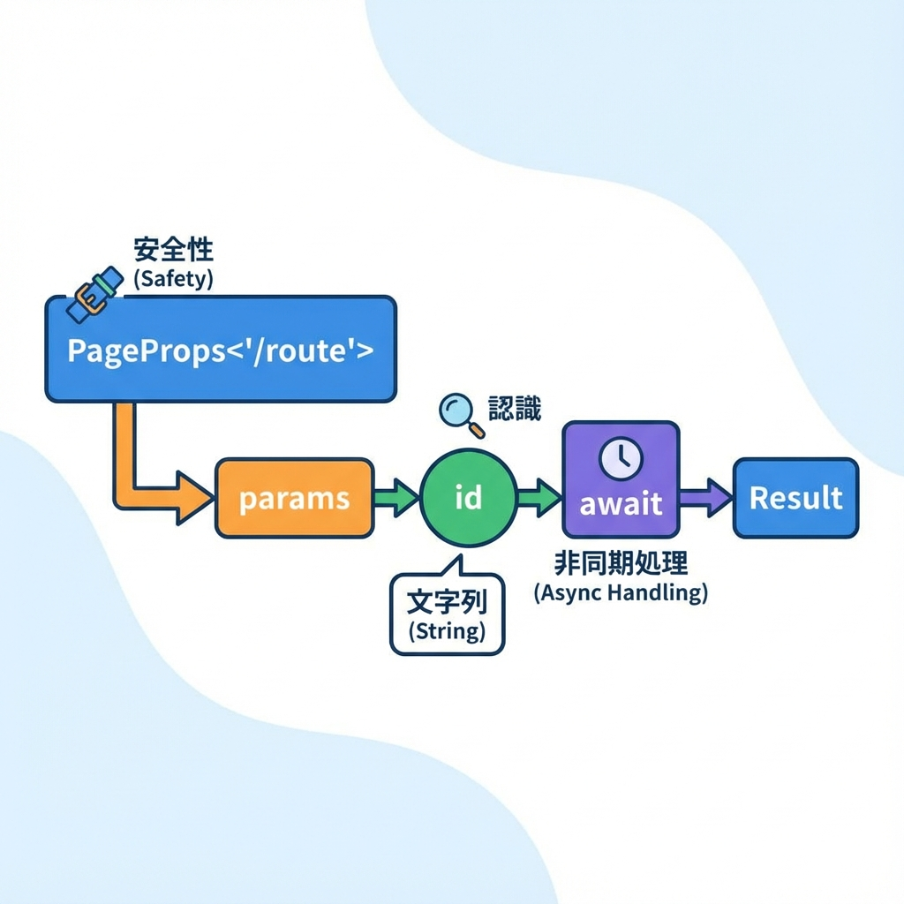
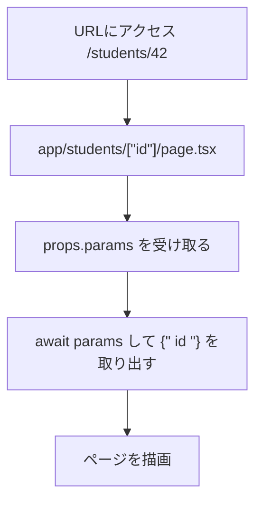

# 第34章：`params` の型をちゃんと書く（TSで安全に）🧷

この章では、Dynamic Route（`[id]`）で受け取る `params` を **TypeScriptで安全に**扱えるようにします😊
タイプミスや「え、これ `string` だっけ…？」みたいな事故を減らすよ〜！💪✨

---

## 1) `params` って何者？👀🧩



Dynamic Route（例：`app/students/[id]/page.tsx`）にアクセスすると、Next.js が `params` にルートの値を入れて渡してくれます📦✨

そして **最近のNext.js（App Router）では `params`（と `searchParams`）が Promise 扱い**になっているので、取り出すときは `await` するのが基本です⏳
（公式の `PageProps` の例でも `await props.params` しています）([Next.js][1])



---

## 2) いちばんおすすめ：`PageProps<'/route'>` で型を自動で付ける🎯✨

Next.js には **ページの props を型付けできる `PageProps`** が用意されています（グローバルに使えるヘルパーだよ）([Next.js][1])
Dynamic Route の `params` / `searchParams` を **ルート文字列から推論**してくれるので、初心者ほど助かるやつです🫶

### ✅ 例：`/students/[id]` の `id` を安全に受け取る

`app/students/[id]/page.tsx`

```tsx
export default async function Page(props: PageProps<'/students/[id]'>) {
  const { id } = await props.params; // ← Promise なので await
  return (
    <main>
      <h1>学生ページ🎓</h1>
      <p>学生IDは <b>{id}</b> です✨</p>
    </main>
  );
}
```

### ✅ 書き方その2：引数で受けてから await（こっちもよく使うよ🧡）

```tsx
export default async function Page({ params }: PageProps<'/students/[id]'>) {
  const { id } = await params;
  return <div>学生ID: {id} 🎀</div>;
}
```

> `PageProps<'/students/[id]'>` みたいに **ルートを文字で書く**のがポイント！
> これで `id` が `string` として補完されやすくなります✨ ([Next.js][1])

---

## 3) 自分で型を書きたいとき（手動タイプ）✍️🧠

「まだ `PageProps` に慣れてないから、自分で型を書きたい！」も全然OKです😊
App Router のページは `NextPage` みたいな型じゃなくて、ふつうに props を型付けします([GitHub][2])

```tsx
type Props = {
  params: Promise<{ id: string }>;
};

export default async function Page({ params }: Props) {
  const { id } = await params;
  return <div>ID: {id} 🌸</div>;
}
```

---

## 4) よくあるハマりどころ集 🪤💥（ここ大事！）

### ❌ `params.id` って直接触っちゃう

`params` が Promise なので、これだと型エラーになりがちです😵‍💫

```tsx
// ダメ例💦
export default function Page({ params }: PageProps<'/students/[id]'>) {
  // params.id みたいに直接は触れないことが多い
}
```

✅ **正解は `await params`** だよ〜！⏳✨

```tsx
export default async function Page({ params }: PageProps<'/students/[id]'>) {
  const { id } = await params;
  return <div>{id}</div>;
}
```

### ❌ `async` を付け忘れて await できない

`await` するなら **関数を `async`** にしようね😊

---

## 5) ミニ練習 🎒✨「学科ページ」を作って型のありがたみを感じよう！

### お題：`/department/[deptId]` を作る🏫🌷

`app/department/[deptId]/page.tsx`

```tsx
export default async function Page({ params }: PageProps<'/department/[deptId]'>) {
  const { deptId } = await params;

  return (
    <main>
      <h1>学科紹介🌼</h1>
      <p>学科ID：<b>{deptId}</b></p>
    </main>
  );
}
```

✅ ここで嬉しいポイント🎉

* `deptId` のスペル間違いをしにくい😆
* `deptId` が `string` 前提で書けるから安心🧷
* ルート名を変えたら型も気づきやすい（事故りにくい）🚑✨

---

## まとめ 🎀✨

* Dynamic Route の `params` は **型をちゃんと付けると安全度が爆上がり**⤴️
* 迷ったら **`PageProps<'/route'>` がいちばんラクで強い**💪 ([Next.js][1])
* `params` は **`await` して取り出す**のが基本だよ⏳([Next.js][1])

[1]: https://nextjs.org/docs/app/api-reference/file-conventions/page?utm_source=chatgpt.com "File-system conventions: page.js"
[2]: https://github.com/vercel/next.js/discussions/62558?utm_source=chatgpt.com "What is the Typescript type of a next page function using ..."
