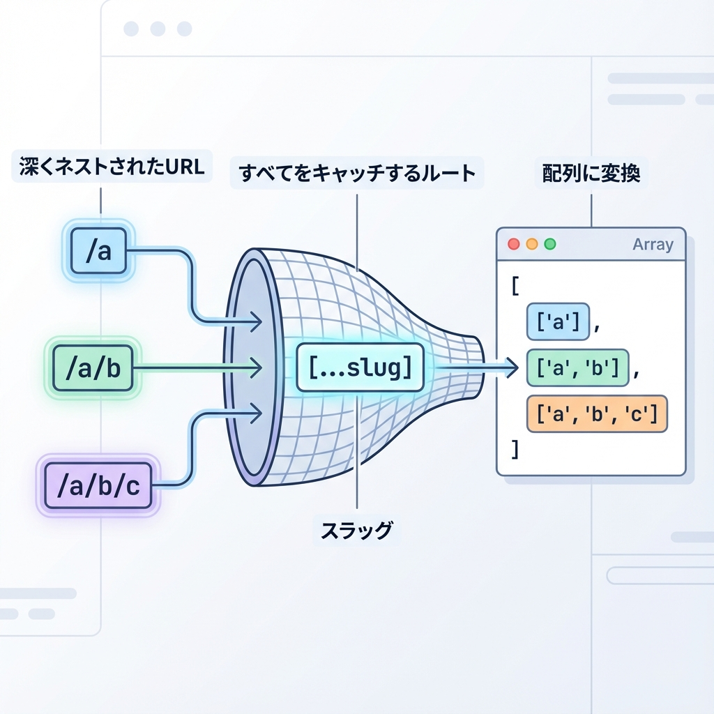
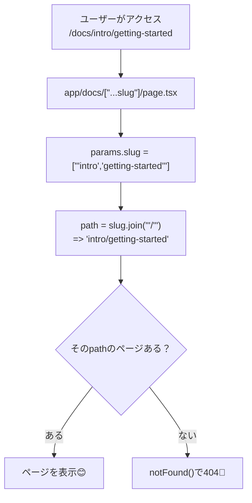

# 第35章：Catch-all：`[...slug]` の使いどころ🪤

今日は **「URLの深さがバラバラでも、1つのページで受け止める」** ための技、**Catch-all ルート**をやるよ〜！🧡

---

## 1) Catch-all ってなに？🤔💡

たとえば、こういうURLたち👇

* `/docs/intro`
* `/docs/intro/getting-started`
* `/docs/intro/getting-started/install`

**何階層になるか分からない**ときに、Next.jsはこれを…

* `app/docs/[...slug]/page.tsx`

みたいに書くと、ぜんぶキャッチしてくれるよ〜🪤✨
このとき `slug` は **配列**になるのがポイント！
`/docs/a/b/c` → `slug = ["a","b","c"]` みたいな感じだよ🎯 ([nextjs.org][1])

---

## 2) どんなときに使う？🧭📚

よくある使いどころはこんな感じ👇

* **ドキュメントサイト**（章・節・項みたいに深くなる）📘
* **カテゴリが何段にもなるEC**（/shop/clothes/tops みたいな）🛍️
* **CMS的なページ**（/pages/2025/12/24 みたいな）📰

---

## 3) 図でイメージしよ〜🖼️✨（Mermaid）





---

## 4) 実装してみよう！🛠️✨（最小で動くやつ）

ここでは「簡易ドキュメント」を作って、Catch-allを体験するよ📚💕

### (1) フォルダ構成📁

```text
app/
  docs/
    page.tsx
    [...slug]/
      page.tsx
```

* `/docs` は一覧ページ（普通のルート）
* `/docs/〜〜/〜〜` は Catch-all が担当🪤

---

### (2) `/docs` の一覧ページを作る（`app/docs/page.tsx`）📄🔗

```tsx
import Link from "next/link";

export default function DocsIndexPage() {
  return (
    <main style={{ padding: 24 }}>
      <h1>Docs 一覧📚✨</h1>

      <ul>
        <li>
          <Link href="/docs/intro">はじめに🌱</Link>
        </li>
        <li>
          <Link href="/docs/intro/getting-started">導入ガイド🚀</Link>
        </li>
        <li>
          <Link href="/docs/guide/routing/catch-all">Catch-all 解説🪤</Link>
        </li>
      </ul>

      <p style={{ marginTop: 16 }}>好きな階層のURLに飛んでみてね😆💖</p>
    </main>
  );
}
```

---

### (3) Catch-all 本体（`app/docs/[...slug]/page.tsx`）🪤✨

※ 最近のNext.jsでは **`params` が Promise** なので、`await` して取り出すよ〜！ ([nextjs.org][1])

```tsx
import Link from "next/link";
import { notFound } from "next/navigation";

const PAGES: Record<string, { title: string; body: string }> = {
  "intro": {
    title: "はじめに🌱",
    body: "ここは /docs/intro だよ〜！Next.jsの道のりへようこそ😊✨",
  },
  "intro/getting-started": {
    title: "導入ガイド🚀",
    body: "ここは /docs/intro/getting-started だよ〜！まずは動かして慣れちゃお🧡",
  },
  "guide/routing/catch-all": {
    title: "Catch-all 解説🪤",
    body: "Catch-allは、URLの深さが増えても1つのページで受け止められる便利技だよ✨",
  },
};

export default async function DocsCatchAllPage({
  params,
}: {
  params: Promise<{ slug: string[] }>;
}) {
  const { slug } = await params; // ✅ slugは配列！
  const path = slug.join("/");

  const page = PAGES[path];
  if (!page) notFound(); // 🚪 存在しないページは404へ

  return (
    <main style={{ padding: 24 }}>
      <p>
        <Link href="/docs">← Docs一覧へ戻る📚</Link>
      </p>

      <h1 style={{ marginTop: 12 }}>{page.title}</h1>
      <p style={{ marginTop: 12 }}>{page.body}</p>

      <hr style={{ margin: "24px 0" }} />

      <h2>いま受け取った slug（配列）🧩</h2>
      <ul>
        {slug.map((seg, i) => (
          <li key={i}>
            {i}: {seg}
          </li>
        ))}
      </ul>

      <p style={{ marginTop: 12 }}>
        今のパス： <b>/docs/{path}</b> ✨
      </p>
    </main>
  );
}
```

これで👇が全部このページに来るよ🪄

* `/docs/intro`
* `/docs/intro/getting-started`
* `/docs/guide/routing/catch-all`
  （そして `slug` が配列で入ってくる！） ([nextjs.org][1])

---

## 5) ついでに：Optional Catch-all も知っておく？👀✨

Catch-allの「親玉」みたいなやつで、

* `app/docs/[[...slug]]/page.tsx`

って書くと **`/docs` も同じページで受け止められる**よ！
この場合、`/docs` に来たときは `slug` が `undefined` になり得るから注意⚠️ ([nextjs.org][1])

---

## 6) よくあるハマり🐣🧯

* `slug` を **文字列だと思って** `slug.toUpperCase()` とかすると壊れる💥
  → **配列**だよ！`slug.join("/")` みたいに使うのが基本✨ ([nextjs.org][1])
* ルート直下（`app/[...slug]`）に置くと、他のルートを飲み込みやすい🥺
  → まずは今回みたいに `docs/` の下に置くのが安心だよ〜🫶 ([GitHub][2])

---

## 7) ミニ練習🎯💖

1. `PAGES` に好きなキーを追加してみてね（例：`"guide/ui/buttons"`）✨
2. `/docs/guide/ui/buttons` にアクセスして表示されれば成功🎉
3. 存在しないURLを叩いて、ちゃんと404になるのも確認しよ〜🚪

---

## まとめ🍀✨

* `app/docs/[...slug]/page.tsx` で **深いURLをまとめて受け取れる**🪤
* `slug` は **`string[]`（配列）**！ `/a/b` → `["a","b"]` ([nextjs.org][1])
* 最近は `params` が **Promise** なので、`await params` で取り出すのが安心🫶 ([nextjs.org][1])

次に進む前に、ぜひいろんな深さのURLを自分で作って遊んでみてね😆💖

[1]: https://nextjs.org/docs/app/api-reference/file-conventions/dynamic-routes "File-system conventions: Dynamic Segments | Next.js"
[2]: https://github.com/vercel/next.js/discussions/80747?utm_source=chatgpt.com "Catch-all [...slug] at root conflicts with other dynamic routes ..."
