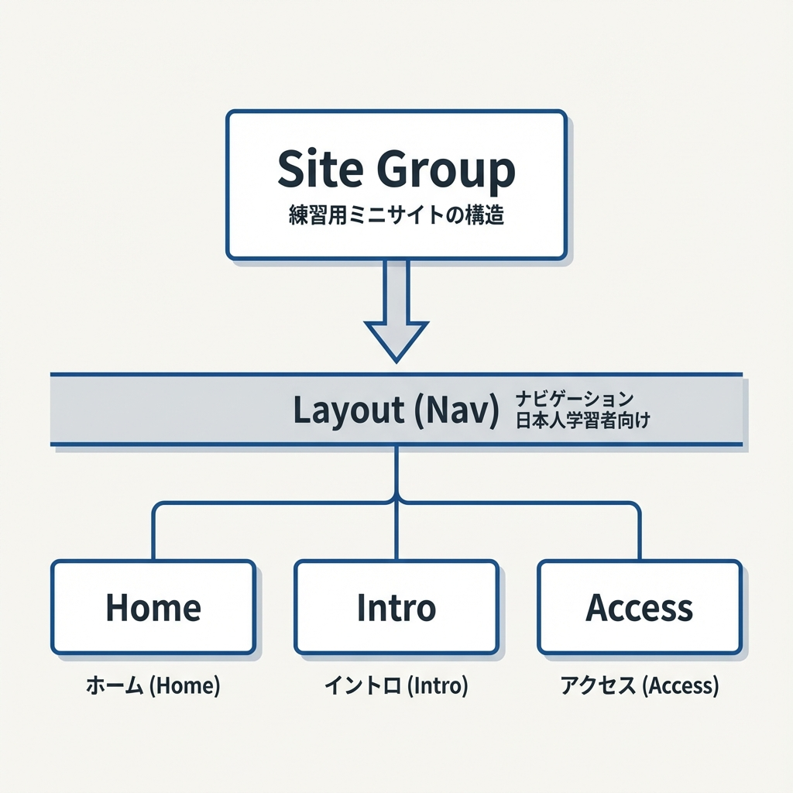
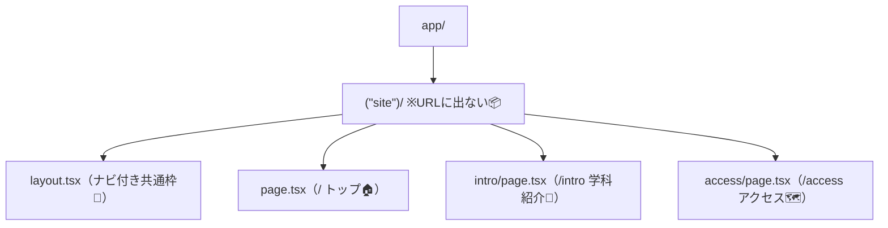
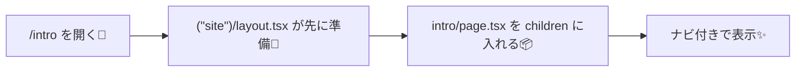

# 第36章：練習：3ページ＋ナビ付きの“学科紹介”ミニサイト🌸

今日は「**3ページ＋共通ナビ**」のミニサイトを作るよ〜！🎀
Next.js（App Router）っぽさが一気にわかる練習です😊💕

---

## ✅ 今日作るもの（完成イメージ）🏫✨

* **トップ**：`/`（学科のキャッチ＋お知らせ）
* **学科紹介**：`/intro`（特徴・学べること）
* **アクセス**：`/access`（場所・最寄り）

そしてどのページにも共通で上に **ナビ（ヘッダー）** が出るようにするよ！🔗💗

---

## 🗺️ ルートとファイルの地図（Route Groupも使うよ📦）



`(site)` は **URLに出ない整理用フォルダ**だよ〜！便利🧸✨



---

## 1) フォルダを作る📁✨（まずは形づくり）

プロジェクト直下で、次を作ってね😊

* `app/(site)/`
* `app/(site)/intro/`
* `app/(site)/access/`

> もし今 `app/page.tsx` があるなら、**`app/(site)/page.tsx` に移動**してね🏠✨
> （同じ `/` だけど、`(site)` 側の layout を使えるようにするためだよ〜！）

---

## 2) 共通ナビを作る：`app/(site)/layout.tsx` 🧱💗

```tsx
import Link from "next/link";
import type { Metadata } from "next";

export const metadata: Metadata = {
  title: {
    default: "◯◯大学 ◯◯学科",
    template: "%s | ◯◯大学 ◯◯学科",
  },
  description: "◯◯大学◯◯学科のミニ紹介サイトです。",
};

export default function SiteLayout({
  children,
}: {
  children: React.ReactNode;
}) {
  return (
    <div className="site">
      <header className="header">
        <div className="brand">
          <span className="logo">🏫</span>
          <span className="brandText">◯◯大学 ◯◯学科</span>
        </div>

        <nav className="nav">
          <Link className="navLink" href="/">
            トップ🏠
          </Link>
          <Link className="navLink" href="/intro">
            学科紹介📘
          </Link>
          <Link className="navLink" href="/access">
            アクセス🗺️
          </Link>
        </nav>
      </header>

      <main className="main">{children}</main>

      <footer className="footer">
        <small>© {new Date().getFullYear()} ◯◯大学 ◯◯学科 🎓</small>
      </footer>
    </div>
  );
}
```

---

## 3) 3ページを作る📄✨（中身はシンプルでOK！）

### A) トップ：`app/(site)/page.tsx` 🏠🌸

```tsx
import type { Metadata } from "next";

export const metadata: Metadata = {
  title: "トップ",
};

export default function HomePage() {
  return (
    <section>
      <h1 className="h1">ようこそ！◯◯学科へ🌸</h1>
      <p className="lead">
        「好き」を学びに変えて、未来の選択肢を増やそう〜！✨
      </p>

      <div className="cardGrid">
        <article className="card">
          <h2 className="h2">学科の雰囲気😊</h2>
          <p>少人数ゼミもあって、質問しやすい空気だよ〜🫶</p>
        </article>

        <article className="card">
          <h2 className="h2">お知らせ📣</h2>
          <ul className="list">
            <li>12/25：オープンキャンパス受付開始🎀</li>
            <li>1/10：研究室ツアー配信🎥</li>
          </ul>
        </article>

        <article className="card">
          <h2 className="h2">まず見てほしい✨</h2>
          <p>ナビから「学科紹介📘」→「アクセス🗺️」の順がおすすめ！</p>
        </article>
      </div>
    </section>
  );
}
```

---

### B) 学科紹介：`app/(site)/intro/page.tsx` 📘🧡

```tsx
import type { Metadata } from "next";

export const metadata: Metadata = {
  title: "学科紹介",
};

export default function IntroPage() {
  return (
    <section>
      <h1 className="h1">学科紹介📘</h1>
      <p className="lead">
        ◯◯学科は「つくる力」と「考える力」をセットで育てるよ💡✨
      </p>

      <article className="card">
        <h2 className="h2">学べること🎓</h2>
        <ul className="list">
          <li>基礎：情報の整理・伝え方📝</li>
          <li>実践：小さな制作を積み上げる🧩</li>
          <li>発展：チームで作る体験🤝</li>
        </ul>
      </article>

      <article className="card">
        <h2 className="h2">こんな人におすすめ🌷</h2>
        <ul className="list">
          <li>何かを作ってみたい！🛠️</li>
          <li>コツコツ成長したい📈</li>
          <li>発表やポートフォリオも頑張りたい📚✨</li>
        </ul>
      </article>
    </section>
  );
}
```

---

### C) アクセス：`app/(site)/access/page.tsx` 🗺️🚃

```tsx
import type { Metadata } from "next";

export const metadata: Metadata = {
  title: "アクセス",
};

export default function AccessPage() {
  return (
    <section>
      <h1 className="h1">アクセス🗺️</h1>
      <p className="lead">
        迷子にならないように、ざっくり案内するね🥺✨
      </p>

      <article className="card">
        <h2 className="h2">所在地📍</h2>
        <p>〒000-0000 ◯◯県◯◯市◯◯町 1-2-3</p>
      </article>

      <article className="card">
        <h2 className="h2">最寄り🚃</h2>
        <ul className="list">
          <li>◯◯駅から徒歩8分👟</li>
          <li>バス：◯◯大学前で下車🚌</li>
        </ul>
        <p className="note">※地図はあとで貼ればOKだよ〜🧸</p>
      </article>
    </section>
  );
}
```

---

## 4) ちょい見た目を整える：`app/globals.css` 💅✨

すでにあるなら、下を「追記」してね😊（上書きしないでOK！）

```css
.site {
  max-width: 920px;
  margin: 0 auto;
  padding: 16px;
}

.header {
  display: flex;
  gap: 16px;
  align-items: center;
  justify-content: space-between;
  padding: 12px 14px;
  border: 1px solid #eee;
  border-radius: 14px;
  background: #fff;
  position: sticky;
  top: 12px;
}

.brand {
  display: flex;
  align-items: center;
  gap: 10px;
}

.logo {
  font-size: 22px;
}

.brandText {
  font-weight: 700;
}

.nav {
  display: flex;
  gap: 10px;
  flex-wrap: wrap;
}

.navLink {
  padding: 8px 10px;
  border-radius: 10px;
  border: 1px solid #eee;
  text-decoration: none;
}

.main {
  padding: 18px 4px;
}

.footer {
  margin-top: 18px;
  padding: 12px 4px;
  color: #666;
}

.h1 {
  font-size: 28px;
  margin: 6px 0 12px;
}

.h2 {
  font-size: 18px;
  margin: 0 0 8px;
}

.lead {
  font-size: 16px;
  color: #444;
  margin-bottom: 16px;
}

.cardGrid {
  display: grid;
  gap: 12px;
  grid-template-columns: repeat(auto-fit, minmax(240px, 1fr));
}

.card {
  border: 1px solid #eee;
  border-radius: 14px;
  padding: 14px;
  background: #fff;
}

.list {
  margin: 8px 0 0;
  padding-left: 18px;
}

.note {
  color: #666;
  margin-top: 8px;
  font-size: 14px;
}
```

---

## 5) 動作チェック✅✨（WindowsでOK！）

ターミナルで👇

```bash
npm run dev
```

ブラウザで👇

* `http://localhost:3000/`
* `http://localhost:3000/intro`
* `http://localhost:3000/access`

ナビで行き来できたら勝ち〜！🎉💕

---

## 🧠 仕組みのミニまとめ（ここ超大事！）

* `layout.tsx` は **共通の外枠**（ナビ・フッターなど）🧱✨
* その中の `children` に **ページの中身**が入るよ📦
* `(site)` は **フォルダ整理**で、URLには出ない📦🪄



---

## 🎯 仕上げミッション（任意で楽しく💞）

* トップに「学科の3つの強み💪」セクションを追加してみる✨
* `metadata` の `description` をページごとに変えてみる🔎
* ナビの文言を「かわいく」してみる🎀（例：アクセス→「来てね🗺️」）

---

これで「3ページ＋共通ナビ」の土台が完成だよ〜！🌸🎉
次に進むとき、ページが増えても同じ作り方でスイスイ増やせるようになるよ😊🫶
