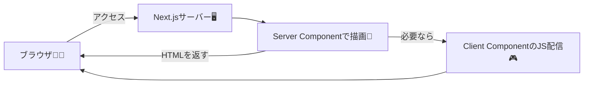

# 第37章：Server Component がデフォルトって覚えよう🧊

Next.js（App Router）では、**何も書かなければ基本ぜんぶ Server Component** だよ〜！🙌
これを先に体に入れると、今後ぜんぜん迷子にならなくなるよ🧭💕

---

### 1) Server Component ってなに？🧊

**サーバー側（Node.js側）で動いて、HTMLを作ってブラウザに返すコンポーネント**だよ🍵
ポイントはこれ👇

* ✅ **コンポーネントの中身（JSの処理）が基本ブラウザに送られない** → 速い⚡軽い🪽
* ✅ **DBや秘密情報（APIキーなど）を安全に扱える**🔐
* ✅ **`async` でそのままデータ取得しやすい**📦

Next.jsのApp Routerは、**React Server Components（RSC）をデフォルトで使う**設計になってるよ〜🧊 ([Next.js][1])

---

### 2) ざっくり図解：どこで動くの？🧠🗺️




* **基本はサーバーで作って返す**（速い・軽い）🧊✨
* **クリックなど“操作が必要な部分”だけ**クライアント側のJSが来る🎮（※これは次章以降で詳しく！）

---

### 3) 「デフォルトがServer」って、具体的に何が起きるの？👀

App Router（`app/`）の世界では…

* `app/page.tsx` も
* `app/xxx/page.tsx` も
* そこから呼ばれたコンポーネントも（基本）

**ぜーんぶ Server Component 扱い**になるのが基本だよ🧊 ([Next.js][2])

だから最初に覚える合言葉はこれ👇
**「迷ったらServer」**🧊✨

---

### 4) Server Component で “できること / できないこと” 📌

#### ✅ できること（得意）💪

* `fetch()` でデータ取得📡（ページ表示前に取れるの強い！）
* DBアクセス（サーバーだけで完結）🗃️
* `process.env` の**秘密の環境変数**を使う🔐
* 重い処理をサーバーでやる🧠

#### ❌ できないこと（苦手）🙅‍♀️

* クリックイベント（`onClick` など）🖱️
* `useState` / `useEffect` などのReact Hooks🎣
* `window` / `document` みたいなブラウザAPI🌐

これらは「ブラウザで動く前提」だから、Server Componentには向かないの🥺
必要なら **`"use client"`** でクライアント側にするよ（ここは次章でちゃんとやるよ〜🎮） ([Next.js][3])

---

### 5) ミニ実習：Server Component が普通に書けるのを体感しよ🧪✨

#### ✅ 手順

1. `app/server-default/page.tsx` を作る📁
2. 下のコードをコピペする✍️
3. `npm run dev` で開いて確認👀

```tsx
// app/server-default/page.tsx
export default async function Page() {
  // ✅ Server Component なので async OK！
  const res = await fetch("https://jsonplaceholder.typicode.com/users", {
    // 学習用：毎回取り直したいならこう（キャッシュ挙動は後の章でやるよ）
    cache: "no-store",
  });

  if (!res.ok) {
    throw new Error("ユーザー取得に失敗したよ🥺");
  }

  const users: Array<{ id: number; name: string; email: string }> = await res.json();

  // ✅ これはサーバー側のログ（ターミナルに出るよ）🖥️📝
  console.log("users count:", users.length);

  return (
    <main style={{ padding: 16 }}>
      <h1>Server Component がデフォルト🧊✨</h1>
      <p>この一覧はサーバーで取ってから表示してるよ〜📡</p>

      <ul>
        {users.slice(0, 5).map((u) => (
          <li key={u.id}>
            {u.name}（{u.email}）
          </li>
        ))}
      </ul>
    </main>
  );
}
```

✅ 見てほしいポイント👀💕

* `async` でそのまま `fetch` できる（気持ちいい！）📡✨
* `console.log` が **ブラウザじゃなくてターミナルに出る**🖥️
* これが「Serverがデフォルト」ってことだよ🧊

---

### 6) つまずきチェック ✅（あるある）😵‍💫➡️😆

* 「`window` がないって怒られた！」👉 それ、Serverで動いてる証拠🌐❌
* 「`useState` 使ったらエラー！」👉 それもServerで動いてる証拠🎣❌
* 「クリック処理書けない！」👉 操作が必要な部分だけクライアントにする（次章でやる🎮）

---

### 7) 練習問題（ミニ）📝✨

できたら最高〜！💮

1. 表示する人数を `slice(0, 5)` → `slice(0, 10)` に変える👥
2. `<h1>` の文言を自分の好きなタイトルに変える🧡
3. `console.log` を増やして「いつ実行されてるか」観察する🖥️🔍

---

### 8) まとめ（今日の合言葉）📌🧊

* **App Router は Server Component がデフォルト**🧊 ([Next.js][2])
* サーバーで描画できると **軽い・速い・安全**⚡🔐
* 迷ったらまず **Serverで作る** → 操作が必要なとこだけクライアント🎮 ([Next.js][3])

次は「じゃあクライアントにするのはどんな時？ `"use client"`って何？」に進めば、めっちゃスムーズだよ〜🎀✨

[1]: https://nextjs.org/docs/app/getting-started/server-and-client-components?utm_source=chatgpt.com "Getting Started: Server and Client Components"
[2]: https://nextjs.org/docs/14/app/building-your-application/rendering/server-components?utm_source=chatgpt.com "Server Components - Rendering"
[3]: https://nextjs.org/docs/app/api-reference/directives/use-client?utm_source=chatgpt.com "Directives: use client"
