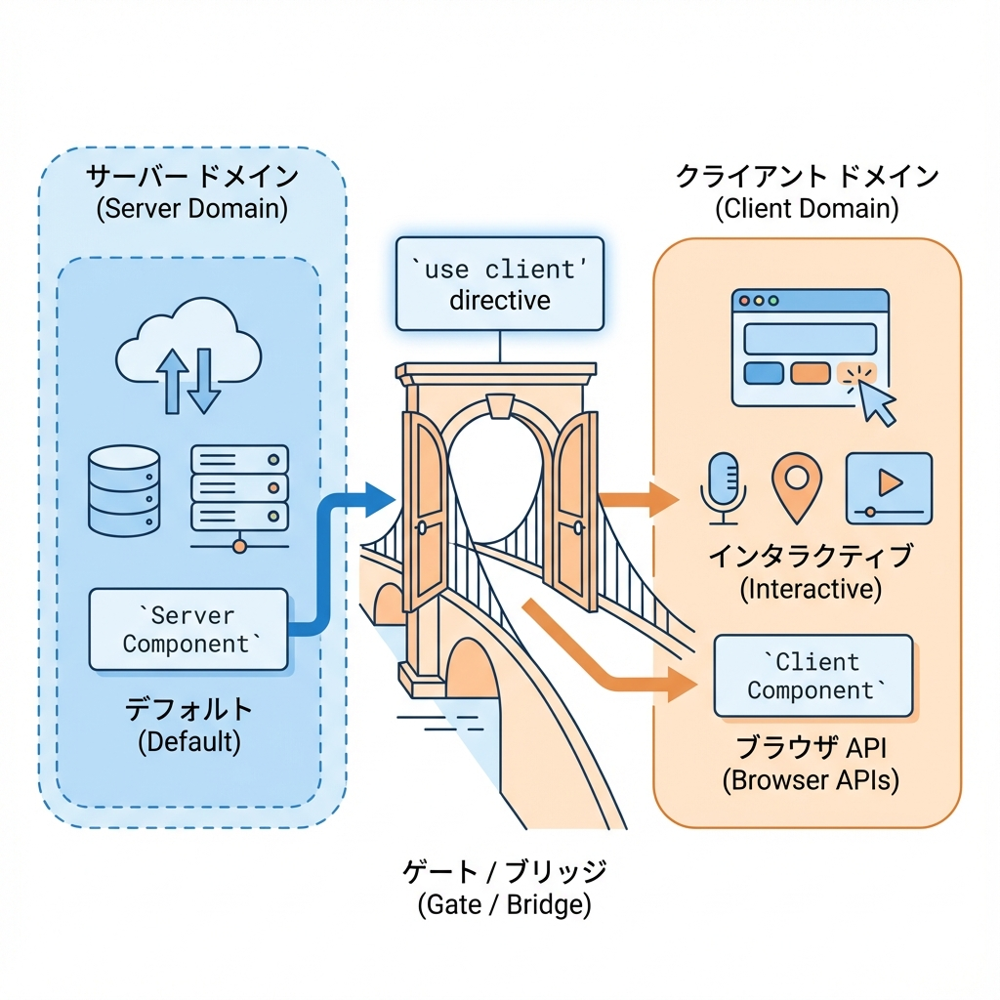
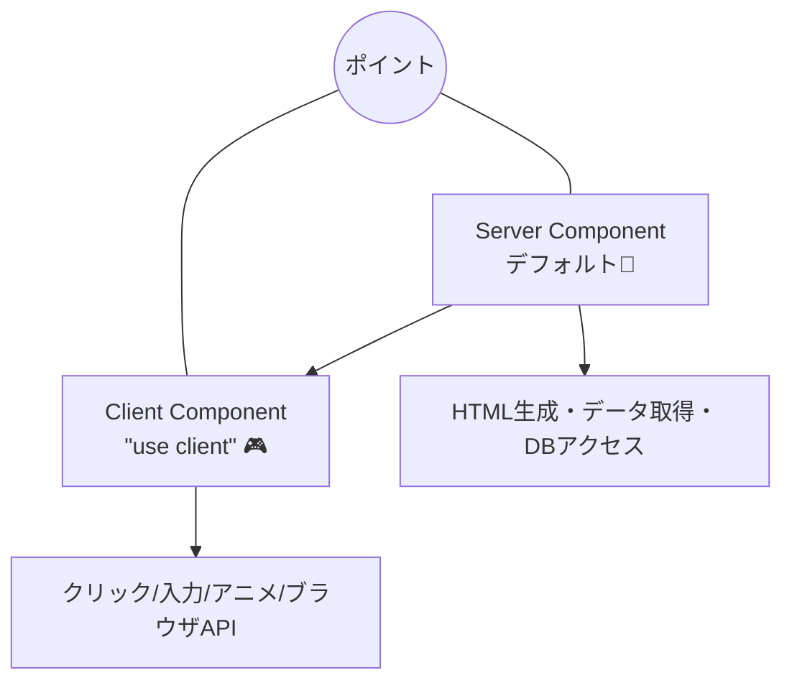

# 第38章：`"use client"` の意味（必要な時だけ！）🎮

## この章のゴール🎯

* Next.js（App Router）で **「ここだけブラウザで動く部品にしたい！」** を指定できるようになる🧠✨
* `useState` / クリック処理 / `window` など **“ブラウザ専用”** が必要なときだけ `"use client"` を付けられるようになる🎮🪄

---

## まず大前提：App Routerは「Server Component がデフォルト」🧊

App Routerでは、何も書かないと **Server Component（サーバー側）** として動きます🍵
つまり、**ブラウザにJSを送らなくても描画できる** のが基本なんだよね✨

でも…👇
ボタンをクリックして数を増やす！みたいな **“操作”** はブラウザ側の仕事🎮
そのときに必要なのが `"use client"` です！💡

---

## `"use client"` ってなに？📝

### ✅ ひとことで

そのファイルを **「Client Component（ブラウザで動く部品）」** にする合図だよ📣🌈

### ✅ 超重要ルール（これだけ覚えて！）🔒

* `"use client"` は **ファイルの一番上** に書く（1行目付近！）⬆️
* そのファイルは **ブラウザ用JSが配信される**（＝ちょっと重くなる可能性）📦
* **Server → Client はOK**（サーバー部品からクライアント部品を呼べる）
  **Client → Server はNG**（クライアント部品からサーバー部品を import できない）🙅‍♀️

---

## 図でイメージ：Server と Client の関係🧊🎮





---

## `"use client"` が必要なとき ✅（だいたいこれ）🎮

次のどれかが出たら「クライアントだ！」って思ってOK🙆‍♀️✨

* `useState` を使いたい（状態を持つ）🔢
* `onClick` / `onChange` みたいな **イベント** がある🖱️
* `useEffect` を使う（初回だけ処理したい等）⏳
* `window` / `document` / `localStorage` など **ブラウザAPI** を使う🌐
* ブラウザ前提のライブラリ（UI系とか）を使う📚

---

## `"use client"` がいらないとき ✅（付けないのが正解）🧊

* ただ表示するだけの見た目コンポーネント🖼️
* サーバーで `fetch` して結果を表示するだけ🍵
* 重い処理や秘密情報（DB接続など）を扱う🔐
  👉 これは **サーバー側に置く** のが安全だよ！

---

## 実例：カウンターボタンを作ろう➕➖🎮

### 1) `components/Counter.tsx` を作る（クライアント部品）✨

```tsx
"use client";

import { useState } from "react";

export function Counter() {
  const [count, setCount] = useState(0);

  return (
    <div style={{ display: "grid", gap: 8 }}>
      <p>カウント：{count} 🧮</p>
      <button onClick={() => setCount((c) => c + 1)}>
        ＋ ふやす ➕
      </button>
    </div>
  );
}
```

### 2) `app/page.tsx` で呼ぶ（サーバー部品から呼ぶのはOK）🧊➡️🎮

```tsx
import { Counter } from "@/components/Counter";

export default function Page() {
  return (
    <main style={{ padding: 24 }}>
      <h1>トップページ🏠</h1>
      <p>下のボタンはブラウザ側で動くよ🎮</p>
      <Counter />
    </main>
  );
}
```

✅ これで「ページ全体はServer」「必要な部分だけClient」になって、軽くて強い構成になるよ〜！💪✨

---

## もう1つ例：`localStorage` を読みたいとき📦

`localStorage` はブラウザにしかないので、クライアント部品が必要だよ🌐

```tsx
"use client";

import { useEffect, useState } from "react";

export function NameFromStorage() {
  const [name, setName] = useState<string>("");

  useEffect(() => {
    const v = localStorage.getItem("name") ?? "";
    setName(v);
  }, []);

  return (
    <div>
      <p>保存された名前：{name || "（まだないよ）"} 🐣</p>
      <button onClick={() => localStorage.setItem("name", "はなこ")}>
        名前を保存する💾
      </button>
    </div>
  );
}
```

---

## よくあるミス集（ここで詰まりやすい）🪤😵

* `"use client"` を **途中に書いちゃう**
  👉 **先頭に置く！**（importより上に！）⬆️
* なんでもかんでも `"use client"` を付けちゃう
  👉 ページ全体がクライアントになると **JSが増えやすい** 📦💦
  **“操作が必要な部品だけ”** に付けるのがコツ✨

---

## ミニ練習🎓✨（5〜10分）

✅ 目標：**「いいね👍」ボタン**を作ってページに置く

1. `components/LikeButton.tsx` を作る（`"use client"` + `useState`）
2. `app/page.tsx` に `<LikeButton />` を置く
3. 押した回数を表示する（例：いいね 3 👍）

ヒント👇

* `count` を `useState(0)` で持つ
* `onClick` で `setCount(count + 1)`

---

## まとめ🌸

* App Routerは **Server Componentがデフォルト**🧊
* 操作・状態・ブラウザAPIが必要なら **そのファイルに `"use client"`** 🎮
* **必要なところだけクライアント化**すると、軽くて気持ちいい✨🚀

次の章（Propsの型）に行くと、Client/Serverどっちでも安全に渡せる書き方がキレイにまとまっていくよ〜🧷😊
