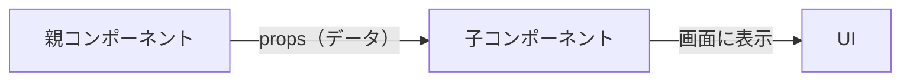

# 第39章：Propsの型：`type Props = {}` の基本🧷

この章では「コンポーネントに渡すデータ（Props）」を **TypeScriptで安全にする**方法をやるよ〜😊🎀
「渡す側（親）」と「受け取る側（子）」で、ズレないようにするのが目的！💪✨

---

## 1) Propsってなに？超ざっくり🍩


Props（プロップス）は、**親コンポーネント→子コンポーネント**へ渡す「引き継ぎメモ」みたいなものだよ📝✨
子はそれを受け取って表示を変えたりするよ〜🎨



---

## 2) 基本形：`type Props = { ... }` を作る🧩

一番よく使う形はこれ！👇✨

```tsx
type Props = {
  name: string;
};

export function Greeting(props: Props) {
  return <p>こんにちは、{props.name}さん🌸</p>;
}
```

でも実務では **分割代入（destructuring）**で書くことが多いよ〜😺

```tsx
type Props = {
  name: string;
};

export function Greeting({ name }: Props) {
  return <p>こんにちは、{name}さん🌸</p>;
}
```

✅ これで「`name` は string 必須！」って TypeScript が見張ってくれる👀🛡️

---

## 3) 使う側（親）で「型の恩恵」を感じる🎁

親でこうやって使うと…

```tsx
import { Greeting } from "@/components/Greeting";

export default function Page() {
  return (
    <main>
      <Greeting name="さくら" />
    </main>
  );
}
```

もし間違えてこう書いたら…👇

```tsx
<Greeting name={123} />
```

✅ TypeScriptが「それ違うよ〜！」って止めてくれる😆🧯
（`name` は `string` って決めたからね！）

---

## 4) よく使うPropsの型テク3つ🧠✨

### (A) 任意（オプショナル）にする：`?` 🌷

「渡してもいいし、渡さなくてもいい」やつ！

```tsx
type Props = {
  name: string;
  subtitle?: string;
};

export function Greeting({ name, subtitle }: Props) {
  return (
    <div>
      <p>こんにちは、{name}さん🌸</p>
      {subtitle && <p>— {subtitle} —</p>}
    </div>
  );
}
```

---

### (B) 選べる値にする（ユニオン）：`"sm" | "md" | "lg"` 👗

「サイズはこの3つだけ！」みたいに縛れる✨

```tsx
type Props = {
  label: string;
  size: "sm" | "md" | "lg";
};

export function Badge({ label, size }: Props) {
  return <span data-size={size}>{label}</span>;
}
```

これで `size="big"` とかは弾けるよ〜💥😆

---

### (C) デフォルト値を入れる（初心者に超おすすめ）🍀

propsが任意のとき、表示が安定する😊✨

```tsx
type Props = {
  name: string;
  emoji?: string;
};

export function Greeting({ name, emoji = "🌸" }: Props) {
  return <p>{emoji} こんにちは、{name}さん</p>;
}
```

---

## 5) ありがちミス集（ここだけ覚えればOK）🧯

* `type Props` に書いた名前と、実際に渡す名前が違う😵‍💫
  例：`type Props = { userName: string }` なのに `<Comp name="..." />` みたいなズレ
* 必須なのに渡し忘れた🙈
  例：`name: string` なのに `<Greeting />`
* なんでも `any` にしてしまう（型チェックが消える）🫥
  👉 困ったらまず `string` / `number` / `boolean` / `("a" | "b")` からでOK！

---

## 6) ミニ練習（5分）⏱️🎀

### お題🎯

`ProfileCard` を作って、Propsに型を付けよう！

**条件**

* `name`：必須（string）
* `faculty`：必須（string）
* `grade`：任意（1〜4想定だけど、まずは number でOK）
* `emoji`：任意（デフォルト "🎓"）

---

### 例（解答）✅

```tsx
type Props = {
  name: string;
  faculty: string;
  grade?: number;
  emoji?: string;
};

export function ProfileCard({ name, faculty, grade, emoji = "🎓" }: Props) {
  return (
    <section>
      <h2>{emoji} {name}</h2>
      <p>学部：{faculty}</p>
      {grade && <p>学年：{grade}年</p>}
    </section>
  );
}
```

---

## この章のゴール達成チェック✅✨

* `type Props = { ... }` を書ける😊
* 必須・任意（`?`）を使い分けできる🌷
* `"sm" | "md" | "lg"` みたいな「選べる値」も作れる👗
* デフォルト値でUIを安定させられる🍀

次の章では、Propsの中でも特別枠の **`children`** をきれいに型付けしていくよ〜🧸✨
