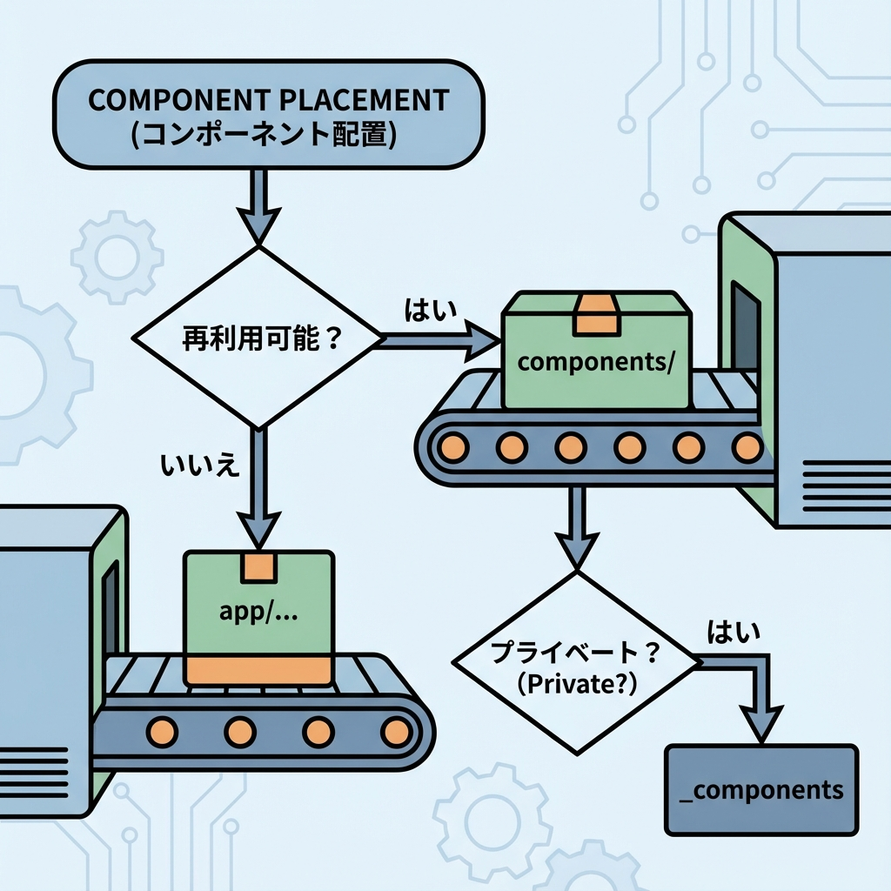
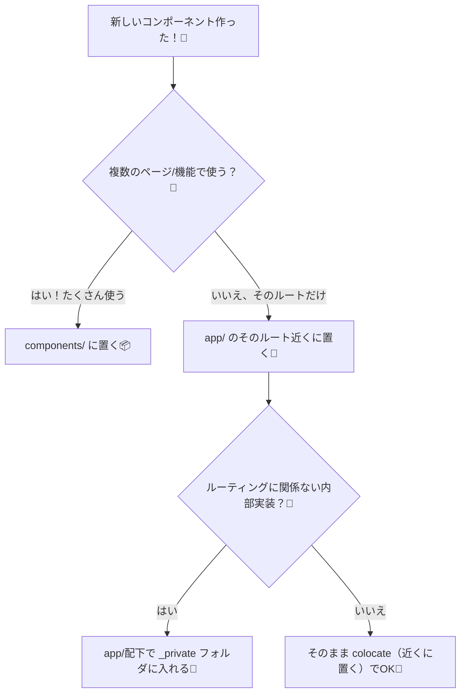

# 第41章：コンポーネントの置き場所：`app/` と `components/` 🗂️

## この章のゴール🎯

「このコンポーネント、どこに置けばいいの〜？😭」を卒業して、**迷子にならない置き場所ルール**を作れるようになるよ〜！🧭💕

---

## まず結論🌟（超たいせつ）

* `app/` は **ルーティング（ページ構造）中心の場所** 🛣️
* `components/` は **いろんなページから使い回す部品置き場** 🧩
* ただし Next.js は「こうしなきゃダメ！」じゃなくて、**チーム（あなた）に合う形を決めて統一**が大事だよ〜🙆‍♀️✨ ([Next.js][1])

> `app/` の中にコンポーネントを置いても、**勝手にURLにならない**から安心してOKだよ〜🫶
> ルートとして公開されるのは、基本 **`page.*` や `route.*` を置いたときだけ**！ ([Next.js][2])

---

## なんで悩むの？😵‍💫（Next.jsの特徴）

Next.js（App Router）では、`app/` のフォルダ階層がURL構造っぽく見えるよね👀
でも実は、**同じフォルダに部品を置いても、それだけでルートにはならない**んだ〜！✨ ([Next.js][2])

---

## 置き場所の決め方フロー🧠💡（これで一発）



「何回使う？」で決めるのが一番ラクだよ〜😆🎀



`_private`（アンダースコア）を付けたフォルダは **ルーティング対象から外れる**から、「ここは内部実装だよ！」って宣言できるよ〜🤫✨ ([Next.js][2])

---

## 実例でイメージしよ〜📁✨（おすすめ構成 2パターン）

### パターンA：ルートの近くに置く（colocate型）📌

「そのページ専用の部品」は、近くに置くと見つけやすいよ〜👀💕

```text
app/
  profile/
    page.tsx
    ProfileCard.tsx      ← このページ専用✨
    _components/
      Avatar.tsx         ← profile内だけで使う部品🤫
```

* `ProfileCard.tsx` は `/profile` のためだけ
* `_components/` は「内部実装だよ」って分かりやすい（ルーティングから外れる）✨ ([Next.js][2])

---

### パターンB：共有部品は `components/` に集める🧩

「どのページでも使うボタン」「ヘッダー」「カード」みたいなのはここが気持ちいい〜🥰

```text
app/
  page.tsx
  about/
    page.tsx

components/
  ui/
    Button.tsx
    Card.tsx
  layout/
    Header.tsx
    Footer.tsx
```

Next.jsの公式ドキュメントでも、`app`・`pages`・`public`・`src` みたいにトップレベルを分けて整理する考え方が紹介されてるよ〜📚✨ ([Next.js][3])

---

## importが地獄にならないコツ🧵✨（超助かるやつ）

深い階層から `../../../components/...` みたいになるとツラいよね😭
そこで **`@/components/...`** みたいに書けるとスッキリ〜！🧼✨ ([Next.js][1])

例：

```ts
import { Button } from "@/components/ui/Button";
```

---

## よくあるハマり🌪️（先に回避しよ）

* **全部 `components/` に突っ込む** → 200個のファイル博物館になって迷子😭
  → `ui/` `layout/` `features/` みたいにサブフォルダ分けよ〜📦✨
* **ページ専用なのに共有置き場へ** → 「これ本当に共有…？」って混乱😵‍💫
  → 専用なら `app/そのルートの近く` が正義📌
* **`app/` の中がURLに見えて怖い** → `page.*` が無い限り公開されないから大丈夫🫶 ([Next.js][2])

---

## ミニ演習🎮✨（5分でできる！）

「共有ボタン」と「ページ専用カード」を分けてみよ〜！💪💕

### 1) 共有ボタンを作る🧩

`components/ui/Button.tsx`

```tsx
type Props = {
  children: React.ReactNode;
  onClick?: () => void;
};

export function Button({ children, onClick }: Props) {
  return (
    <button
      onClick={onClick}
      style={{
        padding: "8px 12px",
        borderRadius: 10,
        border: "1px solid #ccc",
        background: "white",
        cursor: "pointer",
      }}
    >
      {children}
    </button>
  );
}
```

### 2) `app/profile` 専用のカードを作る📌

`app/profile/ProfileCard.tsx`

```tsx
export function ProfileCard() {
  return (
    <section style={{ border: "1px solid #eee", padding: 12, borderRadius: 12 }}>
      <h2 style={{ margin: 0 }}>さくらさん🌸</h2>
      <p style={{ margin: "6px 0 0" }}>情報学部 / 2年</p>
    </section>
  );
}
```

### 3) `app/profile/page.tsx` で使う🎀

```tsx
import { Button } from "@/components/ui/Button";
import { ProfileCard } from "./ProfileCard";

export default function Page() {
  return (
    <main style={{ display: "grid", gap: 12, padding: 16 }}>
      <ProfileCard />
      <Button onClick={() => alert("やった〜！🎉")}>押してみて💖</Button>
    </main>
  );
}
```

---

## まとめ🧸💗（今日の合言葉）

* **共有 = `components/`** 🧩
* **専用 = `app/` の近く** 📌
* **内部実装だよ = `_private`（`_components` など）** 🤫✨ ([Next.js][2])
* **迷ったら「何回使う？」で決める** 🎯

次の章（第42章）で「見た目」と「ロジック」を分けると、さらにスッキリして気持ちよくなるよ〜🫶✨

[1]: https://nextjs.org/docs/14/app/building-your-application/routing/colocation "Routing: Project Organization | Next.js"
[2]: https://nextjs.org/docs/13/app/building-your-application/routing/colocation "Routing: Project Organization | Next.js"
[3]: https://nextjs.org/docs/app/getting-started/project-structure "Getting Started: Project Structure | Next.js"
