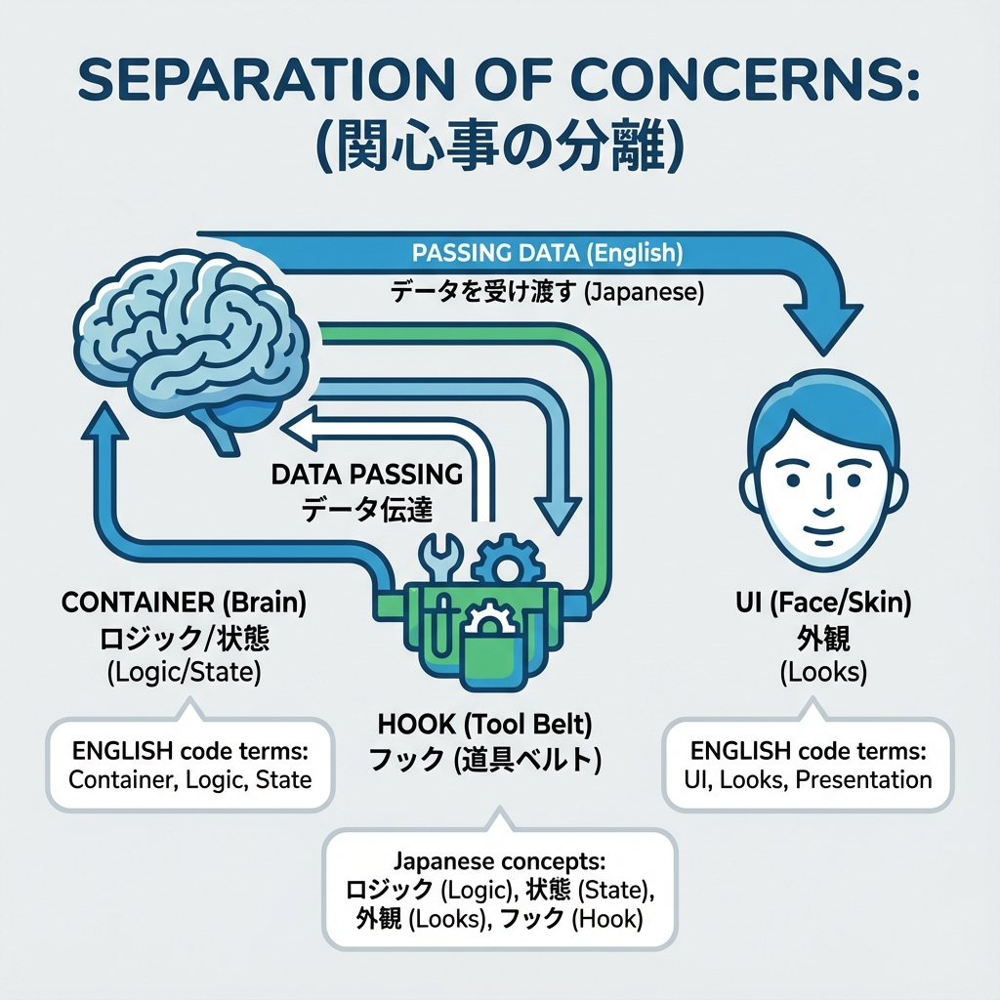
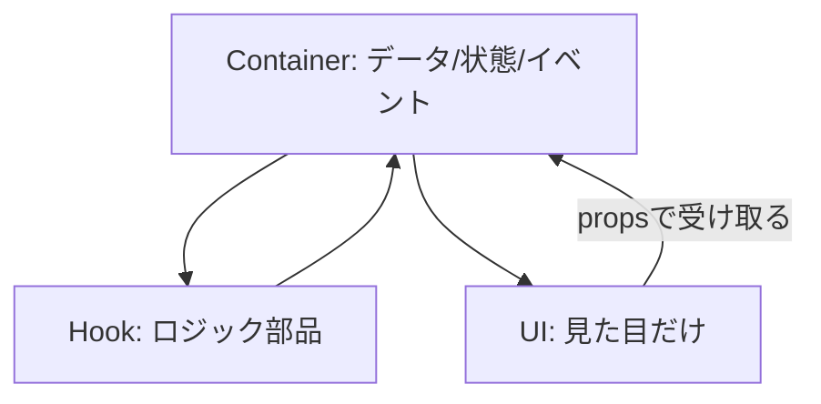

# 第42章：UIを分解するコツ：「見た目」と「ロジック」を分ける🧠

この章では、**画面（UI）をキレイに分けて、コードを読みやすく＆直しやすくするコツ**を身につけるよ〜！🥰
「動くけど、どこ触っていいか怖い…😵‍💫」を卒業する回です🎓✨

---

## 今日のゴール🎯💖

* **見た目だけ担当**のコンポーネントを作れるようになる🎨
* **ロジックだけ担当**（状態・イベント・API呼び出し）を別に出せるようになる🧠
* 「後から仕様変更」が来ても、**泣かずに直せる**構成にできる😭➡️😎✨

---

## なぜ分けるの？（混ざるとツラい😇）

UIとロジックが1ファイルに混ざると…

* JSXが長くて、**読むのに時間かかる**🌀
* ちょっと修正したら、**別の表示が壊れる**💥
* テストもしづらい＆再利用しにくい😵‍💫

だから、ざっくりこう分けるのが強いよ💪✨

* **Presentational（見た目）**：表示するだけ🎀
* **Container（つなぎ役）**：データ取得・状態・イベント担当🧩
* **Hook（ロジック部品）**：状態管理や処理を部品化🪄

---

## 図でイメージするね🧸📌（Mermaid）





ポイントはこれ👇✨
**UIは「受け取ったデータを描くだけ」**にすると、爆発的にラクになるよ💖

---

## 分け方の“黄金3ステップ”🥇✨

### ① まず「見た目」だけにする🎨

* propsでもらったものだけ表示
* `useState` や `fetch` を置かない（置きたくなっても我慢😤）

### ② 次に「つなぎ役（Container）」を作る🧩

* `useState` / `useEffect` / イベントハンドラを書く
* API呼び出しや、状態の持ち方はここ

### ③ ロジックが増えたら「Hook」に逃がす🪄

* 状態・処理・変換を `useXxx()` にまとめる
* Containerがスッキリして気持ちいい🥹✨

---

## ミニ例題：いいね❤️ボタンを“分けて”作るよ！

### 完成イメージ😊

* ボタンを押すと **いいね数が増える**
* 連打防止（処理中は押せない）も入れる⏳

---

## 1) 見た目担当：`LikeButton.tsx`（UIだけ🎀）

```tsx
// components/LikeButton.tsx
type Props = {
  count: number;
  disabled?: boolean;
  onLike: () => void;
};

export function LikeButton({ count, disabled = false, onLike }: Props) {
  return (
    <button
      type="button"
      onClick={onLike}
      disabled={disabled}
      style={{
        padding: "10px 14px",
        borderRadius: 12,
        border: "1px solid #ccc",
        background: disabled ? "#f3f3f3" : "white",
        cursor: disabled ? "not-allowed" : "pointer",
      }}
    >
      ❤️ いいね！（{count}）
      {disabled ? " ⏳" : ""}
    </button>
  );
}
```

✅ このファイルのえらい所👏

* 状態を持ってない
* `onLike` を押されたら呼ぶだけ
* **見た目の責任だけ**🎨

---

## 2) ロジック担当：`useLike.ts`（Hook🪄）

```tsx
// hooks/useLike.ts
"use client";

import { useState } from "react";

type Options = {
  initialCount?: number;
};

export function useLike(options: Options = {}) {
  const { initialCount = 0 } = options;

  const [count, setCount] = useState(initialCount);
  const [isLiking, setIsLiking] = useState(false);

  const like = async () => {
    if (isLiking) return;

    try {
      setIsLiking(true);

      // 本当はAPI呼び出しする想定で、ちょい待つ⏳
      await new Promise((r) => setTimeout(r, 500));

      setCount((c) => c + 1);
    } finally {
      setIsLiking(false);
    }
  };

  return { count, isLiking, like };
}
```

✅ Hookに入れると良いもの🧠

* 状態（count, isLiking）
* 処理（like）
* “ちょい複雑”な流れ（連打防止など）

---

## 3) つなぎ役：`LikeSection.tsx`（Container🧩）

```tsx
// components/LikeSection.tsx
"use client";

import { LikeButton } from "@/components/LikeButton";
import { useLike } from "@/hooks/useLike";

type Props = {
  initialCount?: number;
};

export function LikeSection({ initialCount = 0 }: Props) {
  const { count, isLiking, like } = useLike({ initialCount });

  return (
    <div style={{ display: "grid", gap: 10 }}>
      <p style={{ margin: 0 }}>この投稿、よかった？😊</p>
      <LikeButton count={count} disabled={isLiking} onLike={like} />
    </div>
  );
}
```

✅ Containerの役割は「つなぐ」だけ🤝

* Hookから状態と関数をもらう
* UIにpropsで渡す
  それだけ！気持ちいい！🥹✨

---

## 4) ページで使う：`app/page.tsx`（例🏠）

```tsx
// app/page.tsx
import { LikeSection } from "@/components/LikeSection";

export default function Page() {
  return (
    <main style={{ padding: 24 }}>
      <h1 style={{ marginTop: 0 }}>第42章：見た目とロジック分離💖</h1>
      <LikeSection initialCount={3} />
    </main>
  );
}
```

---

## ファイル構成のおすすめ📁✨

```txt
src/
  app/
    page.tsx
  components/
    LikeButton.tsx       // 見た目だけ🎀
    LikeSection.tsx      // つなぎ役🧩
  hooks/
    useLike.ts           // ロジック部品🪄
```

---

## “分離できてるか”セルフチェック✅🧠

UIコンポーネント（見た目担当）がこうなってたら最高🥰

* `useState` がない（基本）🚫
* `fetch` がない（基本）🚫
* propsが分かりやすい（`count`, `onLike` みたいに）✨
* 「この見た目、別の場所でも使えそう」が出てくる🧁

逆にContainerは…

* 状態・イベント・通信があってOK🙆‍♀️
* でもJSXがデカくなり始めたら、UIへ分割を検討✂️

---

## よくある失敗あるある😇（回避しよっ）

### ❌ UIにロジックが漏れる

例：`LikeButton` の中で `useState` しはじめる
➡️ **「見た目だけ」が崩れる**💥

### ❌ Containerが巨大化する

JSXが200行超えた…😵
➡️ **見た目をUIに戻して、Containerは“薄く”**✨

### ❌ Hookが何でも屋になる

`useApp()` みたいな巨大Hook…😇
➡️ **目的別に小さく**（`useLike`, `useProfile` みたいに）🧩

---

## 練習問題（5〜10分）⌛💪✨

### お題🎀

いま作った `LikeSection` に、メッセージを追加してみよう！

* いいねが **10以上**なら
  `「神すぎる〜〜！😭✨」` を表示
* それ未満なら
  `「よかったら押してね😊」` を表示

📌ルール：
**表示だけのif**はUI側に寄せてもOK（見た目だから）✨
でも、条件が増えて計算が複雑なら **Hookに寄せる**のが◎🧠

（例：`const message = count >= 10 ? ...` をどこに置くか考えるのが練習だよ〜！🪄）

---

## まとめ🎉💖

* **見た目（UI）**：propsでもらって描くだけ🎨
* **つなぎ役（Container）**：状態・イベント・通信を担当🧩
* **ロジック（Hook）**：増えてきたら分離して再利用🪄

この型が身につくと、Next.jsの開発が一気にラクになるよ〜！🥹✨
