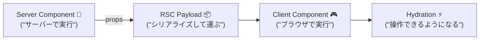

# 第43章：Server→Clientへ渡せるデータの注意（シリアライズ）📦

Next.js（App Router）では、**Server Component（サーバー）→ Client Component（ブラウザ）**に props を渡すとき、**データはいったん「送れる形」に変換（＝シリアライズ）**されて運ばれます📦🚚
だから、**なんでも渡せるわけじゃない**のが今日のポイントだよ〜！🥰

---

## 1) まずはイメージ図🧠💡




Server で作った UI ツリーは **RSC Payload** という形で送られて、その中に **Server→Client に渡した props も含まれる**よ〜📦✨ ([Next.js][1])

---

## 2) 「シリアライズ」ってなに？🧺✨

超ざっくり言うと：

* **サーバーのメモリ上にある“そのままの値”**は
* **ネットワークで運べる形**にしてから
* **ブラウザに届ける**📦➡️🌐

なので、**関数**とか **クラスのインスタンス**みたいな「その場の実体」は運べなくてエラーになりがち💥
Next.js でも **“Client Component の props はシリアライズ可能である必要がある”**って明言されてるよ✅ ([Next.js][2])

---

## 3) 渡してOKなprops / ダメなprops（目安）✅❌

### ✅ OK（代表）

React（RSC）のルールでは、たとえばこんなのは「送れる」よ👍
（迷ったら **プリミティブ + 配列 + プレーンオブジェクト** が最強💪）

* プリミティブ：`string / number / boolean / null / undefined` など
* `Array`
* **プレーンオブジェクト**（`{}` で作った普通のオブジェクト）
* `Date`
* `Map / Set`
* `ArrayBuffer / TypedArray`
* `Promise`
* JSX（コンポーネント要素）
* （特別枠）`'use server'` な **Server Function**（※後の章でやるやつ！） ([React][3])

### ❌ NG（やりがち）

* **普通の関数**（イベントハンドラなど）
* **class のインスタンス**（`new User()` みたいなやつ）
* `Error` などクラス由来のオブジェクト（だいたいアウト）
* `Symbol()`（グローバル登録じゃないやつ） ([React][3])

---

## 4) ありがちエラー例（これ見たら「はいはい、シリアライズね」ってなる😇）

### ❌ 関数を渡して死ぬパターン💥

「Server → Client に関数を渡そうとした」時によく出るやつ👇
（Next.js 側でも “関数はシリアライズできない” って感じで怒られる） ([GitHub][4])

---

## 5) ミニ実践：わざと失敗 → 正しい形に直す🧪✨

### ✅ 構成（例）

* `app/page.tsx`（Server Component）
* `app/_components/ProfileCard.tsx`（Client Component）

---

### 5-1) ❌ ダメな例：Serverから関数を渡す💥

**app/page.tsx（Server）**

```tsx
import ProfileCard from "./_components/ProfileCard";

export default function Page() {
  const user = {
    name: "Aki",
    joinedAt: new Date(), // DateはOK寄り✨
  };

  // ❌ これを props で渡すのがNG（普通の関数）
  const handleClick = () => {
    console.log("liked!");
  };

  return <ProfileCard user={user} onLike={handleClick} />;
}
```

**app/_components/ProfileCard.tsx（Client）**

```tsx
"use client";

type Props = {
  user: { name: string; joinedAt: Date };
  onLike: () => void; // ❌
};

export default function ProfileCard({ user, onLike }: Props) {
  return (
    <div style={{ border: "1px solid #ddd", padding: 12, borderRadius: 8 }}>
      <p>こんにちは、{user.name}さん😊</p>
      <p>参加日：{user.joinedAt.toLocaleDateString()}</p>
      <button onClick={onLike}>いいね！💖</button>
    </div>
  );
}
```

→ だいたい **「関数は渡せないよ」系**で止まる😵‍💫
（理由：Server→Client の境界で props を運ぶ必要があるから📦） ([Next.js][2])

---

### 5-2) ✅ 正しい例：渡すのはデータだけ、関数はClientで作る🎮✨

**app/page.tsx（Server）**

```tsx
import ProfileCard from "./_components/ProfileCard";

export default function Page() {
  const user = {
    name: "Aki",
    joinedAt: new Date(),
  };

  // ✅ 渡すのは「データだけ」
  return <ProfileCard user={user} />;
}
```

**app/_components/ProfileCard.tsx（Client）**

```tsx
"use client";

type Props = {
  user: { name: string; joinedAt: Date };
};

export default function ProfileCard({ user }: Props) {
  // ✅ “押した時の処理”はClient側で定義する
  const handleLike = () => {
    alert(`${user.name}さんに「いいね！」しました💖`);
  };

  return (
    <div style={{ border: "1px solid #ddd", padding: 12, borderRadius: 8 }}>
      <p>こんにちは、{user.name}さん😊</p>
      <p>参加日：{user.joinedAt.toLocaleDateString()}</p>
      <button onClick={handleLike}>いいね！💖</button>
    </div>
  );
}
```

これが基本形だよ〜！🥳
**「データはServerから」**、**「操作ロジックはClientで」**って分けると超安定✅

---

## 6) もっと実戦っぽいコツ：DB結果は“安全な形”に整える🧼✨

DBやライブラリの返す値って、**クラスのインスタンス**が混ざりがち（例：Decimal系とか）😵
そのときは **Client に渡す前に“普通の値”へ変換**しよ〜！

```ts
// 例：なんか複雑そうな user を “安全な形” にするイメージ
const safeUser = {
  id: String(user.id),
  name: user.name,
  // DateはOKだけど、迷うなら文字列にしてもOK🙆‍♀️
  joinedAt: user.joinedAt.toISOString(),
};
```

---

## 7) まとめ🎁✨（ここだけ覚えたら勝ち）

* Server→Client の props は **運べる形（シリアライズ可能）**じゃないとダメ📦 ([Next.js][2])
* **関数・クラス系はNGになりやすい**💥 ([React][3])
* 迷ったら：**string / number / boolean / 配列 / プレーンオブジェクト**に寄せると安心💖

---

## ちょいテスト📝✨（3問）

1. ServerからClientに渡して危険なのはどれ？
   A. number　B. 配列　C. 関数　D. プレーンオブジェクト

2. 「押した時の処理（onClick）」は基本どっちで作る？
   A. Server　B. Client

3. DB結果がそのまま渡せない時、最初にやることは？
   A. とりあえず `as any`　B. 安全な形に変換して渡す

答え：1) C　2) B　3) B 😆🎉

[1]: https://nextjs.org/docs/app/getting-started/server-and-client-components "Getting Started: Server and Client Components | Next.js"
[2]: https://nextjs.org/docs/app/api-reference/directives/use-client "Directives: use client | Next.js"
[3]: https://react.dev/reference/rsc/use-client "'use client' directive – React"
[4]: https://github.com/vercel/next.js/issues/42408?utm_source=chatgpt.com "Functions cannot be passed directly to Client Components ..."
