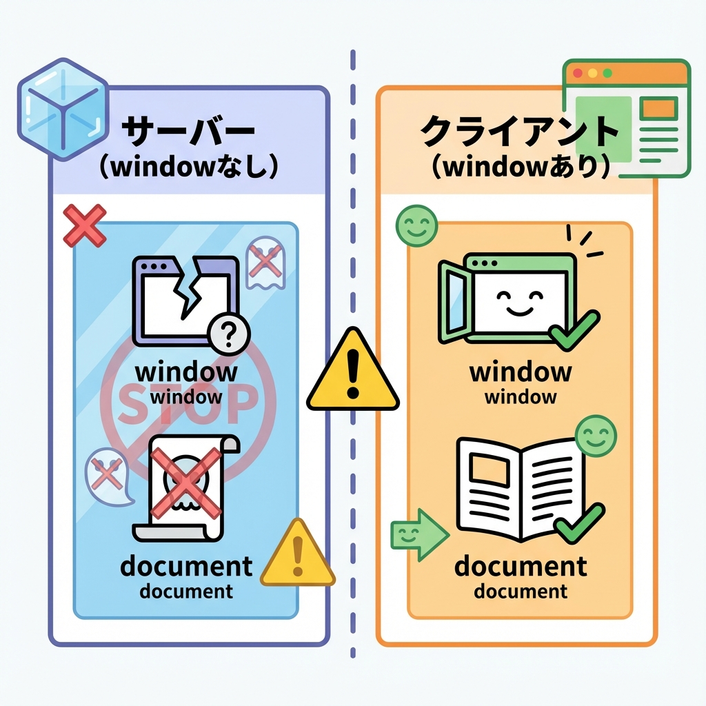
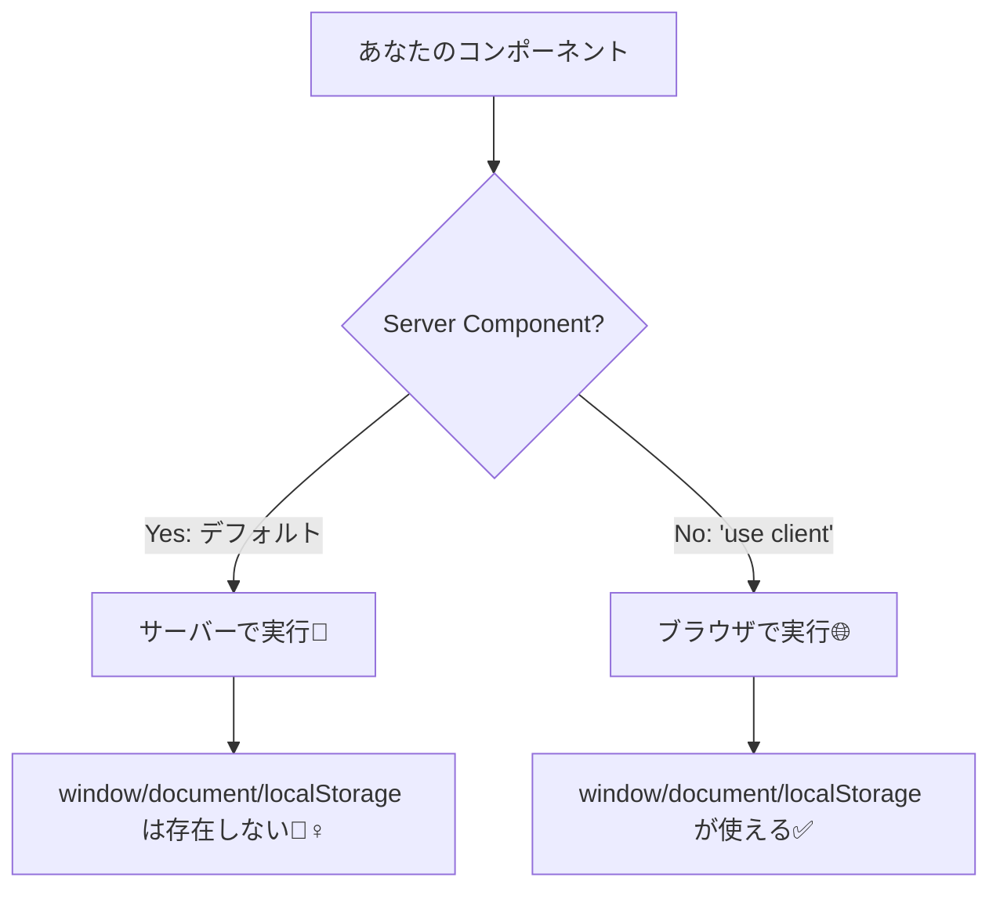

# 第44章：よくあるハマり：ブラウザAPIはClientだけ🌐

Next.js（App Router）では **Server Component がデフォルト** だから、つい React いつものノリで書くと…
**「window がない！」「localStorage がない！」「document がない！」** みたいにハマります😵‍💫💦
この章では、それを **最速で回避する考え方** を身につけよ〜！🫶✨

---

## 1) まず結論✅：ブラウザAPIは「ブラウザの中」だけに存在する💡

* ✅ **ブラウザAPI**：`window` / `document` / `localStorage` / `navigator` など
  → **ブラウザ（＝Client）にしかない** 🌐
* ✅ **Server Component**：サーバー側で実行される🧊
  → **ブラウザがない環境** なので触れない🙅‍♀️

---

## 2) どこで動いてるの？ざっくり図解🗺️





---

## 3) よく出るエラー例😇（これ出たらこの章の話！）

* `ReferenceError: window is not defined`
* `ReferenceError: localStorage is not defined`
* `document is not defined`

つまり：**Serverで動いちゃってる** ってことだよ〜🧊💥

---

## 4) ブラウザAPIの代表メンバー一覧👥🌐（だいたい危険）

Server Component で触ると危ないやつたち👇

* `window` / `document`
* `localStorage` / `sessionStorage`
* `navigator`（ユーザーエージェント、言語など）
* `location`
* `matchMedia`（ダークモード判定とか）
* `Notification`
* `geolocation`
* `IntersectionObserver`（画面内に入った判定）

「ブラウザっぽい匂いがしたら」まず疑ってOK！🕵️‍♀️✨

---

## 5) 解決パターンは主に3つ🧰✨（これだけ覚えれば勝てる）

### パターンA：そのコンポーネントを Client Component にする🎮

ブラウザAPIを使うファイルの先頭にこれ👇

```tsx
"use client";

import { useEffect, useState } from "react";

export function ThemeHint() {
  const [theme, setTheme] = useState<string>("(checking...)");

  useEffect(() => {
    // ✅ ここはブラウザで動く
    const isDark = window.matchMedia("(prefers-color-scheme: dark)").matches;
    setTheme(isDark ? "dark 🌙" : "light ☀️");
  }, []);

  return <p>Theme: {theme}</p>;
}
```

✅ **ブラウザAPIは「useEffectの中」に入れる** と安全度アップ⤴️（初回はサーバー描画→その後ブラウザで動く流れがあるから）😊

---

### パターンB：Server と Client に分割する✂️（いちばん綺麗✨）

**データ取得やDBはServer🧊**、**ブラウザ操作はClient🌐** に分けるやつ！

#### ✅ Server（親）：`app/page.tsx`

```tsx
import { ClientPart } from "./client-part";

export default async function Page() {
  // 🧊 サーバーでできること（例：DB取得 / fetch など）
  const userName = "Akikun"; // 例：サーバーで取ってきた想定✨

  return (
    <main>
      <h1>Hello, {userName} 👋</h1>
      {/* 🌐 ブラウザAPIが必要な場所だけClientにする */}
      <ClientPart />
    </main>
  );
}
```

#### ✅ Client（子）：`app/client-part.tsx`

```tsx
"use client";

import { useEffect, useState } from "react";

export function ClientPart() {
  const [lang, setLang] = useState<string>("...");

  useEffect(() => {
    setLang(navigator.language); // ✅ ブラウザだけの情報
  }, []);

  return <p>Browser language: {lang} 🗣️</p>;
}
```

---

### パターンC：どうしても1ファイルに書きたい時の最終手段🧯

`typeof window !== "undefined"` で「今ブラウザ？」をチェックする方法！

```tsx
export function SafeCheck() {
  const canUseBrowser = typeof window !== "undefined";

  return (
    <p>
      {canUseBrowser ? "Browser OK 🌐" : "Server side 🧊"}
    </p>
  );
}
```

⚠️ ただし、これだけで **localStorage読み書き** とかをゴリ押しすると、描画タイミングでズレやすいから
基本は **パターンA/B** がおすすめだよ〜🫶✨

---

## 6) ミニ練習💪✨：localStorageで「ニックネーム」を表示しよう

やること：

1. `localStorage` から `nickname` を読む
2. なければ `"guest"` にする
3. 画面に表示する

```tsx
"use client";

import { useEffect, useState } from "react";

export function Nickname() {
  const [nickname, setNickname] = useState("guest");

  useEffect(() => {
    const saved = localStorage.getItem("nickname");
    if (saved) setNickname(saved);
  }, []);

  return <p>Nickname: {nickname} 🐣</p>;
}
```

おまけ：保存ボタンも付けたいなら（ちょい発展）🎁

```tsx
"use client";

import { useEffect, useState } from "react";

export function NicknameEditor() {
  const [nickname, setNickname] = useState("guest");
  const [input, setInput] = useState("");

  useEffect(() => {
    const saved = localStorage.getItem("nickname");
    if (saved) setNickname(saved);
  }, []);

  const save = () => {
    localStorage.setItem("nickname", input);
    setNickname(input);
    setInput("");
  };

  return (
    <div style={{ display: "grid", gap: 8, maxWidth: 320 }}>
      <p>Nickname: {nickname} 🐣</p>
      <input
        value={input}
        onChange={(e) => setInput(e.target.value)}
        placeholder="type your nickname ✍️"
      />
      <button onClick={save}>Save 💾</button>
    </div>
  );
}
```

---

## 7) すぐ使えるチェックリスト✅✨（ハマり防止のお守り）

* ✅ `window` / `document` / `localStorage` を触る？ → **"use client" 必須** 🌐
* ✅ ブラウザAPIは **useEffect の中** が安全💖
* ✅ Serverでやること（取得・計算）と Clientでやること（操作・保存）を分ける✂️
* ✅ エラーに `not defined` が出たら **「Serverで動いてる」** を疑う🧊

---

## 8) 1分クイズ🧠✨（答えもすぐ下にあるよ）

Q1. `navigator.language` はどこで使える？
A. Server / Client どっち？🌐🧊

Q2. `app/page.tsx` にそのまま `localStorage.getItem()` 書いたらどうなる？😇

<details>
<summary>答えを見る👀</summary>

* A1：**Client** 🌐（ブラウザにしかない！）
* A2：だいたい **`localStorage is not defined`** で落ちる💥（Serverで動くから🧊）

</details>

---

ここまでできたら、第44章クリア🎉✨
「ブラウザっぽいもの＝Clientで！」って反射でできるようになると、Next.jsが一気に楽になるよ〜🫶🌸
