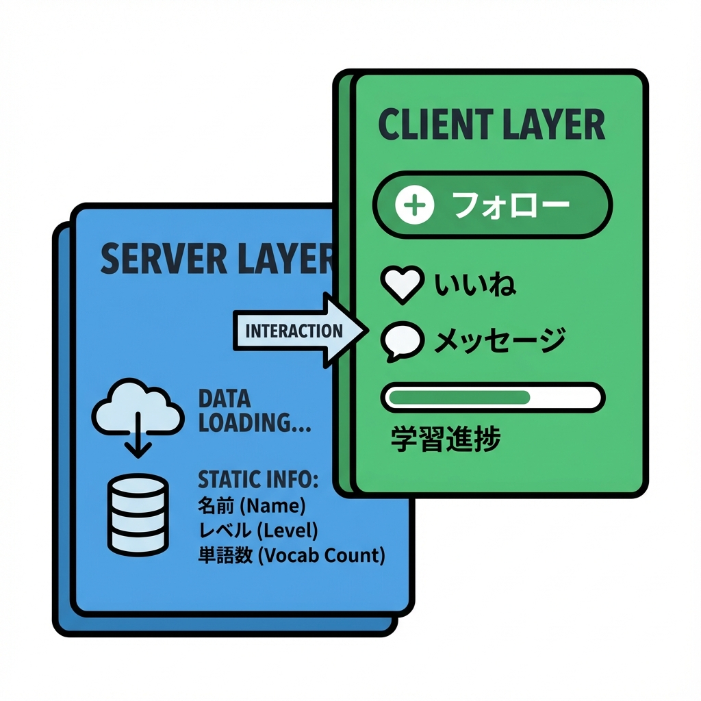
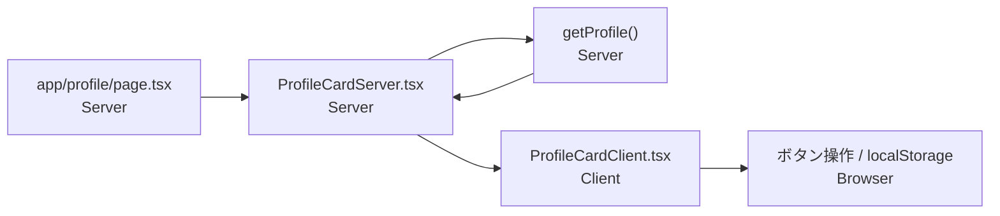

# 第45章：練習：プロフィールカードをServer/Clientで作り分ける🪄

この章は「**プロフィールカード**」を作りながら、
**Server Component（データ用）** と **Client Component（操作用）** をキレイに分ける練習だよ〜！😆💕

---

## この章のゴール🎯✨

* Server側でプロフィールデータを用意する🧊（安全＆速いイメージ）
* Client側で「フォローする」ボタンを動かす🎮（クリック・localStorageなど）
* **“見た目は1枚のカード”** だけど、中身は **Server/Clientの役割分担** になってる状態にする💡

---

## 完成イメージ（役割の流れ）🧭✨





---

## 1) ルート（ページ）を作る🏠📄

### ✅ `app/profile/page.tsx` を作成

```tsx
import ProfileCardServer from "@/components/profile/ProfileCardServer";

export default function ProfilePage() {
  return (
    <main style={{ maxWidth: 520, margin: "40px auto", padding: "0 16px" }}>
      <h1 style={{ fontSize: 24, fontWeight: 700, marginBottom: 16 }}>
        プロフィール🌸
      </h1>

      <ProfileCardServer userId="u_001" />
    </main>
  );
}
```

---

## 2) Server Component（データ担当）を作る🧊📦

ここは「**データを準備して**」「**Clientに渡す**」係だよ〜！🍵✨
（クリック操作やlocalStorageはやらない！）

### ✅ `components/profile/ProfileCardServer.tsx` を作成

```tsx
import ProfileCardClient from "./ProfileCardClient";

type Props = {
  userId: string;
};

type Profile = {
  id: string;
  name: string;
  bio: string;
  avatarUrl: string;
  followerCount: number;
  updatedAtISO: string; // ✅ Dateじゃなく文字列で渡す（安全！）
};

async function getProfile(userId: string): Promise<Profile> {
  // それっぽく「サーバーで取得してる感」😴💤（なくてもOK）
  await new Promise((r) => setTimeout(r, 300));

  return {
    id: userId,
    name: "あかね",
    bio: "カフェ巡りと写真が好き☕📸 ゆるっと開発も勉強中〜！",
    avatarUrl: "/avatar.png", // public/avatar.png を置く想定🖼️
    followerCount: 128,
    updatedAtISO: new Date().toISOString(),
  };
}

export default async function ProfileCardServer({ userId }: Props) {
  const profile = await getProfile(userId);

  // ✅ Server → Client へ「シリアライズ可能なデータだけ」渡す
  return <ProfileCardClient profile={profile} />;
}
```

---

## 3) Client Component（操作担当）を作る🎮💖

ここが「ボタン押したら変わる！」担当😍
ついでに **localStorage** で「フォロー中」を記憶しちゃうよ〜！🧠✨

### ✅ `components/profile/ProfileCardClient.tsx` を作成

```tsx
"use client";

import { useEffect, useMemo, useState } from "react";
import styles from "./ProfileCard.module.css";

type Profile = {
  id: string;
  name: string;
  bio: string;
  avatarUrl: string;
  followerCount: number;
  updatedAtISO: string;
};

type Props = {
  profile: Profile;
};

export default function ProfileCardClient({ profile }: Props) {
  const storageKey = useMemo(() => `followed:${profile.id}`, [profile.id]);

  const [followed, setFollowed] = useState(false);
  const [count, setCount] = useState(profile.followerCount);

  // ✅ ブラウザAPIは Client で！（localStorage）
  useEffect(() => {
    const saved = localStorage.getItem(storageKey);
    if (saved === "1") {
      setFollowed(true);
      setCount(profile.followerCount + 1);
    }
  }, [storageKey, profile.followerCount]);

  const toggleFollow = () => {
    setFollowed((prev) => {
      const next = !prev;
      localStorage.setItem(storageKey, next ? "1" : "0");
      setCount((c) => (next ? c + 1 : c - 1));
      return next;
    });
  };

  return (
    <section className={styles.card}>
      <div className={styles.header}>
        

        <div className={styles.headerText}>
          <p className={styles.name}>{profile.name}さん🌷</p>
          <p className={styles.meta}>フォロワー：{count}人</p>
        </div>
      </div>

      <p className={styles.bio}>{profile.bio}</p>

      <button
        className={followed ? styles.followedBtn : styles.followBtn}
        onClick={toggleFollow}
        type="button"
      >
        {followed ? "フォロー中💖" : "フォローする🤝"}
      </button>

      <p className={styles.updated}>
        更新：{new Date(profile.updatedAtISO).toLocaleString()} ⏰
      </p>
    </section>
  );
}
```

---

## 4) CSS Modulesでカードっぽくする💅✨

### ✅ `components/profile/ProfileCard.module.css` を作成

```css
.card {
  border: 1px solid #e6e6e6;
  border-radius: 16px;
  padding: 16px;
  box-shadow: 0 6px 20px rgba(0, 0, 0, 0.06);
  background: #fff;
}

.header {
  display: flex;
  gap: 12px;
  align-items: center;
  margin-bottom: 12px;
}

.avatar {
  width: 64px;
  height: 64px;
  border-radius: 999px;
  object-fit: cover;
  border: 1px solid #eee;
}

.headerText {
  display: grid;
  gap: 4px;
}

.name {
  font-size: 18px;
  font-weight: 700;
}

.meta {
  font-size: 13px;
  color: #666;
}

.bio {
  margin: 12px 0 14px;
  line-height: 1.6;
}

.followBtn,
.followedBtn {
  width: 100%;
  border: none;
  border-radius: 12px;
  padding: 12px 14px;
  font-weight: 700;
  cursor: pointer;
}

.followBtn {
  background: #111;
  color: #fff;
}

.followedBtn {
  background: #ffe3ee;
  color: #b1004b;
}

.updated {
  margin-top: 10px;
  font-size: 12px;
  color: #777;
}
```

---

## 5) 画像を置く🖼️✨（超かんたん）

* `public/avatar.png` を作って、好きな画像を `avatar.png` という名前で置いてね📁💕
  （Windowsならエクスプローラで `public` にドラッグでOK！🖱️✨）

---

## 6) 動作チェック✅🌈

PowerShell でプロジェクトのルートに移動して…

```bash
npm run dev
```

ブラウザで👇にアクセス

* `http://localhost:3000/profile` 🏃‍♀️💨

### 確認ポイント👀✨

* カードが表示される💳
* ボタン押すと「フォロー中💖」に変わる🎉
* リロードしても状態が残る（localStorage）🧠✨

---

## よくあるハマり🪤（ここだけ見ればだいたい直る😂）

* ボタンが押せない 😭
  → Client側ファイルの先頭に **`"use client"`** がある？🎮

* `localStorage is not defined` 😵
  → ServerでlocalStorage触ってない？（触るのはClientだけ！）🌐

* Server→Clientに渡したらエラー😵‍💫
  → `Date` や `Map` や `関数` を渡してない？
  ✅ この章みたいに **文字列/数値/配列/オブジェクト（JSONっぽい）** にしよう📦✨

---

## ミニ課題（5分）⏱️💪

1. `bio` をもう1行増やして、改行もきれいに見せてみよう📝✨
2. 「フォロー中💖」のときだけ、ボタンの文言を
   `フォロー中（解除する）💔` にしてみよう🎭
3. `followerCount` を「フォローしたら +1 / 解除したら -1」以外に、
   **“上限0で止める”** ようにしてみよう🧯（マイナス防止！）

---

これで「**Serverはデータ担当🧊 / Clientは操作担当🎮**」の分け方が、かなり体に入るはず！😆✨
