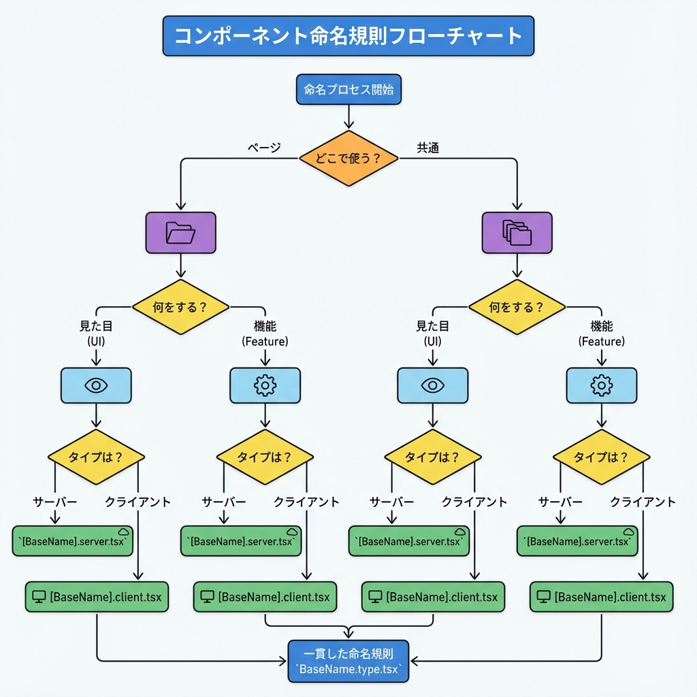
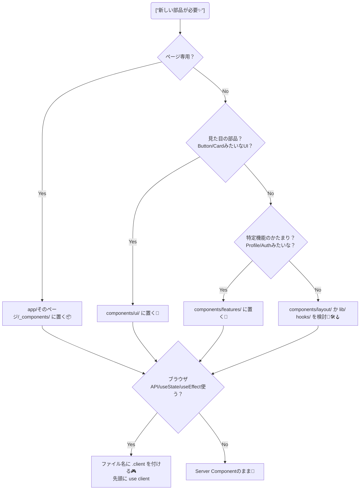

# 第46章：コンポーネント命名：迷子にならないルール決め📛

コンポーネントの命名って、**最初は適当でも動く**んだけど…
チームや未来の自分が増えるほど、**「どこに何があるの！？😵‍💫」**が爆増します💥
だからこの章では、**迷子にならない“命名ルール”を先に固定**しちゃいます💪💖

---

## 1) ゴール🎯（この章でできるようになること）

* 📦 ファイル名を見ただけで「何の部品か」がわかる
* 🧭 置き場所もセットで決められる（探す時間ゼロへ）
* 🧊 Server/🎮 Client の違いも名前でわかるようにする

---

## 2) 命名が崩れると起きる事故あるある💥

* `Card.tsx` が10個ある（どれ！？😇）
* `usercard.tsx` と `UserCard.tsx` が混ざる（Windowsだと見えにくい事故🪤）
* `modal.tsx` が実はボタンだった（嘘つき名前🙅‍♀️）
* `components/` が何でも置き場になってカオス（沼🫠）

---

## 3) まず決めるのはこの3つだけ🧩✨

命名は悩むほど詰むので、判断軸を固定します👍

1. **何を表す？**（見た目？機能？）🎨🧠
2. **どこで使う？**（ページ専用？全体共通？）🗺️
3. **どっちで動く？**（Server？Client？）🧊🎮

---

## 4) 迷子ゼロ命名ルール（これを採用でOK）✅📛✨

### ルールA：コンポーネントは PascalCase 統一👑

* ✅ `UserCard`, `LoginForm`, `ArticleList`
* ❌ `usercard`, `user_card`, `Usercard`

### ルールB：**ファイル名＝コンポーネント名**にする📄✨

* ✅ `UserCard.tsx` → `export function UserCard() {}`
* ✅ 1ファイル1コンポーネントが基本（例外は小さい部品だけ）

```tsx
// components/profile/UserCard.tsx
export type UserCardProps = {
  name: string;
};

export function UserCard({ name }: UserCardProps) {
  return <div>こんにちは、{name}さん 👋</div>;
}
```

### ルールC：Client Component は名前で分かるようにする🎮

「use client」入りは、**ファイル名に印を付ける**のが最強です💡
おすすめはどっちかに統一👇

* パターン①：`.client.tsx` を付ける（推し✨）

  * ✅ `UserCard.client.tsx`
* パターン②：`Client` を付ける

  * ✅ `UserCardClient.tsx`

```tsx
// components/profile/UserCard.client.tsx
"use client";

import { useState } from "react";

export function UserCardClient() {
  const [count, setCount] = useState(0);
  return (
    <button onClick={() => setCount((c) => c + 1)}>
      クリック {count} 回 🐣
    </button>
  );
}
```

### ルールD：Props 型は `〇〇Props` にする🧷

* ✅ `UserCardProps`, `LoginFormProps`
* ❌ `Props`, `Type`, `P`

### ルールE：イベント関数は `handle〇〇` 統一🖱️

* ✅ `handleClick`, `handleSubmit`, `handleChange`

### ルールF：UIの“種類”があるなら接尾辞で揃える🧩

* ローディング用：`Skeleton`

  * ✅ `UserCardSkeleton`
* 空状態：`Empty`

  * ✅ `ArticleListEmpty`
* エラー表示：`Error`

  * ✅ `ProfileError`
* モーダル：`Modal`

  * ✅ `DeleteConfirmModal`
* ダイアログ：`Dialog`（UIライブラリに合わせる）

  * ✅ `ShareDialog`

### ルールG：CSS Modules は `ComponentName.module.css`🎀

* ✅ `UserCard.module.css`
* ❌ `usercard.css`, `styles.css`

### ルールH：同じ概念の“変種”は接尾辞で表す🧠✨

* ✅ `UserCardCompact`, `UserCardLarge`
* ✅ `ButtonPrimary`, `ButtonDanger`（ただし増やしすぎ注意⚠️）

### ルールI：略語は極力やめる（検索に弱い）🔍

* ✅ `UserProfile` / ❌ `UsrPrf`
* ✅ `NavigationMenu` / ❌ `Nav`

### ルールJ：置き場所ルールもセットで固定🗂️

命名だけ頑張っても、置き場がカオスだと負けます😭
おすすめの分け方👇（すごく現実的✨）

* `components/ui/`：見た目部品（Button, Card など）🎨
* `components/features/`：機能のかたまり（Profile, Auth など）🧠
* `components/layout/`：ヘッダーやフッターなど枠もの🧱
* `hooks/`：カスタムフック `use〇〇` 🪝
* `lib/`：ユーティリティ関数（formatDate等）🛠️
* `types/`：型まとめ（必要なら）📘

---

## 5) これで迷わない！命名＆配置の判断フロー🧭✨（Mermaid）





---

## 6) “良い例”フォルダ構成サンプル📁✨

```txt
my-app/
  app/
    (site)/
      page.tsx
      _components/
        HeroSection.tsx
        HeroSection.client.tsx
  components/
    ui/
      Button.tsx
      Card.tsx
    features/
      profile/
        UserCard.tsx
        UserCardSkeleton.tsx
  hooks/
    useDebounce.ts
  lib/
    formatDate.ts
```

ポイント🎯

* `app/` 配下の `_components/` は「そのページだけで使う部品」の置き場にすると最高👍
* 共通化したくなったら `components/` に“引っ越し”🚚✨（最初から全部共通にしないのがコツ）

---

## 7) ミニ練習💪✨（5分でOK）

次の名前、どれが一番わかりやすい？🎓💭

1. プロフィール画面で使う、ユーザーのカード

   * A: `Card.tsx`
   * B: `User.tsx`
   * C: `UserCard.tsx` ✅

2. クリックで開く削除確認モーダル

   * A: `Modal.tsx`
   * B: `Delete.tsx`
   * C: `DeleteConfirmModal.client.tsx` ✅（操作あるならClient寄り🎮）

3. ローディング中のUserCardの代わり

   * A: `Loading.tsx`
   * B: `UserCardLoading.tsx`
   * C: `UserCardSkeleton.tsx` ✅（命名統一しやすい✨）

---

## 8) この章のまとめ📌🎉

* **PascalCase + ファイル名一致**で検索が強くなる🔍✨
* **Client は名前で分かる印（.client / Client）**を付ける🎮
* **Skeleton / Empty / Modal など接尾辞で役割を固定**すると一気に読みやすい🧩
* 命名はセンスじゃなくて**ルールで勝つ**💪🌸

