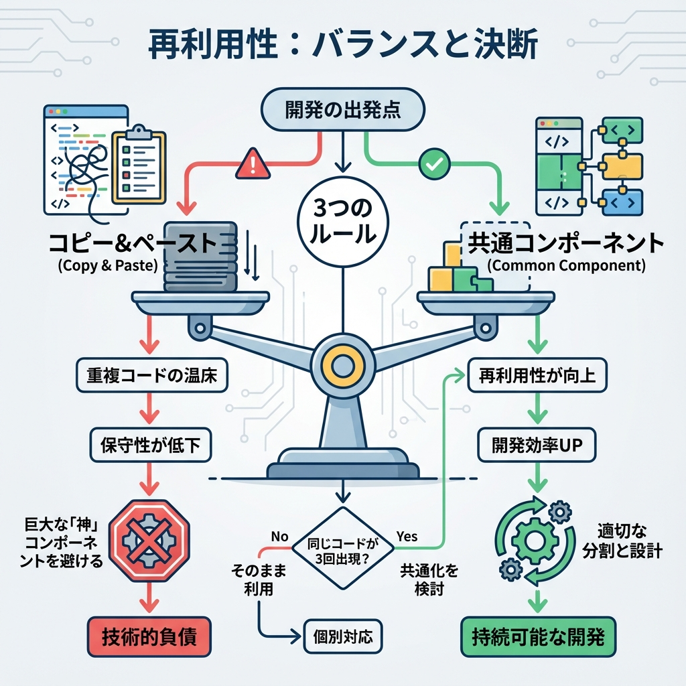
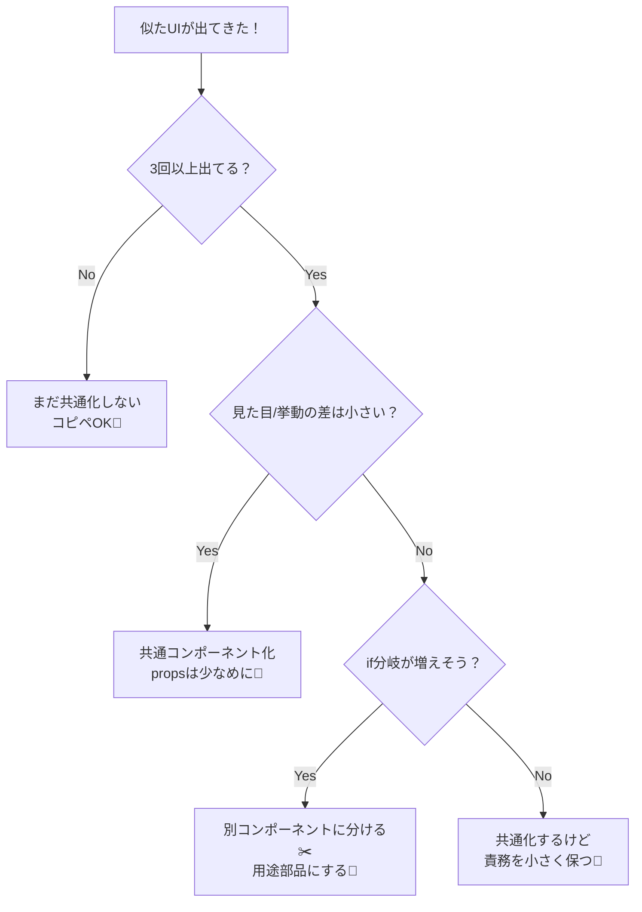

# 第47章：再利用しすぎ注意（ほどほどが正義）🧘

## この章のゴール🎯

* 「再利用したい気持ち」と「読みやすさ・作りやすさ」をいい感じにバランスできるようになる😊
* “万能コンポーネント沼”に落ちないための判断基準を持つ🧠✨
* Next.js（App Router）で**気持ちよく保守できる部品の粒度**をつかむ🧩

---

## まず結論🫶

再利用は正義っぽいけど、**やりすぎると逆に開発が遅くなる**よ〜😵‍💫💦
「共通化のためにコードが読めなくなる」なら、それは負け…！🥲

よくある事故👇

* props が 15個くらい増える🧺
* `variant` が増えすぎて「結局なにが出るの？」になる🌪️
* ちょっと直したら別の画面が壊れる（こわい）🫣
* `if (A) ... else if (B) ...` が増殖してカオス🤯

---

## 「再利用しすぎ」の典型パターン👀💥

### パターンA：万能ボタン病（なんでも Button に押し込む）🔘😇

「ボタンは全部共通化しよ！」ってやると…

* `Button` が肥大化して、実装が読めない
* `primary / secondary / danger / ghost / link / icon / ...` が止まらない

### パターンB：汎用カード病（カードが “何でも表示できる箱” になる）📦😇

`Card` が「商品も、プロフィールも、記事も、全部これで！」みたいになると、
**内部が条件分岐だらけ**になってつらい😵‍💫

### パターンC：早すぎる共通化（未来の自分を信じすぎ）🕰️🌈

まだ1回しか使ってないのに共通コンポーネントにしちゃうやつ！
未来の要求が読めなくて、結局作り直しが起きやすいよ〜🥲

---

## ほどほど判断のコツ（超実戦）🧠✨

### ✅ ルール1：「3回目で共通化」ルール（通称：Rule of Three）🧩

* 1回目：普通に作る🙂
* 2回目：ちょいコピペでもOK🙂‍↕️
* 3回目：**「共通の形」が見えてきたら**共通化を検討👀✨

---

### ✅ ルール2：props が増えたら黄色信号🚥

目安だけど👇

* props が **7〜8個超えてきた**
* `variant` が増えて `if` が増殖してる
  → **「分けた方が速い」可能性が高い**⚡

---

### ✅ ルール3：分岐（if）が増えたら「別コンポーネント化」優先✂️

「この見た目はこう、この時はこう」って条件が増えるなら、
**別の部品に分けた方が読みやすい**ことが多いよ😊

---

### ✅ ルール4：「UIの最小部品」と「用途部品」を分ける🧱✨

* UI最小部品（プリミティブ）👉 `Button`, `Input`, `Badge` みたいな“素材”🍳
* 用途部品（フィーチャー）👉 `LoginButton`, `AddTodoButton` みたいな“料理”🍝

この分け方ができると、共通化が気持ちよくなるよ〜🥳

---

## 図解：再利用していい？の判断フロー🧭✨（Mermaid）





---

## ダメな例：万能すぎて読めない Button 😵‍💫🔘

```tsx
// components/ui/Button.tsx（悪い例：肥大化しがち）
type Props = {
  variant?: "primary" | "secondary" | "danger" | "ghost" | "link";
  size?: "sm" | "md" | "lg";
  leftIcon?: React.ReactNode;
  rightIcon?: React.ReactNode;
  loading?: boolean;
  fullWidth?: boolean;
  round?: boolean;
  underline?: boolean;
  href?: string;
  onClick?: () => void;
  children: React.ReactNode;
};

export function Button(props: Props) {
  // if が増えていく未来が見える…👻
  return <button>{props.children}</button>;
}
```

**なにがつらい？**😢

* 使う側が「どれ選べばいいの？」って迷う
* `href` があるなら Link なの？ button なの？って設計がぶれる
* 変更が怖い（影響範囲が広すぎ）🫣

---

## 良い例：プリミティブは薄く、用途部品で料理する🍳🍝✨

### ① 薄い Button（見た目の基本だけ）🔘

```tsx
// components/ui/Button.tsx（良い例：薄く保つ）
type ButtonProps = React.ButtonHTMLAttributes<HTMLButtonElement> & {
  tone?: "primary" | "danger";
};

export function Button({ tone = "primary", className = "", ...rest }: ButtonProps) {
  const base = "px-3 py-2 rounded";
  const toneClass = tone === "danger" ? "bg-red-600 text-white" : "bg-black text-white";
  return <button className={`${base} ${toneClass} ${className}`} {...rest} />;
}
```

### ② 用途部品（例：削除ボタンは専用で作る）🗑️

```tsx
// components/features/DeleteButton.tsx（用途部品）
import { Button } from "@/components/ui/Button";

type Props = {
  onConfirm: () => void;
};

export function DeleteButton({ onConfirm }: Props) {
  return (
    <Button
      tone="danger"
      onClick={() => {
        if (confirm("本当に削除する？")) onConfirm();
      }}
    >
      削除
    </Button>
  );
}
```

**ポイント**🥰

* `Button` は“素材”で薄いまま🍳
* 「削除の確認」という用途は `DeleteButton` が担当🍝
* 仕様変更が来ても、影響範囲が小さい✨

---

## 「ちょい違い」への対処テク3つ🧰✨

### 1) “コピペでOK” と割り切る勇気🙂‍↕️

* 似てるけど微妙に違う
* この先増えるか分からない
  → **とりあえずコピペでOK**（あとで整理できる）🧹✨

### 2) 共通化するなら「差分だけを渡す」🎁

* `children` で中身差し替え
* `render` props は必要な時だけ（やりすぎ注意）😇

### 3) “用途ごと”に部品を分ける🍝

* `UserCard` と `ProductCard` は別でいい
* 「Card という箱」より「意味のある部品名」が読みやすい📛✨

---

## ミニ演習（10〜15分）✍️🌸

### お題🎒

「学科紹介」ページで、次の2つのカードを作ってみよう👇

* A：学科名 + ひとこと + “詳しく見る” ボタン
* B：先生名 + 研究テーマ + “メールする” ボタン

### ルール🧘

* まずは **共通化しないで2つ作る**🙂
* 作り終わってから、「共通化するならどこ？」を考える🧠✨
* もし共通化するなら、**Card を万能にしない**（用途部品を作る）🍝

### 例：用途部品として分ける案🧩

* `DepartmentCard.tsx`
* `ProfessorCard.tsx`
* 共通の見た目だけ `CardFrame.tsx`（枠だけ）にするのはアリ🙆‍♀️

---

## まとめ🌟（この章の合言葉）

* 共通化は**目的じゃなく手段**🧠
* 「読める」「直しやすい」が最優先🫶
* **3回目で共通化**、props や if が増えたら分割検討✂️
* “素材（ui）” と “料理（features）” を分けると最強🍳🍝✨
