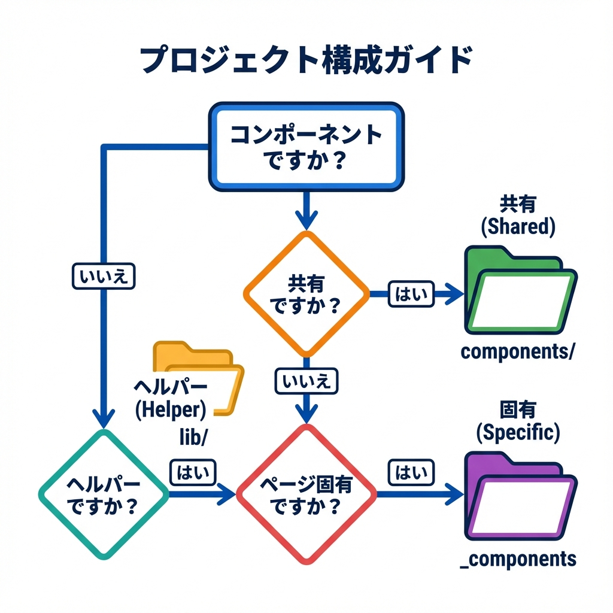
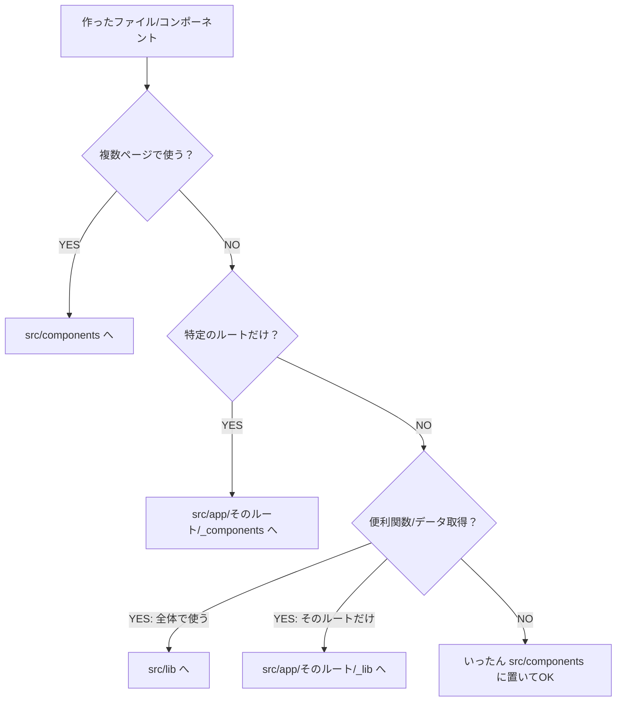

# 第48章：ミニ整理：フォルダ構成を“自分の型”に固定する🧱

この章は「迷子にならない“住所ルール”を決めて、ずーっと使う」がゴールだよ😊📦
一回決めるだけで、あとがめちゃラクになるやつ〜！🎉

---

## 1) まず“Next.jsの整理ルール”だけ最小で知ろう🧠

Next.js（App Router）は、ざっくりこう考えるとラクだよ👇

* **ルート（URLとして公開）になるのは `page` や `route` がある時**
* **`app/` の中にファイルを置いても、勝手にURLにならない**（同居OK）
* さらに「ここは絶対ルートにしない！」をハッキリさせたい時は

  * **`_folder`（Private folder）**でルーティング対象から外せる✅
  * **`(group)`（Route group）**でURLを変えずに整理できる✅ ([Next.js][1])

---

## 2) “自分の型”を決める：おすすめは「バランス型」🧁✨

Next.jsは整理方法を強制しないから、**“一度決めて固定”が正義**だよ🫶
公式ドキュメントにも複数パターンが例として載ってる（どれでもOK！）([Next.js][1])

ここでは、初心者が一番迷いにくい **バランス型テンプレ** を提案するね😊🌸
（ポイント：**ルーティングは `app/`、共有部品は `components/`**）

---

## 3) バランス型テンプレ（これを“固定の型”にしよう）📁✅

おすすめは `src/` を使う形！
Next.jsは `src` 配下に `app` を置く構成もサポートしてるよ👍 ([Next.js][1])

```txt
my-next-app/
├─ src/
│  ├─ app/
│  │  ├─ (site)/
│  │  │  ├─ layout.tsx
│  │  │  ├─ page.tsx
│  │  │  └─ about/
│  │  │     ├─ page.tsx
│  │  │     └─ _components/
│  │  │        └─ AboutHero.tsx
│  │  ├─ api/
│  │  │  └─ hello/
│  │  │     └─ route.ts
│  │  └─ _lib/
│  │     └─ env.ts
│  ├─ components/
│  │  ├─ ui/
│  │  │  └─ Button.tsx
│  │  └─ ProfileCard.tsx
│  ├─ lib/
│  │  └─ fetcher.ts
│  ├─ types/
│  │  └─ user.ts
│  └─ styles/
│     └─ globals.css
├─ public/
└─ package.json
```

### ここが大事ポイント🥰

* `app/(site)/...` みたいに **(group)** を使うと、URLを変えずに区分けできるよ📦 ([Next.js][1])
* `app/.../_components` とか `app/.../_lib` みたいに **`_` で始めるフォルダは Private folder** 扱いで、ルーティング対象から外せるよ🔒 ([Next.js][1])

  * つまり「これは内部実装だよ！」って気持ちが形になる😊✨

---

## 4) 図で見る：どこに置く？迷った時の判断🧭





---

## 5) 命名ルールも“固定”しよう📛✨（迷子防止）

おすすめの最小ルールはこれ👇（少ないほど続く！）

* 共有UI（どこでも使う）

  * `src/components/`
  * 小さな汎用UIは `src/components/ui/`（Buttonとか）🧩
* ルート専用UI（そのページだけ）

  * `src/app/(site)/about/_components/` みたいに **ルートの近く** に置く📍
* 便利関数

  * 全体用：`src/lib/`
  * ルート専用：`src/app/.../_lib/`
* 型

  * `src/types/` に寄せる（迷いが減る）🧷

---

## 6) 既存プロジェクトを“型に揃える”手順（安全コース）🛠️🧯

### Step 1：フォルダだけ先に作る📁✨

Windowsのエクスプローラーでも、VSCodeでもOK！

### Step 2：移動は“少しずつ”🚶‍♀️💨

* まずは `components/` を作って、共有っぽいのから移す
* 次に、特定ページ専用は `app/.../_components` に移す

### Step 3：import を直す（`@/` があると最強）🗺️

例えば、こういう感じに寄せると読みやすいよ😊

```ts
import ProfileCard from "@/components/ProfileCard";
```

### Step 4：動作チェック✅

```bash
npm run dev
```

### Step 5：最後にまとめてチェック✅✅

```bash
npm run lint
npm run build
```

### Step 6：ここでコミット！🧊（“型が完成した記念日”）

この時点のフォルダ構成が“あなたの型”になるよ🎉

---

## 7) ミニ課題：あなたの型を固定する「型チェック」🧪✨

次の質問に **YES/NO** で答えて、YESが多いほど「型が固まってる」💮

* 新しいコンポーネントを作った時、置き場所がすぐ決まる？🤔
* 共有か専用かで、置き場所を分けてる？📦
* `app/` の中に“ルート専用部品”を置く場所がある？（例：`_components`）🔒 ([Next.js][1])
* URLに影響しない整理（例：`(site)`）を使えてる？🧺 ([Next.js][1])
* 「libはここ」「typesはここ」って決めてある？🧷

YESが3つ以上なら、もう十分強いよ〜！💪✨

---

この章はここまでだよ😊🧱
次に新しいファイルを作る時、今日決めた“住所ルール”に置くだけで、どんどんラクになるよ〜🎀🚀

[1]: https://nextjs.org/docs/app/getting-started/project-structure "Getting Started: Project Structure | Next.js"
