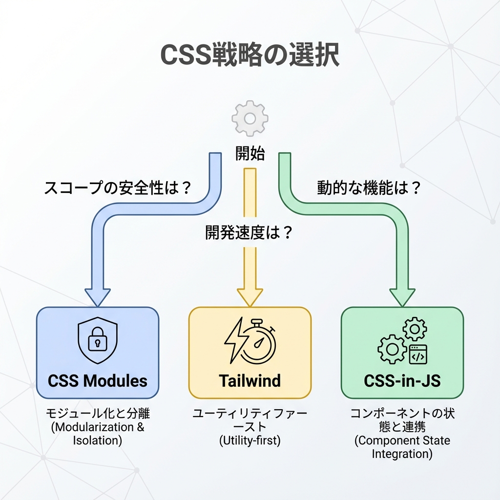
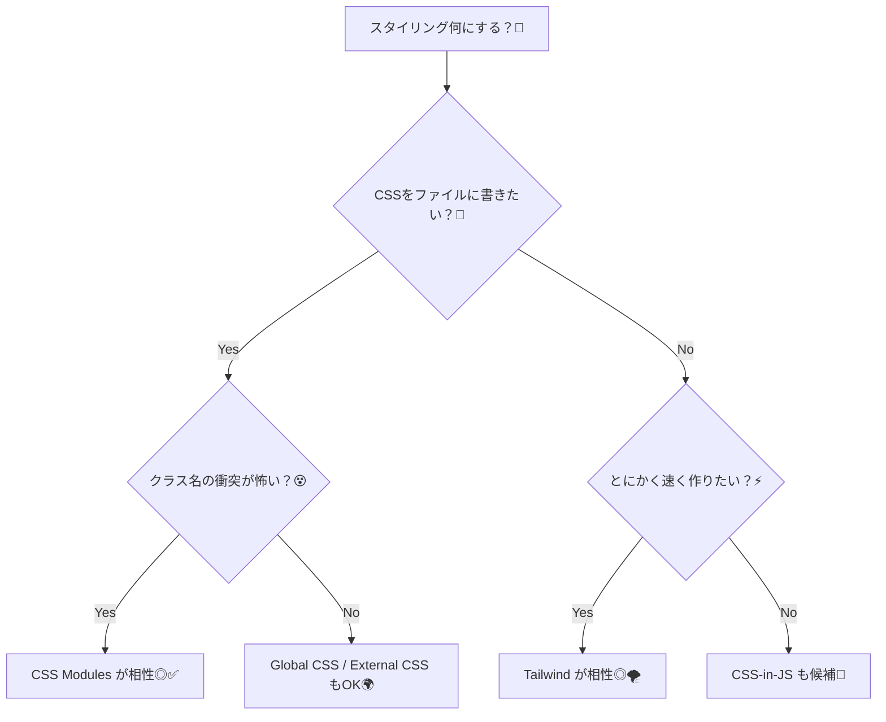

# 第49章：CSSの選択肢：CSS Modules / Tailwind / CSS-in-JS ざっくり🎛️

Next.jsって、実は「CSSの選び方」がけっこう自由なんだよね〜😊✨
代表的には **Tailwind / CSS Modules / Global CSS / External CSS / Sass / CSS-in-JS** みたいに色々用意されてるよ〜！ ([Next.js][1])

この章は、その中でもよく使う **CSS Modules / Tailwind / CSS-in-JS** を「ざっくり理解して、選べるようになる」回だよ〜🧁💕

---

## この章のゴール🎯

* 3つのスタイル手法の「違い」をふんわり理解する🫶
* 自分のプロジェクトに「どれが合うか」判断できるようになる💡
* 次の章（CSS Modulesの実践）にスムーズにつなげる🚀

---

## まず結論：どれを選べばいいの？🤔💭

「迷ったら」このイメージでOKだよ〜！✨

* **CSS Modules**：普通のCSSで、コンポーネントごとに安全に書きたい🧵
* **Tailwind**：とにかく速くそれっぽいUIを作りたい⚡
* **CSS-in-JS**：デザインシステムや動的テーマなど、JS主導で管理したい🎨

---

## 図解：ざっくり選び方チャート🗺️✨（Mermaid）





---

## ① CSS Modules：いちばん「安心して始めやすい」やつ🧵😊

### どんな感じ？

* ファイル名が **`*.module.css`** ならCSS Modules扱い✨
* クラス名が自動でユニーク化されて、**他のコンポーネントと衝突しにくい**よ〜🛡️ ([Next.js][2])

### 何が嬉しい？

* 「CSSはCSSで書きたい」派にやさしい💞
* コンポーネント単位で管理できて、後から見返しやすい📦

### ミニ例（雰囲気だけ）

```tsx
import styles from "./Card.module.css";

export function Card() {
  return <div className={styles.card}>かわいいカード✨</div>;
}
```

```css
/* Card.module.css */
.card {
  padding: 16px;
  border: 1px solid #ddd;
  border-radius: 12px;
}
```

---

## ② Tailwind：爆速で“それっぽい”を作れる🌪️⚡

### どんな感じ？

* CSSを書かずに、`className` にユーティリティクラスを並べて作る感じ✨
* Next.jsでも定番で、公式ガイドもあるよ〜！ ([Next.js][1])
* Tailwind側の “Next.js用セットアップ手順” もまとまってるよ〜🧁 ([Tailwind CSS][3])

### 何が嬉しい？

* 余白・色・角丸・影などが **その場で決まる**から、試行錯誤が速い💨
* 「CSSファイル行ったり来たり」が減って、テンポよく作れる🎶

### ミニ例（雰囲気だけ）

```tsx
export function Card() {
  return (
    <div className="p-4 border rounded-xl">
      かわいいカード✨
    </div>
  );
}
```

### ちょい注意⚠️

* `className` が長くなりがち（慣れると整理できるよ！）🧹

---

## ③ CSS-in-JS：JSの中でスタイルを握る💅🧠

### どんな感じ？

* **styled-components / Emotion** みたいなライブラリで、JS（TS）の中にスタイルを書くやつだよ〜✨
* Next.jsにも **CSS-in-JSのガイド**があるよ（ただし状況によって注意点あり） ([Next.js][4])
* Next.js側も「いろんなCSS-in-JSをテスト中で、例を増やしていくよ」的なスタンスだよ〜🧪 ([Next.js][4])

### 何が嬉しい？

* `props` で色を変える、とか **動的デザイン**が得意✨
* 大きめアプリで「デザインルール」を作りたいときに便利🧩

### ちょい注意⚠️（ふんわりでOK）

* ライブラリによっては **設定が必要**だったり、**Server Componentsとの相性**を考える必要があるよ〜（ここは後で慣れてからでOK🙆‍♀️） ([Next.js][4])

---

## おまけ：Global CSS って何？🌍✨（一言だけ！）

* アプリ全体に効くCSS（リセットCSSとか）に使うよ〜🧼
* App Routerだと `app/layout.tsx` で読み込むのが基本！ ([Next.js][5])

---

## 使い分けの目安まとめ🧁✨

* **CSS Modules**：
  「安全・読みやすい・普通のCSS」でいきたい人におすすめ🧵🛡️

* **Tailwind**：
  「最短で見た目を整えたい」「UI作りが多い」なら強い🌪️⚡

* **CSS-in-JS**：
  「デザインシステム」「テーマ切り替え」「動的スタイル」を本格的にやりたい時に強い💅🎨

---

## ちいさな練習（選ぶだけでOK）🎮✨

次のうち、あなたならどれを選ぶ？（正解はないよ〜！💞）

1. 2〜3ページの小さめサイトで、CSSは普通に書きたい🏠🧵
2. 画面数が多くて、とにかく早くUIを量産したい🏃‍♀️💨
3. ダークモードやテーマ切り替えをガッツリやりたい🌙🎨

---

次の章（第50章）では、いちばん始めやすい **CSS Modules** を実際に手を動かしてやっていくよ〜🧵✨

[1]: https://nextjs.org/docs/app/getting-started/css?utm_source=chatgpt.com "Getting Started: CSS"
[2]: https://nextjs.org/docs/13/app/building-your-application/styling/css-modules?utm_source=chatgpt.com "Styling: CSS Modules"
[3]: https://tailwindcss.com/docs/guides/nextjs?utm_source=chatgpt.com "Install Tailwind CSS with Next.js"
[4]: https://nextjs.org/docs/app/guides/css-in-js?utm_source=chatgpt.com "Guides: CSS-in-JS"
[5]: https://nextjs.org/learn/dashboard-app/css-styling?utm_source=chatgpt.com "CSS Styling - App Router"
