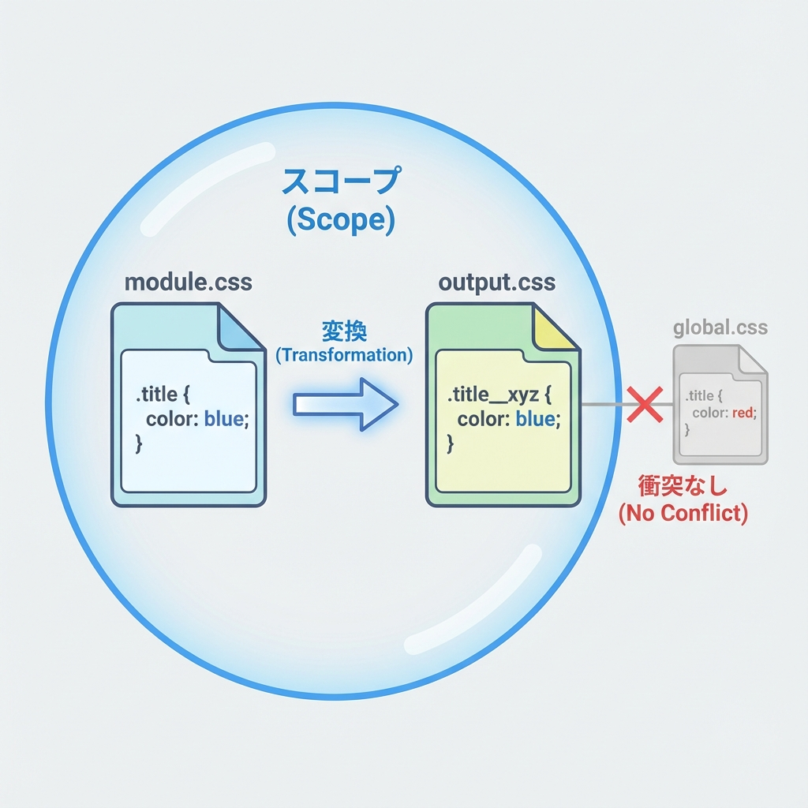
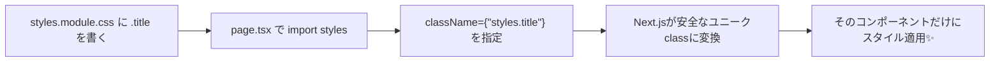

# 第50章：CSS Modules 基本：`styles.module.css` 🧵

この章では「Next.jsでCSS Modulesを使って、**ページや部品だけに効くCSS**を書けるようになる」よ〜！🙌💖
“CSSが他の場所に漏れない”ってだけで、安心感が爆上がりするやつです😆🛡️

---

## ゴール🎯

* `styles.module.css` を作れる🧵
* TSX で `import styles from "./styles.module.css"` できる📦
* `className={styles.xxx}` で安全にスタイルを当てられる🎀
* 「なんで `.module.css` なの？」が説明できる🧠✨

---

## CSS Modulesってなに？🧠💡

CSS Modulesは、ざっくり言うと…

✅ **そのファイルで書いたクラス名が、そのファイルをimportした場所だけに効く**
✅ 同じ `.title` を別の場所で使ってもぶつからない
✅ Next.jsが勝手に “ユニークなクラス名” に変換してくれる

って感じです🪄✨

---

## 図解：CSS Modulesのイメージ🧩





---

## ① まずは作ってみよう！📁✨（ページにスタイルを当てる）

例：`/profile` ページを作って、カードっぽくします💳🌸

### フォルダ構成（この章の完成形）📦

```txt
my-next-app/
  app/
    profile/
      page.tsx
      styles.module.css
```

---

## ② `styles.module.css` を作る🧵🎀

`app/profile/styles.module.css`

```css
.container {
  padding: 24px;
}

.card {
  border: 1px solid #ddd;
  border-radius: 12px;
  padding: 16px;
  max-width: 520px;
}

.title {
  font-size: 20px;
  margin: 0 0 8px;
}

.text {
  margin: 0;
  line-height: 1.7;
}
```

ポイント👀✨

* **クラス名は自由**（でもまずはシンプルに！）
* `.module.css` が超大事（これがCSS Modulesの合図🚩）

---

## ③ `page.tsx` で読み込んで使う📥✨

`app/profile/page.tsx`

```tsx
import styles from "./styles.module.css";

export default function ProfilePage() {
  return (
    <main className={styles.container}>
      <section className={styles.card}>
        <h1 className={styles.title}>プロフィール🌸</h1>
        <p className={styles.text}>
          これはCSS Modulesの練習ページだよ〜！✨<br />
          クラス名が他に漏れないから安心😆🧵
        </p>
      </section>
    </main>
  );
}
```

できたら開いて確認👀🌈

* `npm run dev`
* `http://localhost:3000/profile`

---

## ここが大事！✅ `.module.css` が付くと何が起きるの？🪄

* `.title` みたいな「ありがちな名前」でもOK🙆‍♀️
* Next.jsが内部でこういう感じに変えてくれる（イメージ）👇

```txt
.title  →  title__a1b2c3__profile
```

だから、他のページで `.title` を使ってもケンカしないのです🤝💕

---

## よくあるハマりどころ😵‍💫🪤（先に潰す！）

### ❌ 1) `styles.css` にしちゃった

👉 `styles.module.css` にしないと、`styles.title` が使えないよ〜😭
（ただの普通のCSS扱いになる）

---

### ❌ 2) `className="title"` と書いちゃった

CSS Modulesは **文字列で直書きしない** のが基本🙅‍♀️
✅ `className={styles.title}` にしよ〜！

---

### ❌ 3) `styles.tilte` みたいなスペルミス

`undefined` になってスタイル当たらないやつ😇
VSCodeの補完を使うとミス減るよ〜💡✨

---

## ちょいテク：複数クラスを同時に当てたい🧩✨

CSS初心者さんが一番使いやすい方法はこれ👇（文字列結合）

```tsx
<div className={`${styles.card} ${styles.highlight}`}>...</div>
```

`styles.module.css` 側：

```css
.highlight {
  border-width: 2px;
}
```

---

## ちょい注意：CSS Modules内で「特定のタグ全部」に当てたい時🍀

CSS Modulesは “基本クラスで当てる” のが安全だけど、
「cardの中のpだけ」みたいなのはOK🙆‍♀️✨

```css
.card p {
  margin-top: 8px;
}
```

---

## 練習問題✍️✨（5〜10分）

`styles.module.css` に次を追加して、見た目を変えてみてね🎀

1. `.card` に `background` を追加してみる🧁
2. `.title` の `font-size` を 24px にしてみる🔠
3. `.text` の `line-height` を 2 にして読みやすくする📖

---

## できたかチェック✅🌟

* [ ] `styles.module.css` を作った🧵
* [ ] `import styles from "./styles.module.css"` できた📦
* [ ] `className={styles.xxx}` を使った🎀
* [ ] 他のページに影響しない安心感を感じた😆🛡️

---

次の章（第51章）は「グローバルCSSどこに置く？」で、
“全体に効かせたいCSS”の扱い方を整理していくよ〜🌍✨
