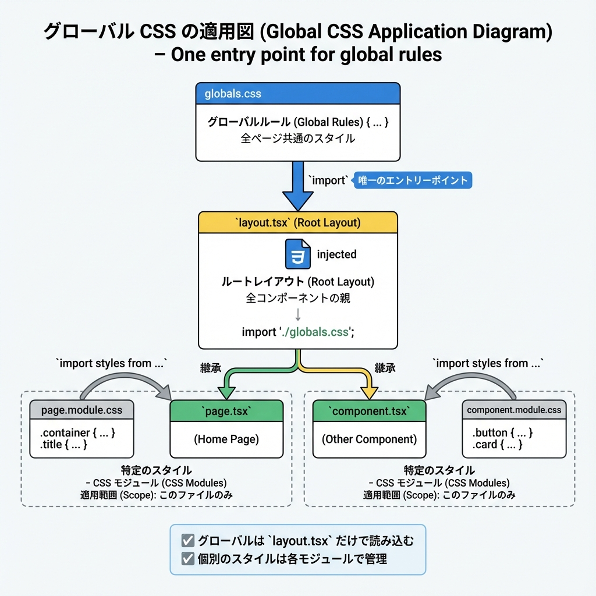
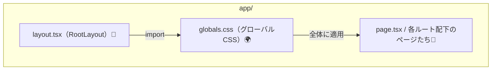
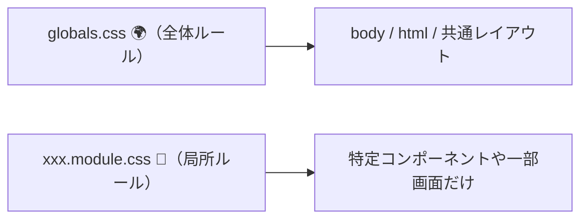

# 第51章：グローバルCSS：どこに置く？🌍

今日は「アプリ全体に効くCSS（グローバルCSS）」を、**どこに置いて・どこで読み込むのが正解か**をスッキリ整理するよ〜😊💕

---

## ゴール🎯

* ✅ **グローバルCSSの置き場所**がわかる📁
* ✅ **読み込み場所（importする場所）**がわかる🧩
* ✅ 「全部に効かせたい」と「一部だけ変えたい」を使い分けられる✨

---

## 1) グローバルCSSってなに？🌎🧴

グローバルCSSは、ざっくり言うと **“アプリ全体に効くルール”** だよ😊
たとえば👇

* `body` の余白をゼロにする
* フォントを統一する
* `a` の下線ルールを統一する
* CSS変数（`--color-...`）を置く

こういう「全員共通の身だしなみ」みたいなもの👗✨

---

## 2) どこに置く？どこで読み込む？📁➡️📥

### ✅ 置く場所（ファイル）

基本は **`app/globals.css`**（またはプロジェクトによって `app/global.css`）みたいに、`app/` の直下に置くのが定番だよ🙆‍♀️✨
Next.js公式も **グローバルCSSを作って、ルートレイアウトでimport** する形を案内してるよ📌 ([Next.js][1])

### ✅ 読み込む場所（importする場所）

**`app/layout.tsx`（RootLayout）** で読み込みます😊
（ここが「全ページ共通の外枠」だからね🧱）

---

### 図でイメージ🧠✨（どこでimport？）





---

## 3) 実装してみよう💻🎀（最短ルート）

### Step 1️⃣ `app/globals.css` を用意する🧴

（すでにあるなら編集でOK✨）

```css
/* app/globals.css 🌍 */

:root {
  /* 全体で使う“共通の変数”を置くと便利✨ */
  --page-max: 980px;
}

* {
  box-sizing: border-box;
}

html, body {
  height: 100%;
}

body {
  margin: 0;
  line-height: 1.6;
}

main {
  max-width: var(--page-max);
  margin: 0 auto;
  padding: 24px;
}
```

### Step 2️⃣ `app/layout.tsx` でimportする📥

```tsx
// app/layout.tsx
import "./globals.css";

export default function RootLayout({
  children,
}: {
  children: React.ReactNode;
}) {
  return (
    <html lang="ja">
      <body>{children}</body>
    </html>
  );
}
```

これで **全ページに反映**されるよ〜！🎉✨
「RootLayoutでimport」が基本、って公式ドキュメントにも載ってるよ📌 ([Next.js][1])

---

## 4) よくあるハマりポイント集😵‍💫🧯

### 💥 ハマり①：グローバルCSSを“あちこち”でimportしてカオスになる

Next.jsでは **`app/` 配下なら layout/page/component でもimport自体はできる**んだけど、**ルート移動してもスタイルが外れず残ることがあって競合しやすい**のね🥲
だから基本は「本当に全体に必要なものだけ」をグローバルにするのが推奨だよ🫶 ([Next.js][1])

### 💥 ハマり②：「Global CSS must be in your Custom `<App>`」って怒られる

これは **Pages Router（`pages/`）のルール**で出ることが多いよ！
その場合は `pages/_app.js` に集約してね、っていうエラー。公式のエラーページもあるよ📌 ([Next.js][2])
（今回の教材は App Router が前提だから、基本は `app/layout.tsx` でOK✨）

### 💥 ハマり③：効かない！😫

チェックポイントはこの3つ✅

* `layout.tsx` の import パスが合ってる？（`./globals.css`）
* ファイル名が合ってる？（`globals.css` と `global.css` を混ぜない）
* たまに開発サーバー再起動で直ることもある（`Ctrl + C` → `npm run dev`）🔁

---

## 5) 「一部だけ見た目変えたい」時はどうする？🧩✨

グローバルCSSに「このページだけ…」を増やし始めると、あとで地獄になりがち😇💦
**“一部だけ”は、基本はCSS Modules（局所CSS）でやる**のが安全だよ🫶
公式も「グローバルは本当にグローバルなものにして、必要ならCSS Modulesへ」って方針を出してるよ📌 ([Next.js][1])

### 図でスコープの違い🌱



---

## まとめ✅🎉

* ✅ グローバルCSSは **`app/globals.css`**（など）に置く📁
* ✅ 読み込みは **`app/layout.tsx`（RootLayout）でimport** 📥 ([Next.js][1])
* ✅ グローバルは「本当に全体に必要なもの」だけにして、**一部だけはCSS Modules**へ🫶 ([Next.js][1])
* ✅ Pages Routerのエラー文言が出たら `pages/_app` のルールなので切り分ける🧯 ([Next.js][2])

[1]: https://nextjs.org/docs/app/getting-started/css "Getting Started: CSS | Next.js"
[2]: https://nextjs.org/docs/messages/css-global "Global CSS Must Be in Your Custom `<App>` | Next.js"
