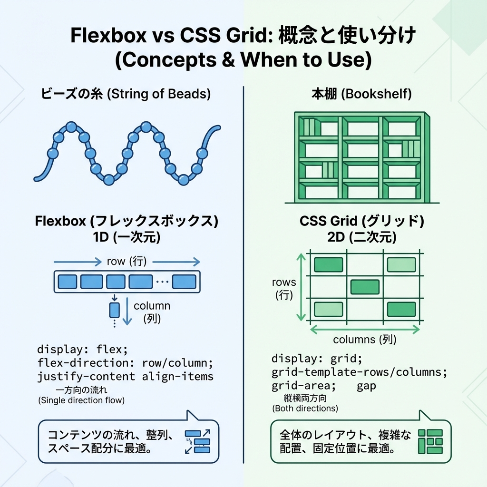
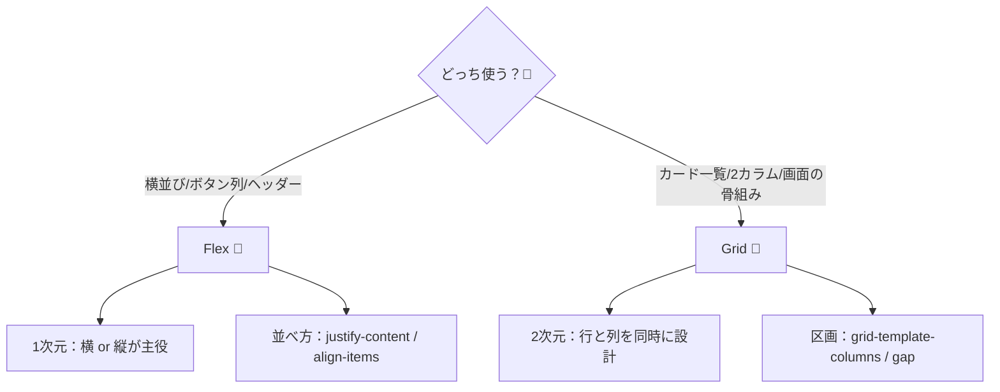
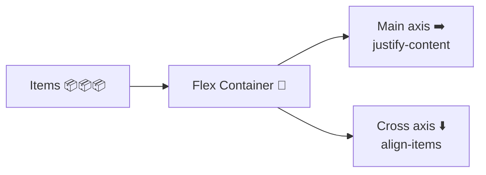
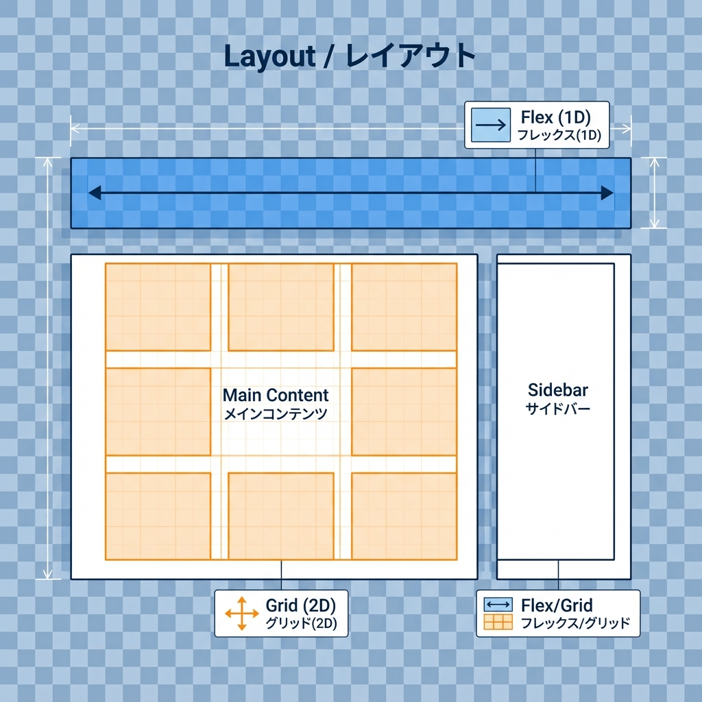
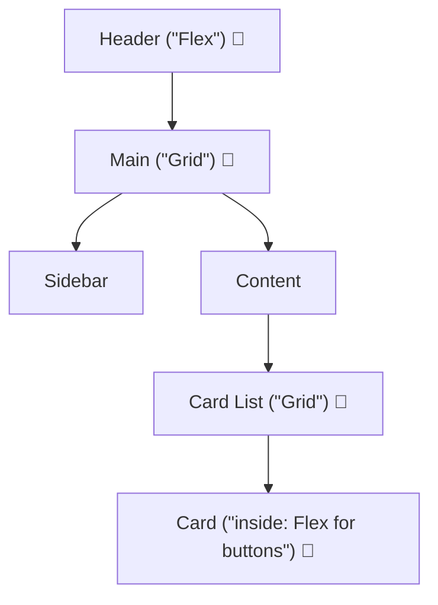

# 第52章：レイアウトの基本：Flex/Gridの最短復習🧱

この章は「**レイアウトの型**」を最短で身につける回だよ〜！🥰
Next.jsでも結局、画面づくりの7割は **Flex** と **Grid** で決まるっ✨

---

## この章でできるようになること🎯

* Flexで「横並び・中央寄せ・左右に分ける」ができる🧵
* Gridで「2カラム・カード一覧・レスポンシブ」ができる🧱
* 1画面の中で Flex と Grid を自然に混ぜられる🌈

---

## まず結論：FlexとGridの違い（超ざっくり）🧠✨



* **Flex**：基本は **1次元**（横 or 縦のどっちかが主役）🧵
  例：ヘッダーの左右、ボタン列、カード内の並び
* **Grid**： **2次元**（行×列をまとめて設計）🧱
  例：2カラム、カード一覧、ダッシュボード



---

## Flex：最短で覚える3点セット🧵💡

### ✅ ① 主役は「軸」！

Flexは「**どっち向きに並べる？**」から始まるよ〜✨

* `flex-direction: row;`（横並び：デフォ）➡️
* `flex-direction: column;`（縦並び）⬇️



### ✅ ② よく使う2つ（これだけで強い）

* `justify-content`：**主役の方向（main axis）** の並べ方
  例：左右に分ける、中央寄せ、等間隔✨
* `align-items`：**直角方向（cross axis）** の揃え方
  例：縦位置を中央に揃える✨

**覚え方🥹**

* justify = 「横に広がる感じ」
* align = 「高さを揃える感じ」

### ✅ ③ 余白は `gap` がいちばん可愛い🫶

* `gap: 12px;` で要素同士の間がスッキリ✨（margin連打より好き🧁）

---

## Grid：最短で覚える3点セット🧱💡

### ✅ ① 列を決める（ほぼこれ）

* `grid-template-columns` で列の形が決まるよ✨

例：**2カラム（左メニュー + 本文）**

* `grid-template-columns: 240px 1fr;`

### ✅ ② 余白は `gap`

Gridも `gap` が強い💪✨

### ✅ ③ カード一覧は「自動で増える列」が便利🌟

これ覚えたら勝ち〜！🥳

* `repeat(auto-fit, minmax(220px, 1fr))`

意味はふんわりでOK👌
「**1枚220px以上にしつつ、入るだけ横に並べる**」って感じ🎀

---

## ハンズオン：FlexとGridで“それっぽい画面”を作る🧁✨




### 作る画面イメージ🖼️

* ヘッダー：左ロゴ / 真ん中ナビ / 右ボタン（**Flex**）
* メイン：左サイドバー + 右コンテンツ（**Grid**）
* カード一覧：自動で横に増える（**Grid**）
* カード内ボタン列：横並び（**Flex**）



---

## 手順1：ページとCSS Moduleを作る📁✨

`app/ch52/` を作って、2ファイル用意するよ👇

* `app/ch52/page.tsx`
* `app/ch52/page.module.css`

---

## 手順2：`page.tsx`（UIを置く）🧩✨

```tsx
import styles from "./page.module.css";

const cards = [
  { title: "学食レビュー🍛", desc: "今日のカレー、当たりだった！" },
  { title: "空き教室メモ🏫", desc: "3号館の4Fが静かでおすすめ✨" },
  { title: "課題メモ📚", desc: "提出は金曜18:00まで！忘れない！" },
  { title: "バイト日記💰", desc: "レジのピークは17:30〜🥹" },
  { title: "推し活🎤", desc: "ライブのセトリ最高すぎた…" },
  { title: "週末の予定🧁", desc: "カフェ→映画→帰宅で完璧☕🎬" },
];

export default function Chapter52Page() {
  return (
    <div className={styles.page}>
      {/* ヘッダー：Flex */}
      <header className={styles.header}>
        <div className={styles.logo}>CampusNote</div>

        <nav className={styles.nav}>
          <a className={styles.link} href="#">
            ホーム🏠
          </a>
          <a className={styles.link} href="#">
            投稿📝
          </a>
          <a className={styles.link} href="#">
            保存🔖
          </a>
        </nav>

        <button className={styles.cta}>投稿する➕</button>
      </header>

      {/* メイン：Grid（2カラム） */}
      <main className={styles.main}>
        <aside className={styles.sidebar}>
          <h2 className={styles.sidebarTitle}>メニュー📌</h2>
          <ul className={styles.menu}>
            <li>🔔 通知</li>
            <li>👤 マイページ</li>
            <li>⚙️ 設定</li>
          </ul>
        </aside>

        <section className={styles.content}>
          <h1 className={styles.title}>第52章：Flex / Grid 最短復習🧱✨</h1>
          <p className={styles.lead}>
            ヘッダーはFlex、画面の骨組みとカード一覧はGrid。これだけで“それっぽい”画面が作れるよ〜🥰
          </p>

          {/* カード一覧：Grid（レスポンシブで自動列） */}
          <div className={styles.cardGrid}>
            {cards.map((c) => (
              <article key={c.title} className={styles.card}>
                <h3 className={styles.cardTitle}>{c.title}</h3>
                <p className={styles.cardDesc}>{c.desc}</p>

                {/* カード内ボタン列：Flex */}
                <div className={styles.cardActions}>
                  <button className={styles.smallBtn}>見る👀</button>
                  <button className={styles.smallBtnSecondary}>保存🔖</button>
                </div>
              </article>
            ))}
          </div>
        </section>
      </main>

      <footer className={styles.footer}>© 2025 CampusNote</footer>
    </div>
  );
}
```

---

## 手順3：`page.module.css`（FlexとGridの練習）💅✨

```css
.page {
  min-height: 100vh;
  display: flex;
  flex-direction: column;
}

/* ✅ ヘッダー：Flex（左右に分ける + 縦中央揃え） */
.header {
  display: flex;
  align-items: center;
  justify-content: space-between;
  gap: 12px;
  padding: 12px 16px;
  border-bottom: 1px solid #e5e7eb;
}

.logo {
  font-weight: 700;
}

.nav {
  display: flex;
  gap: 12px;
}

.link {
  text-decoration: none;
  padding: 6px 10px;
  border-radius: 8px;
}

.cta {
  padding: 8px 12px;
  border-radius: 10px;
  border: 1px solid #e5e7eb;
  background: white;
  cursor: pointer;
}

/* ✅ メイン：Grid（2カラム） */
.main {
  flex: 1;
  display: grid;
  grid-template-columns: 240px 1fr;
  gap: 16px;
  padding: 16px;
}

.sidebar {
  border: 1px solid #e5e7eb;
  border-radius: 12px;
  padding: 12px;
}

.sidebarTitle {
  margin: 0 0 8px;
  font-size: 16px;
}

.menu {
  margin: 0;
  padding-left: 18px;
  display: grid;
  gap: 6px;
}

.content {
  border: 1px solid #e5e7eb;
  border-radius: 12px;
  padding: 12px;
}

.title {
  margin: 0 0 8px;
}

.lead {
  margin: 0 0 12px;
}

/* ✅ カード一覧：Grid（自動で列が増える） */
.cardGrid {
  display: grid;
  grid-template-columns: repeat(auto-fit, minmax(220px, 1fr));
  gap: 16px;
}

.card {
  border: 1px solid #e5e7eb;
  border-radius: 12px;
  padding: 12px;
}

.cardTitle {
  margin: 0 0 6px;
  font-size: 16px;
}

.cardDesc {
  margin: 0;
}

/* ✅ ボタン列：Flex */
.cardActions {
  margin-top: 12px;
  display: flex;
  gap: 8px;
}

.smallBtn,
.smallBtnSecondary {
  padding: 6px 10px;
  border-radius: 10px;
  border: 1px solid #e5e7eb;
  background: white;
  cursor: pointer;
}

.footer {
  padding: 14px 16px;
  border-top: 1px solid #e5e7eb;
  text-align: center;
}

/* ✅ レスポンシブ：幅が狭いと2カラム→1カラム */
@media (max-width: 840px) {
  .main {
    grid-template-columns: 1fr;
  }
}
```

---

## 動作チェック✅✨

開発サーバーを起動して、ブラウザで見てね🎀

* `npm run dev`
* `http://localhost:3000/ch52`

スマホ幅っぽくしたいなら、ブラウザ幅を狭くしてみてね📱✨
2カラムが1カラムに変わったら成功〜！🎉

---

## よくあるつまずき集（ここだけ見ればOK）🥹🧯

### ❓ `align-items: center;` なのに縦中央にならない

* **アイテム自体に高さがない**と見た目変化が分かりにくいことあるよ〜
* ヘッダーみたいに高さ（padding）がある場所で使うと分かりやすい✨

### ❓ 余白を `margin` で頑張りすぎて崩れる

* まずは `gap` を使うのが安全だよ🫶

### ❓ Gridの `1fr` がピンとこない

* 「**残り全部**」って覚えちゃってOK😆

---

## ミニ課題（5分）⏳✨

できたらめっちゃ力つくよ〜！🥰

1. ヘッダーのナビを「右寄せ」にしてみてね（Flexで調整）🔗
2. `cardGrid` の `minmax(220px, 1fr)` の **220** を **260** にして、並び方の変化を観察👀
3. `@media` の幅を **840px → 700px** にして、切り替わるタイミングを調整📱✨

---

## まとめ🎁✨

* **Flex = 1列（横or縦）を気持ちよく並べる**🧵
* **Grid = 画面の骨組み＆一覧を作る**🧱
* そして現実は「**Gridで骨組み → 中身はFlex**」が最強パターン💪😆✨

以上で第52章おしまい〜！おつかれさまっ🎉💖
