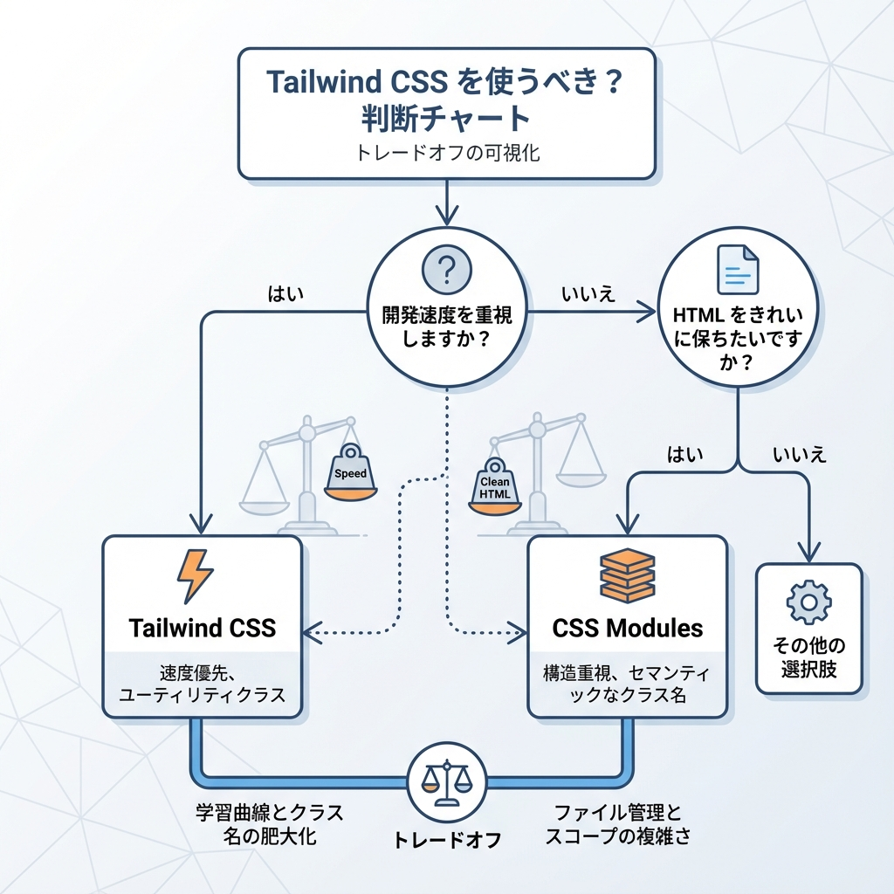
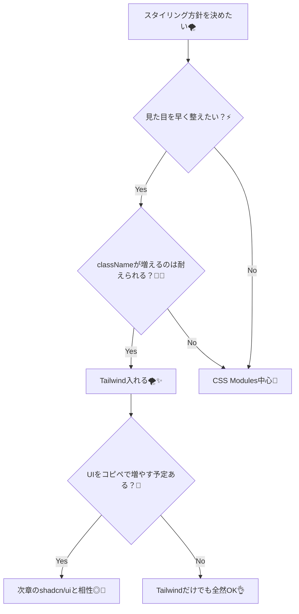

# 第53章：Tailwind導入の雰囲気（導入する/しないを決める）🌪️

この章では、「Tailwind CSSって結局どうなの？入れるべき？」をスッキリ決められるようにします☺️✨
（※導入手順も“雰囲気が掴める範囲”で、最短で触ります💨）

---

## 1) Tailwind CSSってなに？🤔🧵

Tailwindは **「CSSを書かずに、class名で見た目を組み立てる」** スタイルのCSSフレームワークだよ〜💅✨
たとえばこんな感じ👇

* `p-4` → 余白をつける🫧
* `text-2xl` → 文字を大きくする🔤
* `rounded-xl` → 角を丸くする🟦
* `shadow` → 影をつける🌥️

つまり…
**「CSSのファイルに戻らず、その場でサクサク見た目を作れる」** のが強みだよ〜🚀💖

---

## 2) Tailwindを入れる？入れない？決め方🌈🧭

「どっちが正解？」じゃなくて、**相性**で決めるのがいちばん🙆‍♀️✨

### Tailwindが向いてる人🫶🌪️

* 早くそれっぽいUIを作りたい⚡
* “余白のルール”とかを統一したい📏
* CSS設計（命名や階層）で迷いたくない🧠💤
* コンポーネントを増やしていく予定がある🧩

### Tailwindがしんどくなりやすい人🥺🌀

* classNameが長くなるのがストレス😵‍💫
* “CSSをちゃんと書いて理解したい”気持ちが強い✍️
* デザインがガチガチに独自で、細かい調整が多い🎨

---

## 3) 迷ったらコレ！判断フローチャート🧠➡️✅





---

## 4) “入れる派”の最短ルート（新規プロジェクト）🏃‍♀️💨

新しく作るなら、**create-next-appがTailwind込みで作れる**よ✅
おすすめデフォルトにもTailwindが入ってるし、オプションでも指定できる👍 ([Next.js][1])

```bash
npx create-next-app@latest my-app
```

途中で **recommended defaults** を選ぶと、Tailwind込みになる流れがあるよ（表示例に Tailwind が含まれてる） ([Next.js][1])
また、`--tailwind` オプションも用意されてるよ ([Next.js][1])

---

## 5) “途中から入れる派”の雰囲気（既存プロジェクト）🧩🛠️

公式ガイドの流れはざっくりこう👇 ([Tailwind CSS][2])

1. Tailwind関連をインストール📦
2. PostCSS設定を追加🧪
3. `globals.css` にTailwindを読み込み🌪️
4. `npm run dev` で起動🚀

公式の例では、こんな感じの設定になってるよ👇 ([Tailwind CSS][2])

```bash
npm install tailwindcss @tailwindcss/postcss postcss
```

`postcss.config.mjs`（例） ([Tailwind CSS][2])

```js
const config = {
  plugins: {
    "@tailwindcss/postcss": {},
  },
};
export default config;
```

`app/globals.css`（例） ([Tailwind CSS][2])

```css
@import "tailwindcss";
```

> ※ Tailwindのバージョンや構成で“推奨手順”が微妙に変わることがあるから、迷ったら公式ガイドの手順に寄せるのが安全だよ〜🧯 ([Tailwind CSS][2])

---

## 6) いったん触ってみる：1分で「それっぽい」✨⏱️

`app/page.tsx` をちょい変えるだけで雰囲気つかめるよ〜🌷
公式例でもこんな感じで `className` に書くよね！ ([Tailwind CSS][2])

```tsx
export default function Home() {
  return (
    <main className="min-h-screen p-6">
      <h1 className="text-3xl font-bold underline">
        Hello Tailwind 🌪️✨
      </h1>

      <div className="mt-6 rounded-xl border p-4 shadow">
        <p className="text-sm text-gray-600">プロフィール</p>
        <p className="mt-2 text-lg font-semibold">あきこ</p>
        <button className="mt-4 rounded-lg bg-black px-4 py-2 text-white hover:opacity-80">
          フォローする 💖
        </button>
      </div>
    </main>
  );
}
```

「CSSファイル書かなくても、見た目が作れてる！」って体験できたらOK🙆‍♀️💯

---

## 7) classNameが長い問題、どうする？😵‍💫➡️🙂

Tailwindは便利だけど、慣れるまで `className` が長くてびっくりするかも😂
対策はシンプルにこれ👇

* **見た目の塊はコンポーネント化**する🧩
  例：`ProfileCard` / `PrimaryButton` とか
* まずは **“よく使う形”を固定**する📌
  例：カードは「`rounded-xl border p-4 shadow`」みたいにテンプレ化✨

この考え方だけで、だいぶ楽になるよ〜🫶🌸

---

## 8) 最低限これだけ覚えればOKセット🧠✨

まずはこのへんだけで十分戦えるよ💪💕

* 余白：`p-4` `px-4` `py-2` `mt-4` `gap-4` 🫧
* 文字：`text-sm` `text-lg` `font-semibold` `text-gray-600` 🔤
* 箱：`border` `rounded-xl` `shadow` `bg-white` 🧊
* レイアウト：`flex` `items-center` `justify-between` 📐
* 反応：`hover:opacity-80` `sm:text-lg`（小さい画面で切替）📱✨

---

## 9) ミニ課題（5〜10分）✍️🌼

1つだけでOKだよ〜☺️
**課題A：カードを“いい感じ”にする**🪄

* 角丸、影、余白、文字サイズを調整
* ボタンに hover を付ける

**課題B：スマホ対応をちょい足し**📱

* タイトルだけ `sm:text-4xl` にして、画面が広い時だけ大きくする

---

## 10) この章のゴールチェック✅🌪️

* Tailwindが「classで組み立てる」方式ってわかった🧠✨
* 自分は導入する派か、しない派かを判断できた🙆‍♀️
* 入れるなら「新規はcreate-next-appが最短」ってわかった🏃‍♀️💨 ([Next.js][1])
* 途中導入でも、公式ガイドの流れが見えた🧩 ([Tailwind CSS][2])

---

以上が **第53章** だよ〜🌪️💖

[1]: https://nextjs.org/docs/app/api-reference/cli/create-next-app "CLI: create-next-app | Next.js"
[2]: https://tailwindcss.com/docs/guides/nextjs "Install Tailwind CSS with Next.js - Tailwind CSS"
